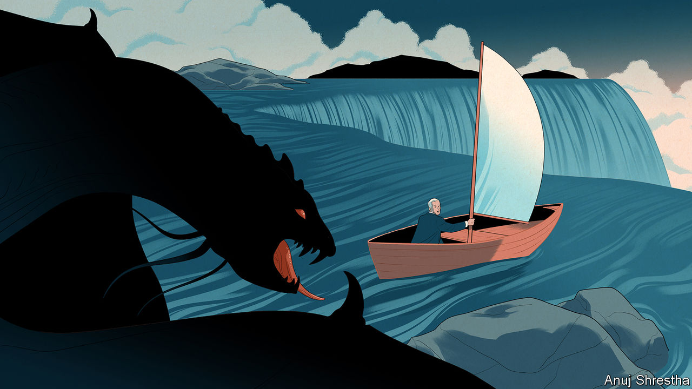
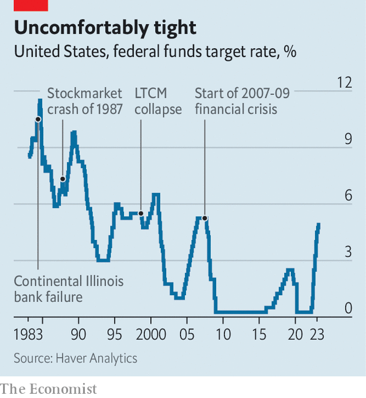
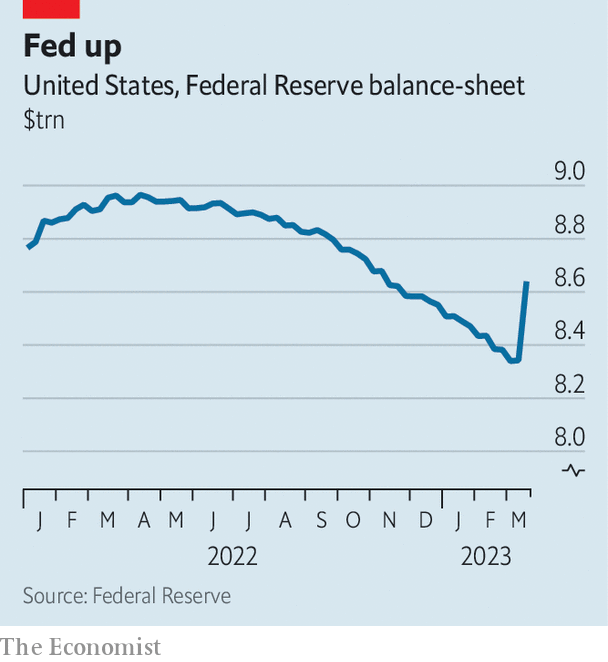
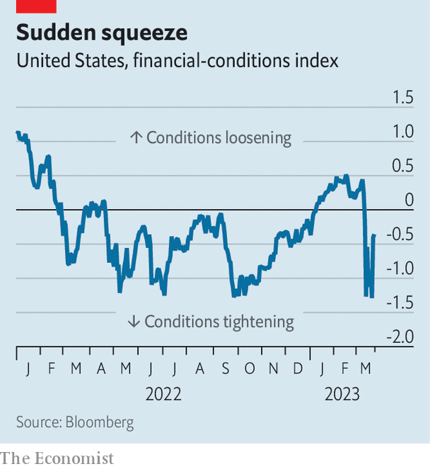

###### The roar gets nearer

# Policymakers face two nightmares: stubborn inflation and market chaos 

##### The Federal Reserve grapples with a dilemma that will soon hit other countries 

 

> Mar 23rd 2023 

In his first speech as a governor of the Federal Reserve, Ben Bernanke offered a simple adage to explain a complex topic. The question was if central banks should use monetary policy to tame frothy markets—for example, raising interest rates in order to deflate property bubbles. His answer was that the Fed should “use the right tool for the job”. It ought to rely, he argued, on regulatory and lending powers for financial matters, saving interest rates for economic goals such as price stability.

Two decades later, Mr Bernanke’s doctrine is facing a stiff test in the reverse direction—as a framework for dealing with frazzled, not frothy, markets. On one flank the Fed is trying to douse the red-hot embers of a crisis that began with a run on Silicon Valley Bank (svb). On the other officials face stubborn inflation, having failed to wrestle it under control in the past year. The tension between stabilising the financial system, which calls for support from the central bank, and reining in price pressures, which calls for tight policy, is extreme. But with two different sets of tools, the Fed is attempting to do both things. It is an improbable mission. And it is one that other central banks will have little choice but to emulate in forthcoming months.

On March 22nd, at the end of a two-day meeting of the central bank’s rate-setting body, Jerome Powell, the Fed’s chairman, laid out the logic of its extensive support for the financial system. “Isolated banking problems, if left unaddressed, can undermine confidence in healthy banks,” he said. Yet he also maintained that the Fed could, and would, bring down inflation. “Without price stability, the economy does not work for anyone,” he said. Putting policy where its mouth is, the Fed opted to lift rates by one-quarter of a percentage point.

 


Before the meeting there was debate about whether officials would follow through with their ninth straight rate rise. Continued tightening had appeared a foregone conclusion when figures for February revealed inflation was still uncomfortably high, running at 6% year-on-year, three-times as fast as the Fed’s target. But as panic spread following svb’s collapse, some prominent voices called for a pause to survey the effects on the economy. Or as Eric Rosengren, a former president of the Fed’s branch in Boston, put it: “After a significant shock from an earthquake should you immediately resume normal life?”

In the end the Fed was undeterred. Having already lifted rates by nearly five percentage points over the past year—its steepest tightening in four decades—the latest increase of a quarter-point was, in numerical terms, piddling. But as a measure of the Fed’s resolve, it was freighted with significance: it showed that Mr Powell and his colleagues believe they can use monetary-policy tools, especially interest rates, to tackle inflation, even when tightening poses risks to financial stability.

The Fed is willing to take this stance because of the range of alternative tools it can deploy in response to the mayhem in markets. Over the past couple of weeks, the Fed, acting in concert with other parts of the state, has raced to safeguard both assets and liabilities in the banking system. On the asset side, it has given troubled banks easier access to liquidity, offering to lend against the face value of government-bond holdings, even when market pricing is much lower. This has spared banks from having to realise losses that, in aggregate, ran to $620bn at the end of 2022—enough to wipe out nearly a third of equity capital in the American banking system.

As for liabilities, the Federal Deposit Insurance Corporation, a regulator, pledged to stand behind large uninsured deposits in svb and Signature, another bank that suffered a run. Janet Yellen, the treasury secretary, has hinted at similar support if depositors flee smaller banks, though on March 22nd she said the Biden administration was not considering blanket insurance (which would require approval from Congress). Still, even with deposit insurance legally capped at $250,000, the message seems to be that accounts are safe no matter their size. The combination of the Fed’s lending plus insurance has, for now, helped calm things down: after plunging by a quarter, the kbw index of American bank stocks has somewhat stabilised.

The Fed’s nightmarish balancing act between inflation and financial stability looks very different from its past two crises. During both the global financial meltdown of 2007-09 and the sudden economic stoppage in 2020 when covid-19 struck, the Fed and other central banks threw everything they had at reviving the economy and propping up the financial system. On both occasions, financial and economic risks pointed sharply downwards. That may have contributed to doubts about the Fed’s ability to walk and chew gum—to fight inflation and soothe market strains.

For Fed watchers, though, such cross-cutting actions look less surprising. In several cases—after a big bank collapse in 1984, a stockmarket crash in 1987 and a hedge-fund blow-up in 1998—the Fed briefly stopped raising rates or modestly cut them but resumed tightening policy before long. Economists at Citigroup, a bank, concluded that these experiences, not 2008 or 2020, are more pertinent today. Whereas markets are pricing in the possibility that the Fed may cut rates by half a percentage point before the end of this year, Citi’s view is that the central bank may surprise investors with its willingness to keep policy tight so long as inflation remains high. Indeed, that is exactly what it has signalled. Along with raising rates on March 22nd, the Fed published a summary of its projections. The view of the median member of the Federal Open Market Committee is that they will raise rates by another quarter-point this year and only start cutting them next year.

Nevertheless, the neat division between monetary-policy and financial-stability tools can look blurrier in practice. Take the Fed’s balance-sheet. As part of efforts to tame inflation, the central bank last year began quantitative tightening, letting a fixed number of maturing bonds roll off its balance-sheet each month, removing liquidity from the banking system. Between last May and the start of March it shrank its assets by about $600bn. Then in the course of a few days after the svb rout, its assets grew by $300bn—a by-product of the credit it had provided to banks through its discount window and other emergency operations. Monetary wonks see a clear distinction: quantitative tightening is an enduring change to the Fed’s balance-sheet, whereas the emergency credit will vanish when things normalise. But given that one of the main channels through which balance-sheet policies work is as a signal about the Fed’s intentions, the potential for confusion is evident.

 


Another blurred line is the feedback between financial stability and monetary policy. Most of those who argued for a Fed pause were not crudely advocating that the central bank needs to rescue beleaguered investors. Rather, the more sophisticated point was that bank chaos and market turmoil were themselves tantamount to rate increases. Financial conditions—which include bond yields, credit spreads and stock values—have tightened in the past couple of weeks. Torsten Slok of Apollo Global Management, a private-equity firm, reckoned that the shift in pricing was equivalent to an extra 1.5 percentage points of rate increases by the Fed, enough to tip the economy into a hard landing.

 


Not all agree the effect will be so large. Banks are responsible for about one-third of credit provision in America, with capital markets and firms such as mortgage lenders offering the rest. This could insulate firms from stricter lending standards at banks. Moreover, America’s biggest banks account for more than half the banking system by assets, and they remain in strong shape. Yet even with these caveats, the . As banks shore up their balance-sheets, both deposit and wholesale-funding costs are rising, which transmits the tightening to the financial system. Deutsche Bank thinks the lending shock, if minor, will shave half a percentage point off annual gdp growth. The Fed will probably now have to go less far to tame inflation.

Ultimately, its ability to treat instability and inflation on separate tracks depends on the severity of the banking crisis. “If financial issues are screaming, they will always, and rightly, trump slower-moving macroeconomic questions,” says Krishna Guha of Evercore isi, an advisory firm. The fact that America’s emergency interventions in the past two weeks had gained traction, with deposit outflows slowing and markets paring their losses, is what enabled the Fed to turn its attention back to inflation. It is easy to imagine an alternative scenario in which the interventions failed, forcing it to desist from a rate rise.

This helps to explain the haste of Swiss officials to bring an end to the Credit Suisse drama. Central bankers know only too well that the uncontrolled collapse of such a big firm would send shock waves through the global financial system. In that case, they would have been under immense pressure to retreat from the fight against inflation. The right tool for the right job is an attractive way of delineating the objectives of central banking. Yet it only works so long as the job of restoring stability after a financial explosion is handled swiftly. ■


