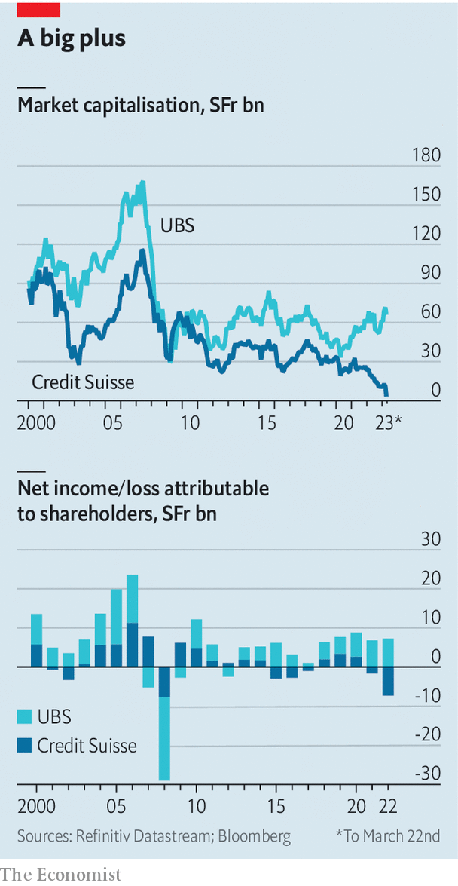

###### Back in black

# Switzerland’s new megabank is bad news for Swiss bankers 

##### The end of the 167-year-old institution will also be the end of many careers 

 

> Mar 19th 2023 

At a press conference in Bern on March 19th the chairmen of  and ubs, the two great rivals of Swiss banking, announced a momentous but unhappy union. After days of haggling, and years of creeping despair, regulators tried to avert crisis by rushing through a tie-up of banks with combined assets worth twice as much as Switzerland’s gdp.

The transaction concluded a bewildering descent for Credit Suisse, as its depositors and counterparties lost faith over the course of a working week. The banking system survived, even if 167 years of Swiss banking history did not. Now attention has turned to the impact of the hastily written terms of the deal—and the prospects for Switzerland’s new banking supergroup.

The tie-up reflected the recent history of the two institutions. Both suffered in the global financial crisis of 2007-09, when ubs received a bail-out from the Swiss government. More recently, though, their paths diverged. As ubs steadied the ship, Credit Suisse sank lower in a series of high-profile mishaps. Last year the bank lost SFr7.3bn ($7.6bn), its worst performance since 2008. Credit Suisse’s share price had fallen by 70% in the three years before the deal; that of ubs had more than doubled.

The merger valued Credit Suisse at around SFr3bn, a 60% discount on its stockmarket valuation and a fraction of its SFr42bn tangible book value. Shareholders fared better than owners of the bank’s Additional-Tier 1 (at1) bonds—a type of debt designed to absorb losses when a bank fails—who were wiped out in the largest-ever loss for holders of such instruments.

 


at1 holders, who would normally expect to stand behind shareholders in the slaughterhouse queue, are apoplectic. Some are replaying the legal manoeuvres of the past week in an attempt to argue, probably in vain, that losses should not have been triggered. Since Credit Suisse’s shareholders will be paid in stock, the bank’s at1 holders will become only more vexed if ubs shares rally. The firm’s share price has risen by more than 5% since the deal was announced.

Although the prices of at1 bonds issued by other banks have dropped in response to the takeover, do not write off the asset class just yet. at1 terms vary significantly between issuers—and most offer better protection than Credit Suisse’s. Jurisdictional differences also matter. The Bank of England and European Central Bank rushed to reassure investors that their nightmare was uniquely Swiss, and that they would be better protected in the event of a British or euro-zone collapse. at1s are perpetual, meaning banks do not face refinancing risks anytime soon. But ubs, which has a disproportionately large number of at1 bonds, will probably be penalised by investors demanding higher returns if it does decide to issue more in order to bolster its balance-sheet.

The bank’s management faces the more immediate problem of integrating the two residents of Zurich’s Paradeplatz. Ralph Hamers, chief executive of ubs, must adjust from running the profitable institution he inherited in 2020 to guiding a chaotic ship through choppy waters. ubs will benefit from SFr100bn of liquidity from the Swiss central bank and SFr9bn of protection from losses it might sustain when disposing of unwanted bits of Credit Suisse. Mr Hamers plans to make billions of dollars of cuts, hoping that the transaction will have made money by 2027. Executing such plans will be difficult with Swiss regulators keeping close tabs.

The combination of the banks’ wealth-management and Swiss banking operations could prove potent, even if there are potential snags. Previous wealth-management mega-deals have seen clients flee. Some prefer to park their money with more than one institution—an approach which seems all the more sensible after the past fortnight. Shares in Julius Baer, another of Switzerland’s courtiers to the rich, jumped this week in expectation of new clients. 

Fruit of the union

But after the merger, both divisions will be powerhouses. ubs will probably hold nearly a third of the Swiss market. The jewel will remain its wealth-management business, which has posted an impressive average return on equity of 24% in the past five years. UBS will become the second-largest wealth manager globally, with $3.4trn of assets under management and a strong claim on the wallets of the world’s billionaires. Iqbal Khan, head of wealth management, joined ubs from Credit Suisse in the midst of a spying scandal in 2019.

The path to profitability will involve brutal cost-cutting, not least in the merged firm’s investment bank, which ubs plans to keep firmly subordinate to its wealth-management outfit. Both ubs and Credit Suisse have found it hard to strike this balance in recent years. Today there are many more superstar bankers who used to work at Swiss banks than work at Swiss banks.

Although Credit Suisse had already begun swinging the axe, having announced the sale of its securitised-products business last year, the operational changes will now be much more bloody. The offending risky businesses will be moved to a “non-core” unit, and quickly wound down. ubs is likely to cherry-pick Credit Suisse’s strongest dealmaking groups, which include those advising on corporate buy-outs, and get rid of the rest. Only bankers with the most polished Rolodexes have any chance of surviving the cull.

Credit Suisse’s plan to spin out its investment-banking operations under Michael Klein, a dealmaking supremo who sat on the firm’s board until October, will probably be shelved. But a similar plan for a stand-alone Swiss investment bank could eventually prove attractive if ubs is able to combine its strongest bankers with those from Credit Suisse. Slow dealmaking markets should help them to hold on to top performers, who may be unable to secure gigs elsewhere, at least for now. 

In the future ubs will no doubt look at other ways to make its business less unwieldy and more focused on profitmaking. Outside the beloved wealth-management division, pretty much everything will be fair game. Deutsche Bank’s spin-off of dws, its asset-management business, could serve as a precedent for a similar move. Long before the merger, Credit Suisse had considered shedding part of its Swiss business to raise capital. 

Financial policymakers around the world will be hoping the merged institution succeeds. Turmoil in America and Europe has already given them cause for concern. But Swiss officials will no doubt be keenest of all for a healthy union. The prospect of further trouble is now chilling. After all, this week’s solution—a merger—would be off the table. The new megabank would simply be too big for such a deal. ■


