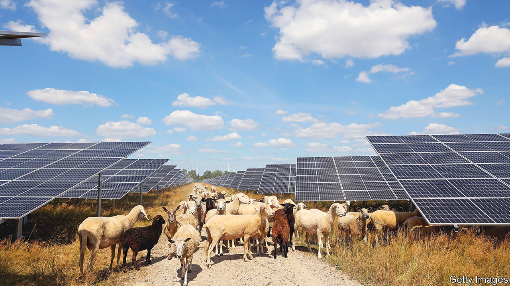

###### Following the herd

# The battle for Europe’s economic soul 

##### Policymakers in Brussels ready their response to America’s protectionism 

 

> Mar 23rd 2023 

Over the past two weeks, a flurry of proposals to reshape Europe’s economic model has emerged from the Berlaymont, a cruciform building in Brussels, which is home to the European Commission. The commission usually fiercely guards the eu’s rules. But things are now in flux. The proposals contain ideas for how governments can help companies invest in green technology, cut reliance on dominant suppliers (read: China) and boost industry. On March 23rd, after we went to press, leaders from the eu’s 27 member states were due to come together to discuss the changes and set plans in motion. 

The discussions may reshape the bloc’s very core. The eu is in essence the deepest and most comprehensive free-trade agreement in the world. Restrictions on subsidies, along with common rules and regulations, some extremely stringent, ensure a level playing-field. This market-mindedness is reflected in the fact that the eu has long had a carbon-trading scheme for industry and electricity generation, which will in time be extended to heating and transport. The eu is relatively open to trade and investment from the outside world, too. Only agriculture remains subsidised and protected from competition. 

Yet the bloc’s leaders worry this openness has left Europe exposed. America’s protectionism and China’s rising assertiveness are seen as evidence that old certainties must now be reconsidered. In the eyes of many, the urgency of climate change, disruptions during the covid-19 pandemic and Russia’s invasion of Ukraine only underline the need for the eu to take a more interventionist role. 

The next generation of European subsidies will not be combined with the sort of protectionist “buy local” clauses favoured in America. These would violate wto rules which the eu, at least, still thinks are important. But the commission is determined to bolster the continent’s manufacturers and reduce dependence on China as it spends on the green transition. This will require big changes to the internal market, trade policy and state-aid rules. 

Dirigiste directions

The most straightforward reforms relate to domestic policies. Countries in Europe are trying to shorten permitting times for green projects, lighten administrative burdens and train the workforce in the skills it needs to make heat pumps and install solar panels. The commission also wants them to introduce “regulatory sandboxes”, to allow for deviation from ordinary rules so that innovative firms can experiment. New eu rules would provide extra incentive to get going on this.

The commission also wants to sign long-term agreements with countries that supply crucial raw materials, such as lithium and rare-earth metals. This could prove trickier, as Europe is not the only place in need of these minerals. If European politicians demand lots of green standards are met when sourcing the materials, countries might simply strike deals with other buyers. As painful as it will be for Europe, the continent’s leaders may have to make peace with dodgy practices. Forthcoming negotiations with America—about access to its markets for Europe’s raw materials—might help familiarise the continent’s leaders with uncomfortable trade-offs.

The most significant rule changes involve experiments with protectionism. The commission wants national leaders to agree to domestic-production targets, something at odds with the bloc’s usual market-minded approach. At the moment these are mere ambitions. They state that, among things deemed “strategic technologies”, including heat pumps and solar panels, the eu should produce 40% of what it uses. They also state that the eu should mine 10% and refine 40% of the resources needed for the green transition. If formally adopted, the targets could end up shaping policy on state aid, subsidies and trade. 

The commission also plans to allow governments to subsidise green investment more freely. In early March, under pressure from national governments led by France, it relaxed strict state-aid rules, which had prevented governments from tilting the playing-field in favour of domestic firms. Now countries can more generously support companies that want to make factories greener or expand renewable-energy production. The new approach looks beyond Europe’s shores. It would allow governments to pay firms to invest in the bloc by matching subsidies they are offered by other countries, a move designed to counter America’s new regime.

Plans to get governments to diversify when handing out subsidies and buying stuff are more nuanced. The commission wants governments to take the way a supplier might contribute to the bloc’s “resilience” into account when making decisions—code for moving away from China. If a supplier dominates the eu market, selling more than 65% of a particular good, it is considered a problem. Yet there is a carve-out. If the price difference between options is more than 10% firms would be allowed to plump for the cheaper (Chinese) one.

Imagine the red tape. In the fight for Europe’s economic soul, Britain’s absence as a supporter of markets will be keenly felt by former allies. Germany will need to take a stand against intervention (and thus France). But its politicians are wavering. The country’s coalition government does not agree on many of the issues, and as the eu’s biggest industrial economy, with deep pockets to boot, Germany stands to benefit from inward-looking policy. Thus the continent’s rule-book is about to undergo sweeping changes. ■


