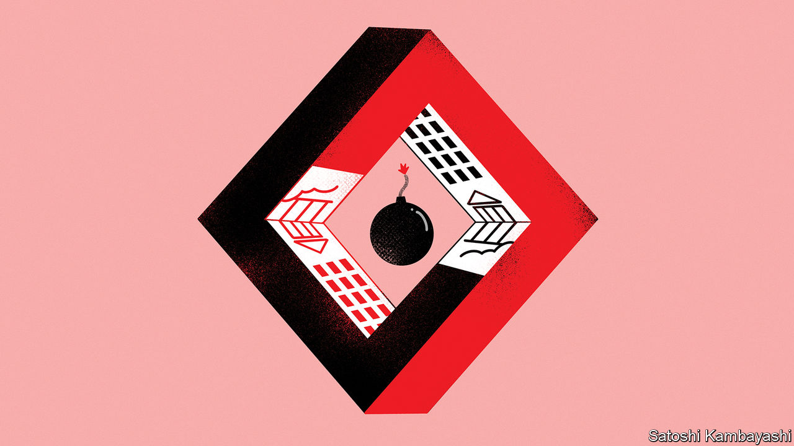

###### Buttonwood

# Why markets can never be made truly safe 

##### In seeking to prevent a crisis, officials may have planted the seeds of the next one 

 

> Mar 23rd 2023 

Collateral is usually a boring affair. Valuing assets and extending credit against them is the preoccupation of the mortgage banker and the repo trader, who arranges trillions of dollars a day in repurchase agreements for very short-term government bonds. This activity is called financial plumbing for a reason: it is crucial but unsexy. And like ordinary plumbing, you hear about it only when something has gone wrong.

Now is one of those times. On March 16th the Swiss National Bank extended $54bn to Credit Suisse, backed by the bank’s collateral, in a move that turned out to be insufficient to save the 167-year-old institution. On March 19th America’s Federal Reserve announced it would reactivate daily dollar swap lines with Britain, Canada, the euro area, Japan and Switzerland. The central banks of these economies can now borrow dollars from the Fed at a fixed exchange rate for short periods, backed by their own currencies, and lend them on to local financial firms. 

In normal times assets that are exposed to little risk, and thought unlikely to swing much in value, underpin lots of market activity. Government bonds and property are typical examples of collateral. Commodities, corporate credit and stocks are riskier but also sometimes employed. Both sorts of collateral are at the root of many financial crises.

The perception of safety is the reason why risks eventually emerge. The safer assets are thought to be, the more comfortable a lender is extending credit against them. Sometimes the assets are themselves safe, but the lending they enable (and the use of the money) is not. 

This tension between safety and risk can prompt financial panics. At other times, the problem is simple misjudgment. The activities of Silicon Valley Bank (svb) were in essence a leveraged bet on assets its bankers believed to be solid: long-dated mortgage and Treasury bonds. The firm’s management believed it could safely borrow money—namely, that owed to depositors in the bank—against these reliable assets. The subsequent rapid drop in price of the assets was ultimately the cause of the bank’s downfall.

During the global financial crisis of 2007-09, the belief in the unimpeachable safety of the American mortgage market led to an explosion in collateralised lending. The blow-up did not even require actual defaults in mortgage-backed securities. The mere shift in the probability of default raised the value of credit-default swaps, and the liabilities of firms that sold the products, which was sufficient to sink institutions that had sold enormous volumes of the swaps. In Japan in the early 1990s a collapse in land prices, the preferred collateral of domestic banks, led to a slow-burning series of financial crises that lasted for longer than a decade.

Crises do not only reveal where collateral has been wrongly judged to be safe. They are also the source of innovations that upend how collateral works. In response to the panic of 1866, caused by the collapse of Overend, Gurney &amp; Company, a wholesale bank in London, Walter Bagehot, a former editor of this newspaper, popularised the idea of central banks operating as lenders of last resort to private financial institutions, against sound collateral. The daily swap lines recently reactivated by the Fed were introduced in the financial crisis and reopened in the early period of covid-19.

The Fed’s “Bank Term Funding Programme”, introduced after the collapse of svb, is the first innovation in collateral policy during the present financial wobble. The programme’s generosity is both new and shocking. A 30-year Treasury bond issued in 2016 is worth around a quarter less than its face value in the market today, but is valued at face value by the Fed if an institution pledges it as collateral. In the programme’s first week, banks borrowed nearly $12bn, as well as a record $153bn from the central bank’s ordinary discount window, at which banks can now borrow without the usual haircut on their collateral.

The programme could change the understanding of collateral that has built up over the past 150 years. If investors expect the facility to become part of the regular panic-fighting toolkit, as swap lines have, then long-maturity bonds would enjoy a new and very valuable backstop. This would mean that financial institutions benefit when interest rates fall and their bonds rise in value; and when rates rise and the bonds slump in value, the Fed comes to the rescue. In an attempt to remove the risk of sudden collapses, and make the financial system safer, policymakers may in the long run have done just the opposite.


