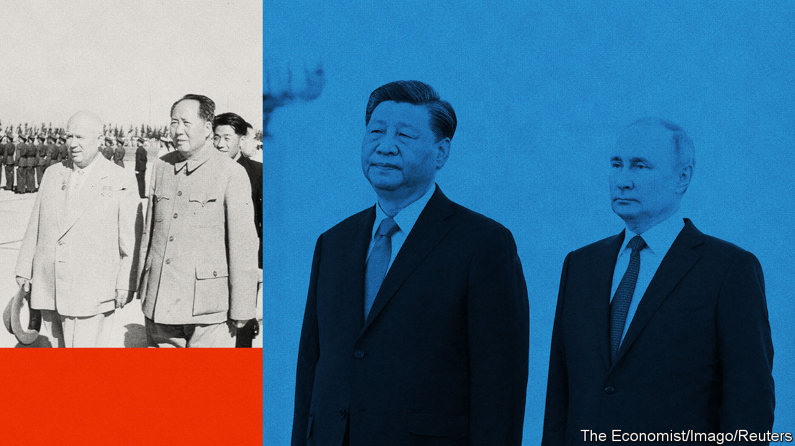
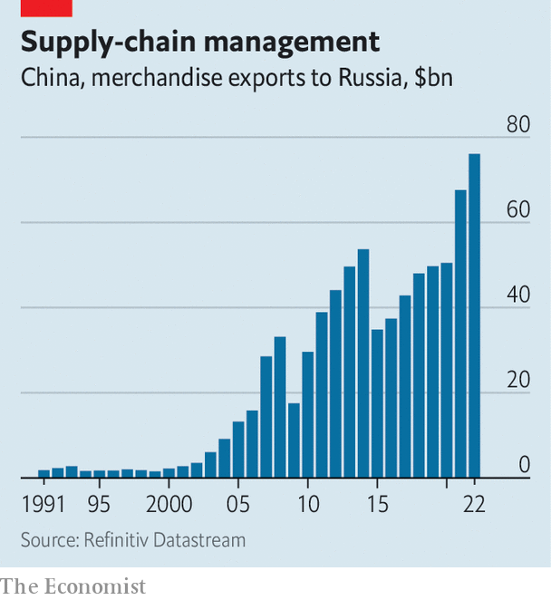
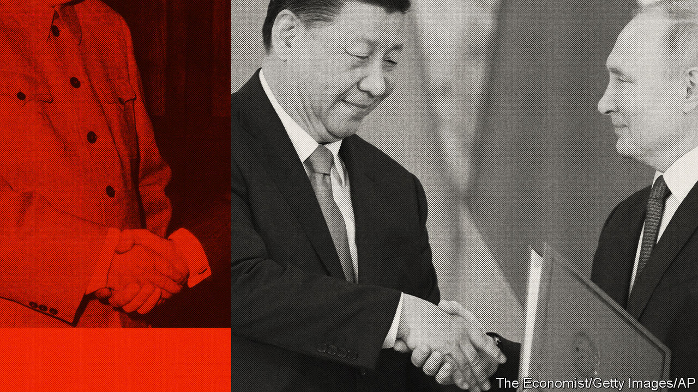

###### Peacemaker or provocateur?

# What does Xi Jinping want from Vladimir Putin? 

##### Big questions loomed behind the Chinese leader’s trip to Moscow 

 

> Mar 19th 2023 

Ever since the second world war global politics has been moulded by the “strategic triangle” between America, China and Russia. Co-ordination between Mao Zedong and Josef Stalin in the early 1950s fuelled American determination to halt the spread of communism. That led to America fighting wars in Korea and Vietnam, its commitment to , and many proxy conflicts elsewhere. 

A decade later Mao’s schism with Nikita Khrushchev prepared the ground for an eventual American rapprochement with China. That brought covert Chinese assistance in the fight against Soviet forces in Afghanistan, which helped end the cold war. It also underpinned the decades-long run of  that transformed China into a global power. 

Now another shift is under way. On March 22nd Xi Jinping, China’s leader, completed a three-day visit to Moscow, his first since Russia’s invasion of Ukraine last year. Coming just days after the International Criminal Court (icc) issued an arrest warrant for Mr Putin, it was an emphatic display of solidarity. Mr Xi even invited Mr Putin to visit China later this year and endorsed his running for re-election in 2024. 

Mr Putin reciprocated with an elaborate charm offensive, proffering two banquets in the Kremlin, praise for Mr Xi’s diplomatic initiatives and backing for him over Taiwan. “We’re now witnessing changes that haven’t been seen for more than a century, and we’re pushing them forward together,” Mr Xi told Mr Putin, after the two leaders had polished off a state banquet of crab, marbled beef and borscht in a 15th-century banqueting hall built for the tsars. 

Calling each other “dear friend”, the two leaders signed a statement that voiced opposition to the American-led global order and pledged deeper ties in trade, military exercises and space. In private, their talks probably covered much more besides. American officials believe Mr Xi is weighing Russia’s request to supply it with lethal weapons, including artillery shells and attack drones, for use in Ukraine. If Mr Xi agrees, it would draw China into a proxy war with NATO. 

But in China’s telling, Mr Xi was there as a peacemaker, and with no offer of arms. He repeated his call for a ceasefire, and again promoted a 12-point peace plan that China had first proposed in February. Mr Putin praised the plan, and committed to starting peace talks with Ukraine “as soon as possible”. The statement also repeated Chinese calls to uphold the UN Charter and to avoid the use of nuclear weapons (although it failed to repeat Mr Xi’s previous statements opposing threats of their use).

To offset Western criticism of his Moscow visit, Mr Xi is expected to follow it with virtual talks with Ukraine’s president, Volodymr Zelensky. That will play well in many developing countries, and among Westerners keen to ease tensions with China. As evidence of Mr Xi’s peacemaking credentials, Chinese officials point to their country’s role in an agreement between , announced on March 10th, to re-establish diplomatic ties. 


Yet Mr Xi’s true intentions are hidden in plain sight. While professing neutrality, he has refused to condemn Russia’s invasion or its soldiers’ atrocities. His officials and China’s state-controlled media continue to push the Kremlin line that the war was caused by NATO expansion, a trope repeated in the joint statement. It also condemned NATO’s involvement in Asia and America’s bid to strengthen its alliances there in preparation for a potential Chinese attack on Taiwan. 

None of the declarations and agreements signed during Mr Xi’s visit made any mention of weapons. But even if China stops short of arming Russia, its non-military support will help sustain the war. Although China largely avoids violating Western sanctions on Russia, it helps Russia offset their impact by buying more of its oil and gas, and selling it more electronics and other goods.

You call that a plan?

China’s peace plan, meanwhile, is a non-starter for Ukraine and its Western backers. It advocates an end to Western sanctions without requiring Russia to withdraw from conquered territory. The plan sticks to Kremlin talking-points in arguing that security “should not be pursued at the expense of others”, nor by “expanding military blocs”. This echoes Mr Xi’s “Global Security Initiative”, which he proposed last year as an alternative to the American-led “rules-based international order”.

Mr Xi’s stance unsettles some in China’s elite. It shreds the country’s claim to be pursuing a foreign policy based on respect for national sovereignty, and undermines a guarantee given in 2013 to help Ukraine if it were to be threatened with nuclear attack. It makes Chinese attempts to sever Europe from America much harder. Chinese strategists are clear-eyed, too, about Russia’s unpredictable politics and dismal economic prospects. Arming it would expose China to severe sanctions from America and the European Union, its two biggest trading partners, hobbling efforts to revive its economy. Talk of a new cold war would harden into reality. 

Yet Mr Xi’s calculations are dominated by his conviction that China is locked in a long-term confrontation with America that may lead to a war over Taiwan. If so, Russia represents an indispensable source of energy, military technology and diplomatic support. A Russian defeat in Ukraine would embolden America and its allies. If Mr Putin’s grip on power slipped, instability on China’s vast northern border with Russia could follow. The worst-case scenario for China would be the arrival in the Kremlin of a pro-Western leader tempted to help America to contain Chinese power, in a mirror image of China’s own strategic shift in the 1970s.

“That is the nightmare for China,” says Li Mingjiang, an expert on Chinese foreign policy at Nanyang Technological University in Singapore. For Mr Xi America represents the greatest potential threat, and China has no other big power on its side to help resist Western economic or military pressure. “Russia is the only option,” he says. “It’s the same logic as in the cold war, when Mao saw the Soviet Union as China’s number-one enemy, and decided to pursue rapprochement with the United States.”

Mr Xi’s strategic considerations are underpinned by a personal connection with Russia. His father, Xi Zhongxun, was a revolutionary who later oversaw the Soviet experts who helped build up Chinese industry in the 1950s. The elder Xi visited Moscow in 1959. He returned full of admiration, bearing Soviet-made toys that delighted his six-year-old son.

The younger Xi’s interest in Russia seems to have deepened when he was sent to a remote village at the age of 15, during the Cultural Revolution. The books he read there are still on display, including “War and Peace”, a selection of Lenin’s writings, an account of Soviet battles in the second world war and “How the Steel was Tempered”, a novel about a man who fights the Germans, joins the Bolsheviks and becomes an ideal Soviet citizen. 

Mr Xi was not alone in his regard for Russia. Senior Chinese military officers developed close ties with their Russian counterparts after Western governments placed arms embargoes on China over the crushing of pro-democracy protests around Tiananmen Square in 1989. (They remain in place.) Since then, China has bought tens of billions of dollars’ worth of Russian weapons. 

In the decade before Mr Xi took power in 2012, he also appears to have been influenced by leftist academics and fellow “princelings” (as offspring of Communist Party leaders are known) who became disillusioned with the West, especially after the financial crisis in 2007-09. Inspired by Mr Putin, then near the height of his power, they began to see Russia as a potential partner and to question Chinese historians’ conclusions that the Soviet Union collapsed because of problems dating back to Stalin. Instead, they blamed Mikhail Gorbachev and his liberalising reforms.

By the time Mr Xi assumed office, he and his advisers were already bent on closer alignment with Russia. He chose Moscow for his first trip abroad, and hinted there that the two countries would work together against the West. “Our characters are alike,” he told Mr Putin. Mr Xi has since met him some 40 times, far more than any other leader, apparently bonding over common disdain for democracy and fears of American encirclement. 

Sneak attack

Some of the shine may have come off the pair’s relationship in the wake of Mr Putin’s invasion. In February 2022, just before Russia attacked, Mr Putin visited Mr Xi in Beijing for the opening ceremony of the Winter Olympics. The two sides declared that their partnership had “no limits”. Whatever the pair discussed, Chinese officials appear to have been wrong-footed by the scale of the invasion. They had no prepared talking-points or plans to evacuate Chinese citizens. Soon after the invasion, China’s deputy foreign minister responsible for Russia was transferred to the radio and television administration.

Chinese perceptions of Russian military prowess have also changed since the war began. Previous Russian successes in Crimea, Georgia and Syria had convinced Chinese generals that Mr Putin was a great strategist in command of an effective army. Drills and exercises between the two countries’ armed forces have focused on interoperability. Recent Chinese military reforms have copied those in Russia. But Chinese commanders have been shocked by Mr Putin’s miscalculations over Ukraine and the  of Russian soldiers and weaponry. 

Disillusion is not confined to military types. In December Feng Yujun, a prominent Russia expert at Fudan University, in Shanghai, made a scathing speech in which he noted that Russia had annexed millions of square miles of Chinese territory between 1860 and 1945. The Soviet Union then pushed China to distance itself from the West and to enter the Korean war, causing “countless” Chinese casualties, he argued. Modern Russia had not accepted its weakness relative to China and was obsessed with rebuilding its empire, he added, concluding: “The weakest party in the China-America-Russia triangle always benefits the most.” Such views are common among Chinese scholars and business figures familiar with Russia. But their impact on decision-making is limited in a system that depends increasingly on the will of one man.

Late last year some Western officials expressed hope that China was edging away from Russia, especially after Mr Putin promised to address China’s “questions and concerns” about Ukraine when he met Mr Xi in Uzbekistan in September. Mr Xi, without explicitly mentioning Mr Putin’s nuclear sabre-rattling, then voiced disapproval of any such threat or attack. For a while, Mr Xi seemed to be mixing support for Russia with efforts to ease tensions with America. But that stopped in February after America shot down a high-altitude Chinese balloon that it said was part of a global spying operation. 

 


In practical terms, there is little evidence that China is distancing itself from Russia. In 2022 Russian exports of crude oil and gas to China rose, in dollar terms, by 44% and more than 100% respectively. Chinese exports to Russia increased by 12.8% (see chart). Shipments of microchips—which are used in military as well as civilian kit, and which the West has tried to deny to Russia—more than doubled. Some Chinese firms have provided items for direct military use, such as satellite images, jamming technology and parts for fighter jets, although so far only in small quantities. Some of these deals may pre-date the war, or involve entities already under American sanctions. 

China has also continued to conduct joint military drills with Russia. In November Chinese and Russian strategic bombers flew on a patrol over the Sea of Japan and the East China Sea, and landed on each other’s airfields for the first time. On the anniversary of Russia’s invasion of Ukraine in February, Russian, Chinese and South African warships were practising together in the Indian Ocean. And on March 15th Russia, China and Iran began naval drills in the Gulf of Oman.

Pressing the advantage

Rather than downgrade China’s relationship with Russia, Mr Xi appears to be strengthening it, while exploiting Russia’s weakened position. One result of Mr Xi’s visit appears to have been a more robust assurance that Mr Putin would back him in a war over Taiwan. In the joint statement, Russia repeated its assertion from February 2022 that the island is Chinese territory, but added a line saying it “firmly supports China’s measures to safeguard its sovereignty and territorial integrity”. 

Mr Xi has won access to cheap energy, too. Mr Putin claimed a “near agreement” to build “Power of Siberia 2”, a new gas pipeline to China that would divert supplies once earmarked for Europe. (The joint statement’s wording was more circumspect, suggesting China is bargaining hard on the price). Economic agreements foresee Russia helping Chinese firms take the place of departing Western ones. 

Although it was not discussed publicly, Mr Xi has also  to seek high-end Russian military technology, such as surface-to-air missiles and nuclear reactors designed to power submarines—and to press Mr Putin to withhold or delay supplies of similar items to Russian customers that have  with China, such as India and Vietnam. Russia could also help upgrade China’s nuclear arsenal, or work on a joint missile-warning system.

Even as China extracts concessions its officials are keen to keep Mr Xi’s hands clean, especially given the icc’s arrest warrant. They are wary of moves by America and its allies to portray China as explicitly backing Mr Putin’s war. In February, while China’s foreign minister was in Moscow, Joe Biden, America’s president, made an unannounced visit to Kyiv. Something similar happened on March 21st. As Mr Xi was being feted at the Kremlin, Japan’s prime minister, Kishida Fumio, visited Ukraine. He laid a wreath at a church in Bucha, the site of a massacre by Russian forces of hundreds of Ukrainian civilians. 

 


Mr Xi’s proposed call with Mr Zelensky, long advocated by European and American officials, may mute some criticism of his stay in Moscow, especially if the Ukrainian leader makes positive noises about China’s peacemaking potential. But Mr Xi probably has little immediate interest in mediation. Chinese officials calculate that neither Russia nor Ukraine wants peace yet, since both believe they can make further advances on the battlefield. And China’s record is in any case rather mixed. The Iran-Saudi deal was brewing for some time before China stepped in. Its efforts as an intermediary in North Korea, Afghanistan and Myanmar have been poor. Mr Xi’s posturing is more about burnishing his international image while undermining America’s, and positioning China to take advantage of whatever emerges from the war. 

As for Russia’s request for weapons, China is probably undecided. American officials say there is no evidence yet of such shipments. Their recent allegations may have been pre-emptive warnings. But China may see another opportunity to gain leverage. In public statements and private discussions its officials increasingly draw a link with Taiwan. “Why does the US ask China not to provide weapons to Russia while it keeps selling arms to Taiwan?” asked Qin Gang, China’s foreign minister, on March 7th.

If Mr Xi does decide to arm Russia, he may do so quietly. China has a long history of covert arms exports. In the 1980s it secretly supplied Chinese-made variants of the Soviet AK-47 assault rifle to American-backed mujahideen insurgents in Afghanistan. Providing Russia with artillery shells would be easy: Chinese firms produce similar models and can remove markings, or add ones suggesting they originate elsewhere, says Dennis Wilder, a former American spy who used to track Chinese arms exports. China could also supply weaponry via third countries, like North Korea or Iran, or provide them with incentives to ship their own arms to Russia. America might detect such moves, but proving them will be harder. “All China needs is plausible deniability,” says Mr Wilder.

But the quiet approach has limits. To alter the course of the war might require China to supply bigger, more sophisticated weapons, such as attack drones. Those would be harder to conceal, especially if any were to fall into Ukrainian hands. Public exposure would undermine Mr Xi’s efforts to present himself as a peacemaker.

In the end Mr Xi’s decision could depend on how the war plays out, and especially on the result of a Ukrainian offensive that is expected in the coming months. It could hinge, too, on the level of tensions between China and America over Taiwan, suggests Alexander Korolev, who studies China-Russia relations at the University of New South Wales in Australia. “If, by sending weapons to [Russian troops in] Ukraine, China can control the level of escalation and keep Russia going for as long as needed, then it can keep the West busy,” he says. “That makes it more feasible to deal with Taiwan.” ■

