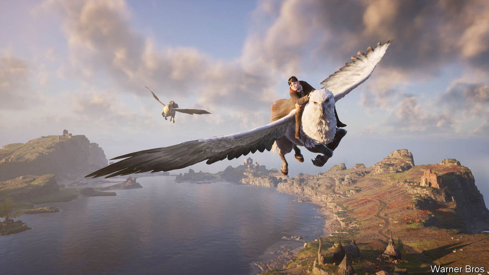
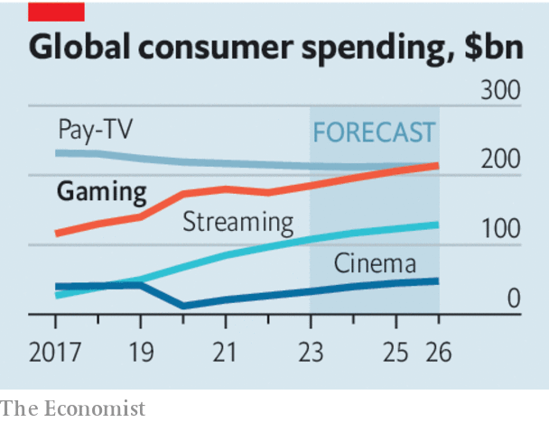

###### Storm forming

# As video games grow, they are eating the media 

##### The games business has lessons for other industries and for governments 

 

> Mar 23rd 2023 

Warner Bros released a new Harry Potter title last month and took $850m in two weeks. That made it the second-most-successful Potter launch in the film studio’s history. But “Hogwarts Legacy”, the title in question, was no movie: it was a video game.

Warner’s hit is an example of how gaming is besting older media, both as a business and as a way for people to entertain themselves. Consumers are forecast to spend $185bn on games this year, five times what they will spend at the cinema and 70% more than they will allocate to streamers like Netflix. Once a children’s hobby, gaming has grown up. Console players in their 30s and 40s now outnumber those in their teens and 20s.

Yet as gaming matures, it is not just rivalling other media. Rather like a ravenous Pac-Man, it is . While such intellectual property as Harry Potter may be finding success in game form, game franchises have themselves become the most in-demand kind of ip in other media. Apple’s “Tetris” movie, due out later this month, is the latest (and perhaps oddest) instance of Hollywood mining games for ideas as audiences tire of comic-book heroes. Amateur creators are doing the same. After music, gaming clips are the biggest content category on YouTube.

 


At the same time, audiences are increasingly consuming old media through games. The latest season of “The Walking Dead”, a long-running television drama, took the form of an interactive game on Facebook. Musicians such as Ariana Grande perform concerts in “Fortnite”. The fitness video is giving way to the fitness game. Even social networking is partly migrating to the gaming arena. Platforms like Roblox provide children with a place to play—but also to hang out, chat and shop. In so far as anything resembling a metaverse yet exists, it exists in games.

Expect more growth. Smartphones put a powerful console in people’s pockets and unlocked hours of playtime on the commute and at the back of the lecture hall. The next boost may come from smart tvs and streaming, which bring high-fidelity games to living rooms without the need for dedicated hardware.

New business models are another source of growth. Gaming’s latest boom was propelled by free-to-play games, which suck users in before monetising them with ads and in-game purchases. A new phase of expansion is coming from game-library subscriptions, which already show signs of increasing consumption and accelerating discovery, much as the cable bundle did in television. These new distribution mechanisms and business models promise more choice for consumers—which is why regulators should allow Microsoft’s $69bn acquisition of Activision Blizzard, a big gamemaker whose titles Microsoft would make available for streaming and subscription.

All this holds lessons for other industries—chiefly that, if you are in media, you need to be in gaming. Apple and Netflix are scrambling to complement their streaming offerings with games. Others are already there. In August Sony Pictures will release “Gran Turismo”, a film based on a Sony game which features songs by artists from Sony Music. Media firms that ignore gaming risk being like those that decided in the 1950s to sit out the tv craze.

Governments should also pay attention. Their main concern so far has been whether games rot young minds (almost certainly not, especially if playing diverts them from social media). As gaming grows, bigger questions loom. Film and television, the engines of popular culture in the 20th century, are dominated by Hollywood. The contest in new media is more open. Western governments are waking up to the implications of the world’s hottest social-media app, TikTok, being Chinese-owned. Next they might consider what it means that China also made two of last year’s three highest-grossing mobile games.

When video games were just electronic toys, this might not have mattered. But as games expand and spill into other formats, it is becoming clear that whoever dominates gaming is going to wield clout in every form of communication. In every sense, the future of the media is in play.■

