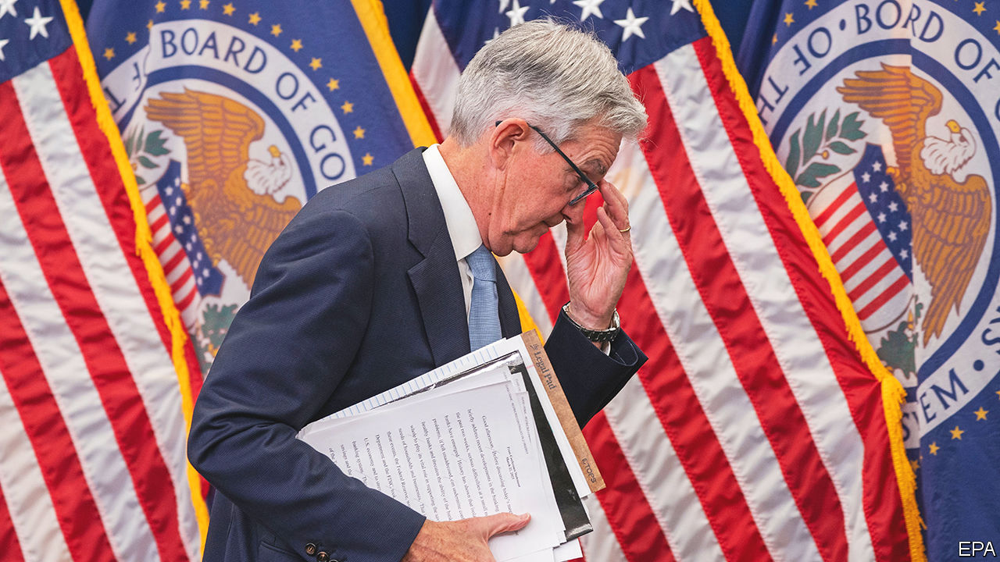

###### The great balancing act

# Central banks face an excruciating trade-off 

##### They have to choose between financial instability and high inflation. It wasn’t meant to be that way 

 

> Mar 22nd 2023 

The job of central bankers is to keep banks stable and inflation low. Today they face an enormous battle on both fronts. The  is still untamed, and the financial system looks precarious. 

Stubbornly high inflation led the Federal Reserve to increase interest rates by a quarter of a percentage point on March 22nd, less than a week after the European Central Bank raised rates, too. The Fed acted days after three midsized American banks had collapsed and Credit Suisse, a grand old Swiss bank with more than SFr500bn ($545bn) in assets, suffered a wounding run that ended in a  with its Swiss rival, ubs. Bankers led by Jamie Dimon, the boss of JPMorgan Chase, are trying to shore up First Republic, the next teetering domino. 

The trouble is that central bankers’ two goals look increasingly contradictory. All but the biggest American banks are suffering from the consequences of higher interest rates. Dearer money has reduced the value of their securities portfolios and has made it likelier that depositors will flee to big banks, or to . Cutting interest rates would help the banks; so does backstopping the financial system. But either option would further stimulate the economy and make inflation worse.

It was not meant to be like this. New rules introduced after the financial crisis of 2007-09 were intended to stop bank failures from threatening the economy and the financial system. That, in turn, was supposed to leave monetary policy free to focus on growth and inflation. But the plan has not worked, obliging central banks to perform an excruciating balancing act.

Consider the humbling of Credit Suisse. Regulators are supposed to be able to “resolve” a failing bank in an orderly fashion over a weekend by following a plan to wipe out shareholders and write down convertible bonds (or convert them to equity). But Credit Suisse’s demise has sowed uncertainty and confusion. Instead of winding down the bank, Swiss officials pressed UBS to buy it, providing generous taxpayer-backed loans and guarantees to make the deal work and even passing a law to make the terms watertight. 

Although regulators wrote off the bank’s convertible bonds, shareholders still received $3.2bn, upending the expected preference of bondholders over stockholders. One reading of the bond contracts’ small print is that this inversion was allowed. Even though regulators in Britain and the eu were quick to insist they would respect the usual order of creditors, the Swiss departure from the norm has inevitably shaken investors’ faith, creating doubt about what might happen with the next bank failure. 

America’s improvised rescue of all the depositors of Silicon Valley Bank and Signature Bank could also have a corrosive effect. Deposits above a cap of $250,000 per customer are not formally insured by the federal government. But nobody is sure which larger depositors would be bailed out if a bank failed. Jerome Powell, the chairman of the Fed, said on March 22nd that depositors “should assume” they are safe. The same day Janet Yellen, the treasury secretary, said expanding insurance to all depositors is not under consideration. Meanwhile, the Fed has lent $165bn through its newly generous lending schemes, which shield banks from the risks of holding long-dated securities. 

As we published this, it looked as if First Republic would survive without more state intervention. Nonetheless, the combination of banks’ travails and regulatory uncertainty could yet harm the economy. 

One source of pain could be America’s small and midsized banks. Those with less than $250bn in assets account for about half of all banking assets and 80% of loans for commercial property, a sector that has been vulnerable since the pandemic (see Finance &amp; economics section). If smaller banks continue to lose deposits or if they need to raise capital because investors or regulators doubt their safety, then they could limit the loans they make, slowing economic growth and inflation. 

Another cause for concern is credit markets. The extra yields paid by the riskiest firms to borrow have risen and in some markets credit seems to be drying up. Worries about tighter financial conditions have led markets to pare back their bets on high inflation even as they have priced in interest-rate cuts. 

As they weigh this precarious economic outlook, central banks must also be cautious about the signals they send. Because they regulate banks, they have special insight into the health of the financial sector. One reason the Fed was right to raise rates this week was that a sharp u-turn would have caused panic about what the central bank knew that markets didn’t.

Where to go from here? The essential aim is to fix the regulatory regime, so that central banks remain free to fight inflation. A big task is to revisit the measures that ensure one bank failure does not spill over into the next. If need be, policymakers must be able to recapitalise a failing bank by writing down bonds or converting them to equity. And it should be clear that shares will first be written off entirely. 

In America the appeal of insuring all depositors is that they then have no incentive to flee from smaller banks. But the real problem is lax capital rules for banks with less than $700bn in assets and inadequate planning for the failures of banks with under $250bn. Offering universal deposit insurance without fixing those problems would encourage excessive risk-taking. Banks would remain fragile yet be freed from any scrutiny by large depositors. 

Don’t look down

Until the banks are fixed, monetary policymakers have no choice but to take into account the dangers they pose to the economy. The Fed must scrutinise the lending behaviour of affected banks and build it into its economic forecasts, and also keep a close eye on credit markets. It would be a mistake to stop fighting inflation to preserve banks. But inflation also needs to be brought down in a controlled manner, and not as a result of the chaos of a financial crisis and the economic agonies it would bring. Central bankers already faced a narrow path to success. The ravines on either side of it have become deeper. ■

