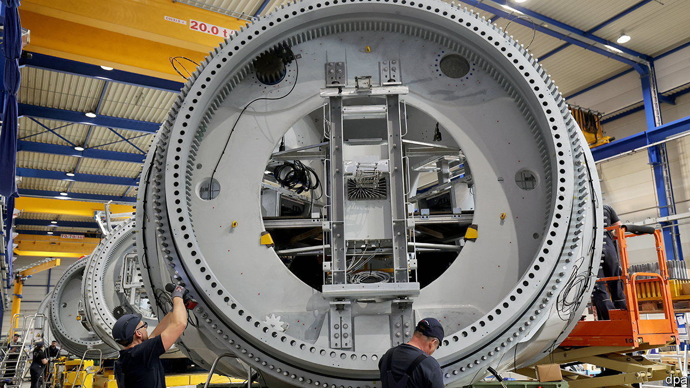

###### Green protectionism

# How the EU should respond to American subsidies 

##### Instead of imitating them, it should play to its strengths 

 

> Mar 23rd 2023 

This year the European Union will celebrate a momentous achievement: its single market turns 30. The unfettered movement of goods, people, services and money within the bloc, together with an openness to foreign trade and investment, has served the eu remarkably well. But, among the leaders of member countries who had gathered in Brussels to talk about the single market as was published, the mood was more anxious than jubilant. There is a nagging fear that the eu’s economic model may no longer be working.

Climate change calls for a bold and swift transformation of the economy. Vladimir Putin has weaponised trade for geopolitical gain, fuelling fears that Xi Jinping, too, may one day do the same. America, once the guardian of a rules-based order, has become brazenly protectionist. Its lavish subsidies, some with “Made in [North] America” strings attached, appear to be luring European carmakers such as Volkswagen into setting up electric-vehicle battery factories on the western side of the Atlantic. 

Faced with all this, Europe’s leaders are tempted to respond with handouts and protectionism of their . Indeed, the agenda for the meeting in Brussels features a range of proposals from the European Commission, including plans to support green tech and to secure supply chains. Yet before they loosen the purse-strings, leaders should remember the strengths of the eu’s market-based approach. 

Some of the commission’s ideas, such as spurring governments to speed up permits and to invest in skills, are sensible. Others represent a worrying shift. In a throwback to 1970s-style industrial policy, the commission now favours domestic production targets for important things such as heat pumps and the mining and refining of raw materials like lithium. 

For decades the commission fiercely restricted the use of “state aid” by members to tilt the playing-field towards domestic firms. Now it has weakened those rules to allow members to subsidise greener firms more freely and, within limits, to match other countries’ subsidies to entice investment to Europe. 

A carbon price beats handouts

Such policies risk squandering public money to little effect. For a start, the eu’s market-based approach to climate change, which is based on a carbon price, will make the transition a lot cheaper than in America, which is relying on handouts instead. One rule of thumb suggests that using subsidies alone could make the green transition three times as costly as a pure carbon-price approach. 

Europe worries that America’s largesse may cause domestic jobs and industries to flee across the Atlantic. True, the handouts may encourage some firms to bring forward some investments in America. But that is a boon to Europe, not a threat. Europe has a large and well-rooted green industry; battery firms and carmakers would be foolish to abandon as big a market as the eu. If America turbocharges the green transition, European firms and customers will benefit from cheaper technology and a greater choice of suppliers. 

A subsidy race, then, would be horribly wasteful. But there is still a role for wise public spending. Governments can help ensure that green tech has better access to finance, and they can bear some of the risks of investing in renewables. Public infrastructure, including electricity grids, should be upgraded, and poor households given subsidies to make their homes more eco-friendly. Thanks in part to the eu’s post-pandemic recovery fund, much of the money to do all this is already in place.

Responding to the economic and political threats that China poses is a lot harder. In contrast with America, the eu’s members lack a common understanding of what the goal should be. Germany’s coalition government is divided on the matter. For the time being, diversifying supplies of vital goods and raw materials, as the commission is proposing, is a good start. But rather than setting domestic targets, the best bet is to keep looking outward, and to develop deeper economic ties with other countries. 

Squeezed as it is between an assertive China and a protectionist America, the eu is right to rethink its economic strategy. But instead of copying the protectionism and meddling of other governments, it should draw on its strengths: a free internal market, limits on state subsidies and a vigorous trade policy. ■

