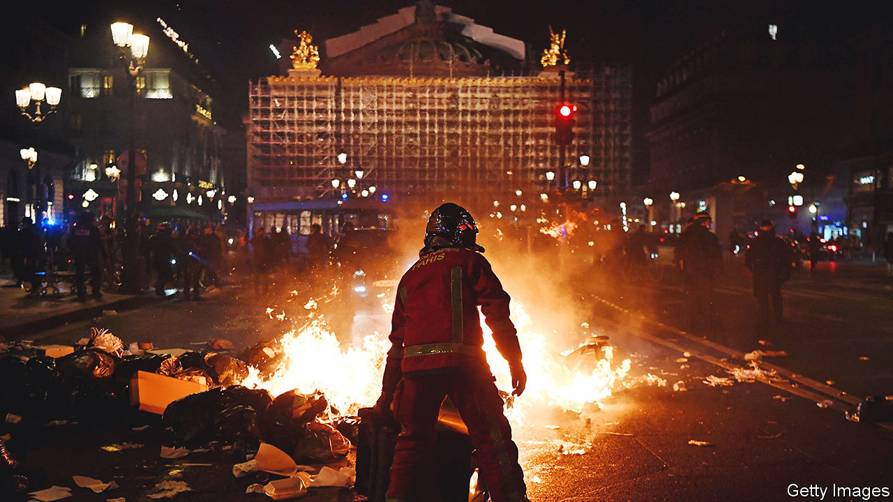

###### French reform

# The trouble with Emmanuel Macron’s pension victory 

##### The way a wise policy was forced through will have political costs 

 

> Mar 23rd 2023 

Any French president who asks his fellow citizens to retire later does so at his peril. When Jacques Chirac tried in 1995, crippling strikes made him shelve the project; 18 months later voters sacked his government. Piles of rubbish were left to rot on the streets, as they are today on the boulevards of Paris. Bin collectors have joined strikes against the decision by the current president, Emmanuel Macron, to raise the minimum pension age from 62 to 64. So it was with some relief that on March 20th his minority government narrowly survived two no-confidence votes, opening the way for his reform to enter the statute books.

The French president is not yet in the clear. The law must be approved by the constitutional council. And the French still know better than most how to deploy the force of the mob when all else fails. In 2006 countrywide protests forced Dominique de Villepin, then prime minister, to revoke new labour rules for young people even after they had been written into law. Now, once again, opposition leaders are agitating in the streets to overturn a reform that they could not get rid of in parliament. Do not rule out the risk of an uprising, like the one France witnessed during the  movement.

Mr Macron seems determined not to be pushed around by the protesters—and rightly so. His pension reform is imperfect, but essential. France spends 14% of its GDP on public pensions, nearly double the OECD average. This burden is rising as the population ages. France is home to 17m pensioners, 4m more than in 2004. Raising the retirement age is the soundest way to close the financing gap, as other European countries have proved.

Yet the president’s narrow escape has come at a high political cost. After failing to persuade the public, trade unions or the opposition of the need for his reform, Mr Macron judged that he could not risk a normal parliamentary vote. Instead he resorted to a constitutional provision that put his government’s survival on the line. This is perfectly legal: it has been used 100 times since Charles de Gaulle introduced it, including to build France’s nuclear deterrent. But it is increasingly seen as a way to impose a decision against the will of the people. For Mr Macron, whose haughty top-down governing style irks many, its use reinforces the impression that he will not listen.

This is dangerous, because Mr Macron’s narrow escape should not be the end of his ambitions to reform France. Much is still to be done, from the pursuit of net-zero emissions and full employment, to better schooling in tough and remote areas. The 45-year-old president is still in the first year of his second term, fizzing with energy and ideas. But minds are already wandering to 2027, and the dark threat that he may have to hand over the keys to the Elysée Palace to someone from the extremes, such as Marine Le Pen. Unless Mr Macron can improve the lives of his fellow citizens, he will not contain the  that turbocharges populism.

Even then, a record of reform may not be enough. Democratic leadership requires the constant and careful forging of consent. Now, more than ever, Mr Macron needs to correct his solitary manner, and show the French that he disrespects neither parliament nor the people.

With war raging in Ukraine, Europe benefits from a strong, stable France, the EU’s second-biggest economy and only military heavyweight. For France, imposing the pension reform was always going to be the second-best outcome. For Mr Macron, it is a reminder that in politics it is not always enough to be right.

The lesson goes wider than this. Those in France who want their next president to come from the democratic centre, not the far right, cannot afford to stay silent. Mr Macron alone is not to blame for this mess. A chunk of legislators from the centre-right Republicans, many of whom support reform, withheld their backing. The silence of those in politics, business and beyond, who know well that France needed change, was short-sighted and craven. They could end up paying a steep price. ■

