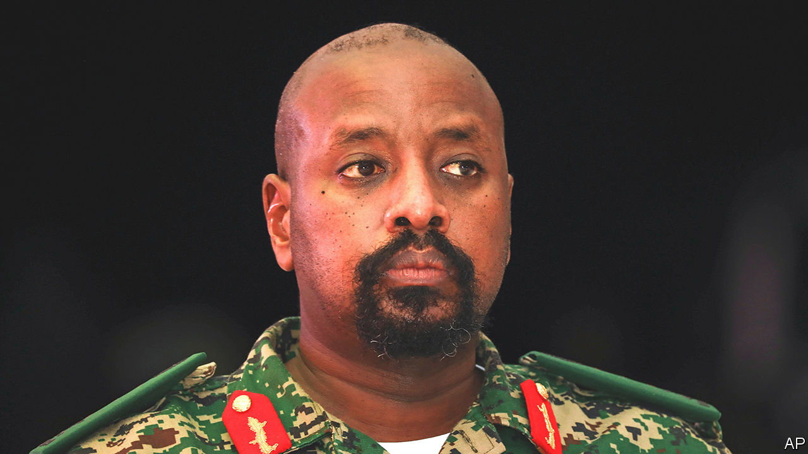

###### Not now, son

# A dictator and his entitled son are holding Uganda captive 

##### Family rule is a bad way to run a country 

 

> Mar 23rd 2023 

Many fathers have complicated relationships with their sons. But when a family controls the state, personal matters become a national concern. Uganda’s president, , has long cultivated General Muhoozi Kainerugaba, his eldest, promoting him in the army and forgiving his tempestuous moods. And now the son thinks it is his turn at the top. The result is friction in the army, chaos in the ruling party and confusion in the country.

General Kainerugaba says he is “tired of waiting” to be president. Twice in recent weeks he has tweeted, then deleted, his intention to stand at the next election, in 2026. By then, he has noted pointedly, “it will be 40 years of the old generation in charge”. Forty years, that is, since his own father marched into Kampala at the head of a rebel army. Mr Museveni, who is 78, may indeed want his son to succeed him when he dies. But he is yet.

And so the 48-year-old General Kainerugaba, who styles himself as the voice of youth, throws tantrums on Twitter. In October he joked about invading Kenya, prompting his father to sack him from his position as commander of the Ugandan land forces. In December he lashed out at the ruling National Resistance Movement (NRM), the party that Mr Museveni founded and leads. It is “probably the most reactionary organisation in the country”, he tweeted, and “certainly does NOT represent the people of Uganda”. He often tweets after a tipple, say insiders. 

The son’s impatience echoes that of other middle-aged members of the ruling elite, who find their path blocked by obdurate elders. They see the regime’s authority slipping and fear there will be little left for them to inherit. The old guard is pushing back. General Kainerugaba’s clique are “children” who have been “shepherded”, says Kahinda Otafiire, the 72-year-old interior minister, who fought alongside Mr Museveni in the bush. “Were they to face the challenges we faced, when they are not prepared, will they manage to hold the country together?”

The agitation of General Kainerugaba also touches the most sensitive issue in Ugandan politics: relations with neighbouring Rwanda. He has made several visits to Kigali to hobnob with President Paul Kagame, whom he calls “uncle”, and has declared his sympathies with his “brothers” in M23, a Rwanda-backed rebel outfit in eastern Congo. That unsettles other officers who are deeply distrustful of Rwanda’s intentions. But the first son refers to the Ugandan forces as “my army” and shows no inclination to be bound by its rules.

Tensions came to a head last June when M23 captured the Congolese border town of Bunagana with the acquiescence of Ugandan soldiers, who let the rebels move through Ugandan territory. Two weeks later the deputy military chief put the army on its highest state of alert. General Kainerugaba issued his own countermanding order. Other generals berated him for insubordination. One of his close associates, who would discuss the matter only anonymously, claims the first son disobeyed orders because he thought a coup was afoot.

Anyone else who behaved in this fashion would be court-martialled. But General Kainerugaba shows no signs of pulling back. He has said that those organising for his father’s re-election are “gangsters, criminals and disasters”. He is now holding rallies to promote the “MK Movement”, named after himself. It stands for little except his own ego.

Such are the symptoms of political decay. Over his four decades in power, Mr Museveni’s trust has narrowed in concentric circles: first to his own region, then to his ethnic group, then to his family. Debates about the future of the nation are now reduced to whispers about palace politics. While he is healthy, the president holds all the cards. It remains unlikely that any of the jostling factions in the army would move against him. But it is no longer unthinkable.

Why then does Mr Museveni not pull his son into line? Some say he sees the kerfuffle as a convenient distraction from his never-ending rule; others say that he cannot bear to crush his own. It would not matter so much, had he not gathered all power in his own hands. ■

