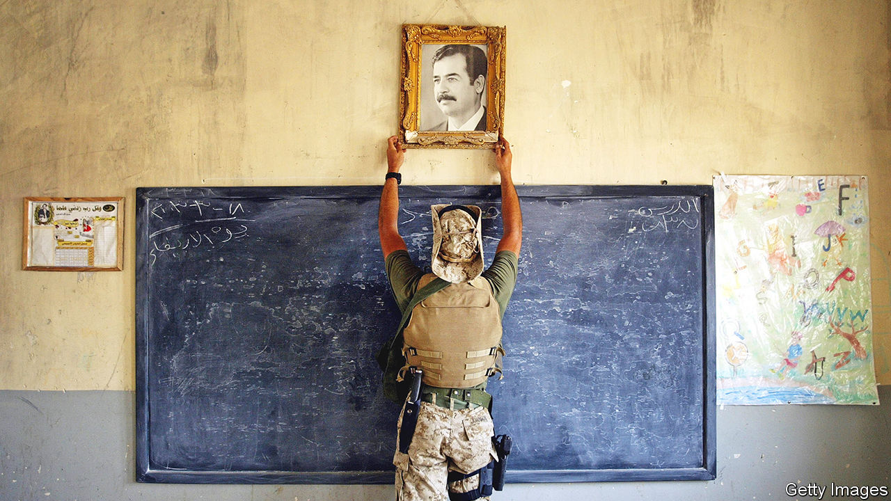
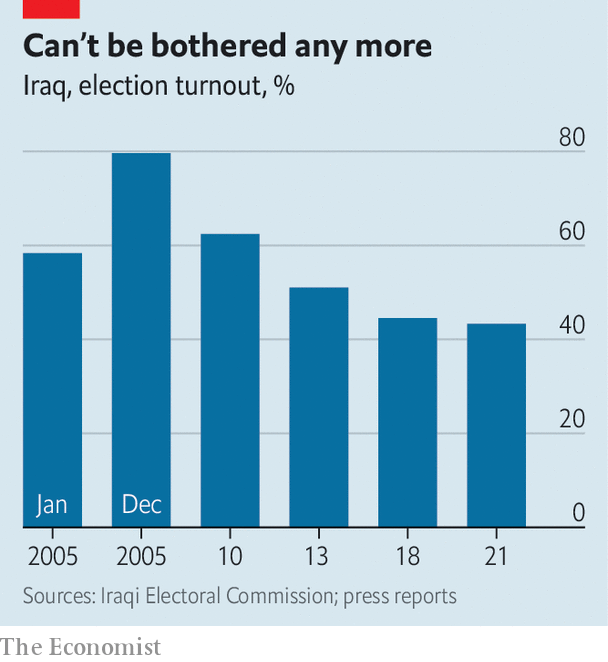

###### The wreckage of Iraq

# After 20 years of trauma, Iraq is struggling to recover 

##### Baghdad is more or less peaceful, but corruption and misgovernment prevail 

 

> Mar 23rd 2023 

After two decades of , Iraq is at last showing signs of recovery. Most of the concrete blast walls that sliced up cities have come down. Baghdad, the capital, is reviving, towered over by a new central bank. The road to the airport, once dubbed the world’s most dangerous because of the snipers along the way, is lined with private universities and housing estates. “Before, we had to clear roads of landmines,” says the head of a paramilitary engineering unit. “Now we clear people’s sewage.” 

Though politics is still messy and corrupt, with parliament and government subject to bitter horse-trading between parties in hock to sectarian militias, a measure of representative . The Shia majority, suppressed under the vicious Sunni-led dictatorship of Saddam Hussein, is sitting pretty, its leaders content to reap the rewards of power and patronage. The application of religious laws has softened. Unveiled women again walk the streets. 

A main reason for this return to relative normality is that violence has largely abated. Last year about 60 people were killed every month, according to Iraq Body Count, a British-based monitor, whereas at the height of the sectarian civil war in the years that followed the American invasion of 2003, the toll often exceeded a hundred a day, with suicide-bombings sometimes killing whole crowds in markets. The last big bomb in Baghdad was over a year ago.

Yet the trauma of the past two decades cannot easily be wiped away. At least 270,000 Iraqis, more than half of them civilians, perished violently in that period, as well as 8,000-plus American service people and contractors, according to a monitoring project at Brown University in America. Mosul, the country’s third city and heart of the Sunni north, was ruined as the central government recaptured it from the Sunni jihadists whose caliphate oversaw a reign of terror over much of the north and west in 2014-17. 

Many of Iraq’s ancient minorities, notably the Christians, have been chased abroad or into the Kurds’ autonomous haven in the north. Under the caliphate thousands of Yazidis, adherents of a sect in northern Iraq that draws from elements of Christianity and Islam, suffered what nearly amounted to genocide.

Only the Kurds can claim a more or less unbroken period of progress and calm as a result of the American invasion. Protected initially by American force and by their own militias, their autonomous region has been far less affected by the violence that shattered the rest of the country. Their government in Erbil continued to function while the rest of Iraq fell into bloodshed and chaos. But the Kurds’ bid for complete independence looks unlikely to succeed; in 2017 forces under the aegis of the government in Baghdad recaptured a chunk of territory the Kurds had occupied, including the oilfields of Kirkuk. 

 


Ordinary Iraqis have yet to benefit from the oil wealth of the country, the world’s fifth-biggest producer. Some 25% of the population have incomes below the national poverty line, the government says. This is because billions of dollars from oil revenues have been lost to corruption, leaving public services overwhelmed even as Iraq’s population has soared, from 27m in 2003 to 44m at last guess. A third of young Iraqis have no jobs. Schools are dilapidated. Electricity is as patchy as it was after America invaded. 

The failures of Iraq’s government are making the democracy promised by America look increasingly threadbare. Elections are held on time but are manipulated by militia bosses. Turnout has steadily declined. Freedom of speech, a big bonus of Saddam Hussein’s removal, is declining. Journalists who criticise the militias may be killed. Protesters who take to the streets are liable to be met with guns. 

Yet the younger generation, for whom the American invasion is a distant memory, has not given up hope. In late 2019 mass protests unseated a prime minister and called for better services and an end to corruption. The protesters were brutally repressed. But their thirst for a decent government and a decent society cannot be denied for ever. ■

