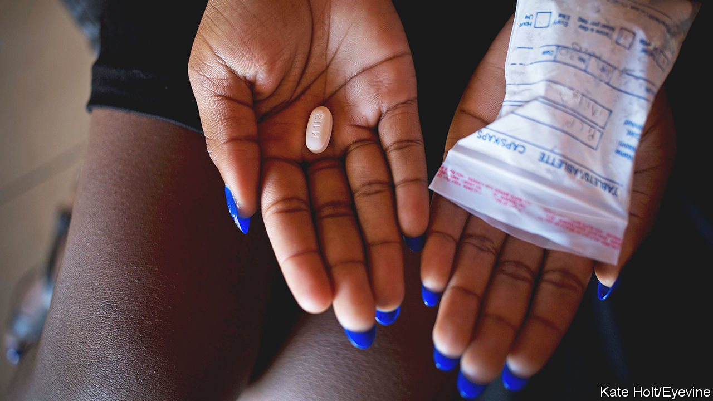
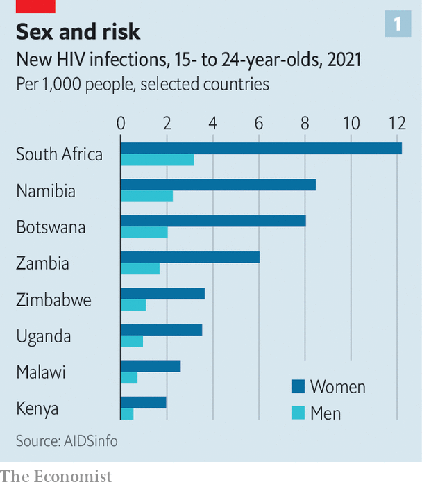
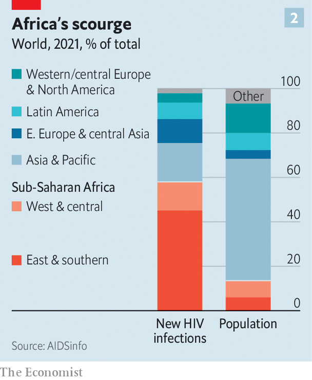

###### Age gaps and infection

# New drugs may protect girls having sex with older men from HIV 

##### The virus circulates between generations. New medicines could slow it dramatically 

 

> Mar 22nd 2023 

When Lesedi was growing up in Johannesburg, South Africa’s commercial capital, her family was so poor that she used a cloth filled with sand as a makeshift sanitary product. That changed when, at the age of 14 (which is below the legal age of consent), she began having sex with a man nearly 15 years older who gave her rides to school and bought her toiletries. The boyfriends who followed in her teenage years and early twenties were increasingly generous. “If I were to date you, you had to make sure that you’re working first,” says Lesedi (whose name we have changed). “Love alone can’t give me food.” One married man paid for her apartment and outfits, and gave her money to support her family. She got everything she wanted, says Lesedi, until she found out that she was infected with HIV. 

 


Relationships between adolescent girls or  are a big cause of new HIV infections globally. Eastern and southern Africa have about a tenth of the world’s population, yet accounted for nearly half of the world’s 1.5m new HIV cases in 2021. And young women (aged 15-24) are disproportionately affected, with infection rates more than three times higher than in their male peers (see chart 1). Like Lesedi, many of these girls and women have become infected while dating a succession of older men. A few years later many pass it on when they meet someone closer to their own age with whom they wish to settle down. “This is when HIV is transmitted to this young man, who then becomes the older man,“ says Linda-Gail Bekker of the Desmond Tutu HIV Centre at the University of Cape Town. “So you have the vicious HIV cycle.”

Breaking this cycle is one of the biggest challenges in public health. Efforts to change the behaviour of young women and older men are seldom successful. Instead, the solution may be pharmacological, in the form of pre-exposure prophylactic (PrEP) drugs that healthy people take to avoid contracting HIV. New and  for women are becoming available or are in late-stage development. If they become widely used by girls and women having sex with older men, Africa’s HIV epidemic will take a sharp turn down. 

Explaining the age gap

Relationships with sugar daddies (which wonks prefer to call “transactional sexual relationships”) are different from sex work. Some women talk about being romanced by older men and getting emotional support from them that they might not get from men their own age. Girls in South Africa often start having sex at the age of 14 or 15 when, puberty-wise, they are more sexually mature than their male peers, says Dr Bekker. Some start relationships with slightly older men as part of discovering their sexuality, flattered that they are so attractive to them. Research in South Africa has found that the man is usually five to eight years older, though there are also cases like Lesedi’s, with a man a generation older. 

Attitudes to men in such relationships are encapsulated in what many young Africans call their older male partners: “blessers”. Some women boast on social media about their gifts (using #blessed). Having a blesser provides social status as well as trendy clothes, smartphones and other goodies that their parents cannot afford to buy for them, says Joyce Wamoyi of the National Institute for Medical Research in Tanzania. Such gifts are common among university students. In the poorer countryside, by contrast, men provide money for necessities such as food and clothing. 

Younger men struggle to compete for the attention of young women because they tend to earn less money than older men. Yet their male elders are much more likely to have HIV, simply because they have been having sex for longer and with more partners in societies with high rates of HIV. Men in their 20s—often the first partners of adolescent girls—are less likely to know they are infected and, therefore, to take antiretroviral drugs (ARVs), which would make them less likely to pass the virus on through sex. A study conducted in 2016 in KwaZulu-Natal, a province in South Africa with a high prevalence of HIV, found that the sexual partners of women younger than 25 were, on average, 8.7 years older. The partners of women who were 25-40 were only a year older. Clusters of related infections identified through HIV genotyping led the researchers to conclude that younger women got infected by older men. Then, as they grew older, they infected men of their own age.

Various programmes aiming to change this have mostly failed. Charities have tried giving poor adolescent girls small amounts of cash to meet their basic needs. But once they have food on the table as a result of such handouts, says Dr Wamoyi, they aspire to have more, such as nicer clothes; and once they have that, they want more expensive things, such as a smartphone. A cash grant programme may give them the equivalent of $10 or $20 every three months. “An older man can give you $20 on the spot,” she says.

 


A more promising idea is to prevent girls and young women from becoming infected, ideally using methods which do not require them to persuade a man to wear a condom (which is difficult). Among these are three PrEP methods that have become available in recent years: a vaginal ring, a daily pill and an injection every second month. Convincing women at risk of HIV to use them can, however, be a challenge.

The vaginal ring, an insertable silicone device that releases an ARV drug and must be replaced every month, can reduce the risk of HIV infection by as much as 50%. But “it’s not going to be everybody’s cup of tea,” admits Dr Bekker. 

The daily PrEP pill, which contains a combination of ARV drugs, has been available in Africa for several years. But it has been tricky to pinpoint how effective it is because even in clinical trials too few women used it consistently. Some studies estimate that, if used properly, these pills can reduce the risk of HIV infection by as much as 90%. But it is hard to take the medication discreetly at work or school and tricky to hide from a parent or a boyfriend.

Women worry about stigma if people think that they are taking the pills because they have HIV. And many people, particularly youngsters, are not very good at remembering to take medication every day, says Dr Bekker. “They have enthusiasm, they get started, but then the persistence falls off quite rapidly,” she says. Some also choose to take their pills only around the time they have sex. A study of 427 girls and young women in Africa published in 2019 found that a year after starting this type of prophylaxis only 9% had levels of the drug in their blood that suggested they were still taking it regularly. 

The most promising option is an injectable form of PrEP. This contains a long-acting form of cabotegravir, which stops an important stage in the replication of HIV in host cells. It is delivered as an injection, initially once a month and then every two months, and was included in the World Health Organisation guidelines on HIV prevention last year. In clinical trials with women in Africa, it was nearly 90% more effective than oral PrEP. Regulators in Zimbabwe and South Africa approved it late last year; other African countries are expected to follow. 

Injectable contraceptives are already the most popular type of birth control in Africa, so women in the region may take to injectable PrEP more easily than the vaginal ring or the pills. And more convenient versions of it are in clinical trials. Lenocaprivir, which is injected every six months, is in late-stage trials. Unlike cabotegravir, which is an intramuscular jab, lenocaprivir is a subcutaneous injection. This means it can be administered by community health workers, rather than nurses, or even self-administered. Its timing will also align with the most popular injectable contraceptives, which are taken every three months. Women going to a family-planning clinic could get their HIV shot, too, “and nobody would ever know about it,” says Nina Russell of the Bill &amp; Melinda Gates Foundation, a charity.

The impact could be large. Modelling published earlier this year in the  found that the introduction of injectable cabotegravir in sub-Saharan African could almost double uptake of PrEP to 46% of those who need it, from about 28% if it were not introduced. The authors reckon that this would avert 29% of new HIV infections over 20 years and bring cases within a whisker of the HIV-elimination threshold of one new infection per 1,000 people.

Much will depend on the cost of injectable PrEP. The  study estimates that cabotegravir would be cost-effective at about $60 for a year’s supply, which is almost the same as the cost of oral PrEP. Viiv, the company that makes the drug, says it will offer it at a non-profit price to public programmes in sub-Saharan Africa until a generic version is available, though it has yet to reveal the price (it charges $22,000 for it in America). It has signed a deal with the Medicines Patent Pool, a UN-backed organisation that promotes the manufacture of generic versions of patented drugs for poor countries. But setting up production in a low-cost factory, perhaps in India or Africa, will take time. Meanwhile, African countries will need aid organisations to help pay for the new drug. 

It may be a while before long-acting PrEP drugs are widely available in Africa. But they are coming. And with them, eventually, the hope of ending the HIV epidemic on the continent. ■

