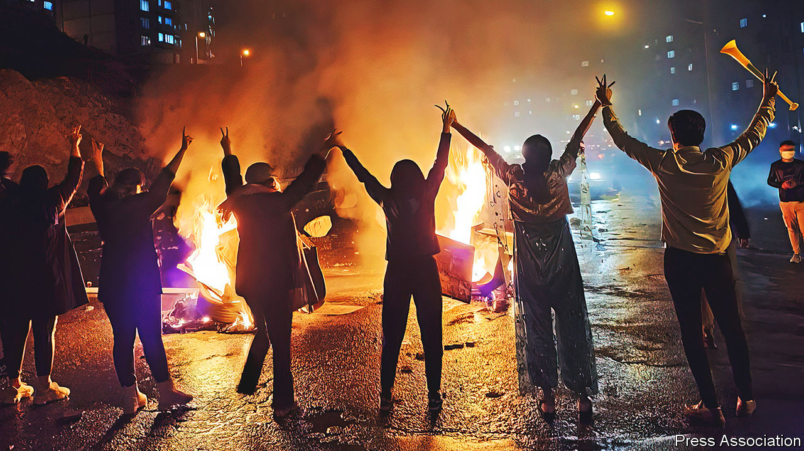
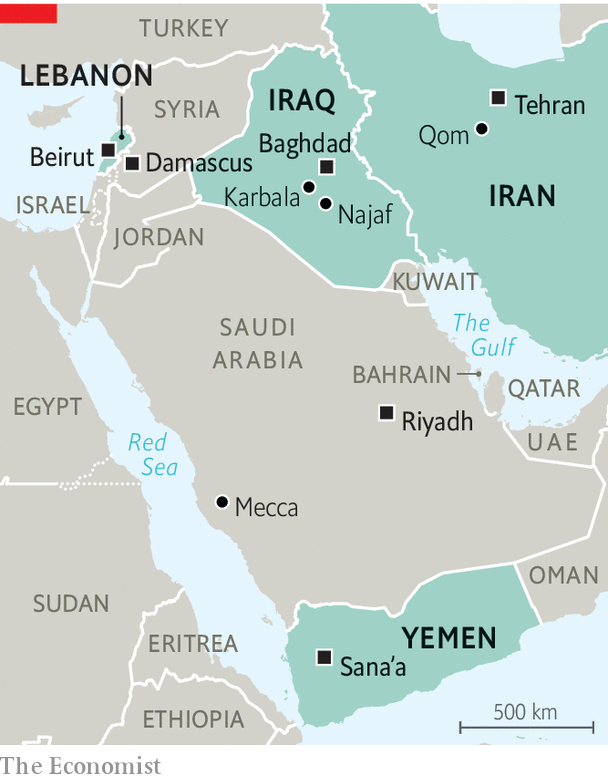

###### The flickering Shia crescent

# Shia Muslims are no longer in the ascendant 

##### Despite taking over Iraq, the Shias have been losing momentum 

 

> Mar 23rd 2023 

Visting iraq’s latest grand shrine in what is said to be the world’s largest cemetery, in the holy city of Najaf, has become something of a pilgrimage for people from across the region wanting to salute two of Shia Islam’s modern heroes. One is , the long-serving commander of the Quds force, the foreign arm of Iran’s Islamic Revolutionary Guard Corps (IRGC); the other is Abu Mahdi al-Muhandis, the commander of the beefiest umbrella group of Shia militias in Iraq, whose grave is at the shrine. (Suleimani is buried in southern Iran.) Both were killed three years ago in Baghdad by an American drone strike aimed at Suleimani, whose job was to protect and  across the region. 

Busloads of fellow Shias—from Lebanon and Bahrain as well as Iraq and Iran—come to the shrine to hail the pair for carving out a Shia domain that gave their sect, which caters for about 15% of Muslims across the world, a rare moment of triumph across the region. “Never again will we be the shoe-shiners and street-sweepers of the Middle East,” says a militiaman from Lebanon, referring to the centuries of domination by Sunni Muslims like those who still reign over Egypt, Saudi Arabia, Turkey and beyond. 

Were it not for America’s invasion of Iraq 20 years ago, the Shia resurgence might never have happened. Iran’s Islamic revolution in 1979 launched the project to elevate the region’s minority. But the dismantling of Saddam Hussein’s Sunni-led regime heralded its spread, replacing it with a government system that put Iraq’s Shia majority in charge. Uprisings in the Arab spring of 2011 shook the region’s Sunni order still more, creating power vacuums that Iran often sought to fill.

Under Iran’s baton, Shia militiamen poured into Syria from as far afield as Afghanistan and Pakistan. In Lebanon a Shia political movement-cum-militia, Hizbullah, became the country’s dominant force. In Yemen a Shia revivalist militia under the Houthi banner swept into Sana’a, the capital. From north, south and east Shia militias launched their drones at Saudi Arabia, the bastion of Sunni Islam, striking its royal palaces in the capital, Riyadh, and briefly incapacitating half of the kingdom’s oil supply. In 2004 King Abdullah of Jordan lamented that a new “Shia crescent” was endangering the old Sunni world. 

 


Shia clerics trained in Iran’s religious capital, Qom, led Lebanon’s Hizbullah, much of Yemen, three of Iraq’s six main Shia parties, as well as Iran itself. Their main shrines in the Iraqi cities of Najaf and Karbala attract more pilgrims than Mecca in Saudi Arabia. They have routed the Sunni jihadists who created the caliphate that straddled eastern Syria and north-western Iraq. And they have gathered a vast arsenal, with an estimated 150,000 missiles pointing at Israel alone. Shia Iran has realised its age-old dream of reaching the Mediterranean by land and more recently air, through Iraq and Syria and on to Lebanon.

But the Shia moment may have passed. Iran’s regime is in trouble, facing opposition on the street and from within its dithering, ageing ruling circle.  is mired in corruption, periodic violence and misgovernment. Succession crises are brewing in both. “There’s a realisation that the Islamic order is reaching a dead end,” says Ali Taher, who runs Bayan Centre, a think-tank in Baghdad.

One reason is that the clerics have been bad at managing economies. Incomes have plummeted, currencies have crashed and inflation has soared across the Shia crescent. Lebanon’s pound is the world’s worst-performing currency this year. The Syrian pound has fallen from 47 to the dollar before the Arab spring in 2011 to 7,550 this year. Iran’s economy has struggled since America walked away from a nuclear deal in 2018 that had eased sanctions in exchange for curbs on Iran’s . Its currency has since slumped from about 45,000 rials per dollar to a low of about 580,000. (Before the revolution in 1979 a dollar would buy 70 rials.) 

From crescent to moonshine

Iraq should have bucked the trend. Alone among Shia states it retained its ties to the global economy under American tutelage. But its power-brokers squandered its oil wealth. Across the wider region Shia militia leaders have exploited the black economy, overseeing smuggling rings and the mass production of recreational drugs. Even in Lebanon, once the leading banking centre of the Middle East, Shia leaders have shared in the catastrophic mismanagement of the economy. 

Democracy in Iran, the self-proclaimed beacon of Shia governance, has shrivelled, even within the tight confines of clerical rule. Turnout in Iran’s election in 2021 was the lowest since 1979. In Iraq, among Shias, it has fallen from 80% after the fall of Saddam Hussein by more than half to perhaps 20% in 2021, when independent candidates topped the poll. In the southern districts of Beirut, Lebanon’s capital, support for Hizbullah, which still dominates the area, is said to be dwindling.

The declining popularity of Shia Islam is most noticeable in Iran. Mass protests used to erupt roughly once a decade. Since 2017 they have burst forth every few years and have spread from the main cities to provincial towns. They now embrace working-class Iranians, long considered the regime’s base, as well as students and the middle class. A recent poll suggested that more than 80% of Iranians approve of the current protests. 

As disaffection grows, many Shias are losing faith, not just in the ayatollahs’ ideology but in religion itself. , the practice of strict obedience to the ayatollahs, is weakening. Women, in particular, want to shed religious dress codes and clerical patriarchy. Many are increasingly discarding the veil, once hailed by Ayatollah Ruhollah Khomeini, the regime’s founder, as “the flag” of the Islamic Republic. 

In Iraq, too, protesters have begun turning on the clerics whose fatwas endorsed the political system. “In the name of religion, we have been robbed by the thieves,” one banner recently declared. In some mosques in Baghdad’s middle-class neighbourhoods, clerics have abandoned their Friday sermons because they no longer draw crowds. Surveys suggest that, though most Iraqi Shias still respect their ayatollahs, they no longer obey them blindly, especially in matters of personal observance.

Iran’s supreme leader, Ayatollah Ali Khamenei, is 83 and ailing. His succession is shrouded in doubt. None of the front-runners seems likely to revive the regime’s fortunes. Ebrahim Raisi, Iran’s turbaned president, is lampooned by fellow clerics for his lack of religious qualifications. Mr Khamenei’s son, Mojtaba, has sought them by teaching in Qom. But his nomination would smack of the dynastic rule that Iran’s revolution cast aside. 

The choice is limited because Mr Khamenei long ago silenced Muhammad Khatami, a former president who has called for a “fundamental transformation” of the system. Another former occupant of that post, Akbar Hashemi Rafsanjani, was hounded out before his death. Mir Hossein Mousavi, a former presidential candidate who spent 13 years under house arrest, recently called for a referendum on whether Iran should remain an Islamic republic.

Some insiders suggest that the commander of the IRGC, Hossein Salami, may try to grab power if the clerics are unable to hold the country together. The corps might even offer a “new social contract”, speculates a political analyst in Tehran. The IRGC already dominates Iran’s armed forces, the parliament, the intelligence services and perhaps 40% of the economy, so a coup is far from unthinkable. “We’re living in suspended animation between one era and the next,” says a university lecturer.

Should the IRGC seize the reins, says a government adviser, it would ditch the clerics’ isolationism and reach out to the West”. It could accommodate Iran’s prosperous business class and even its vocal diaspora that has long been at odds with the ayatollahs. The IRGC might even drop, or reduce, Iran’s support for its allies abroad, such as in Syria, Lebanon and Yemen. And it could build on Mr Khamenei’s recent decision to re-establish relations with the republic’s bitterest Sunni rival, Saudi Arabia.

Long beards, long faces

Iraq is facing its own clerical succession crisis. This is less overtly political, because Iraq’s electoral system is not under the thumb of theocrats in the same way that Iran’s is. And Iraqi clerics tend to hold back from direct rule, preferring to nudge their candidates from the sidelines, though some, such as Moqtada al-Sadr, a populist cleric, have led from the front. 

Even so, politicians have generally sought the blessing of clerics such as Ali al-Sistani, Iraq’s 92-year-old chief ayatollah. When the Sunni jihadists of Islamic State were threatening to take over the whole country in 2013, Mr Sistani called all Shias to arms. But more recently he has withdrawn from the political scene, and no clear successor has emerged. “The age of the is ending,” says a Shia commentator, referring to the font of Shia religious authority. Mr Sadr may harbour ambitions to replace Mr Sistani as the leading light among Iraqi clerics, but an array of other Shia leaders are fiercely against him.

In any case, since America assassinated Suleimani and Muhandis in 2020, Iran has struggled to stop its satellites from breaking away. “They’re asking why we should be agents of Iran,” says an analyst in Beirut close to Hizbullah’s leadership, when asked why Hizbullah had agreed to last year’s maritime deal with Israel mediated by America. President Bashar al-Assad of Syria is also doing his own thing. He has recently been welcomed with honours in the United Arab Emirates, visited Oman and received Egypt’s foreign minister. Despite its close affiliation to Iran, Iraq’s latest government may have nettled Iran’s rulers by becoming friendlier with Sunni-led states in the Gulf. 

Iran and Iraq still make a powerful pair of Shia states. But they are both in a mess. They and their allies in the region are beginning to hedge their bets. Across the Sunni world, King Abdullah’s striking phrase no longer feels so aptly fearful. ■

