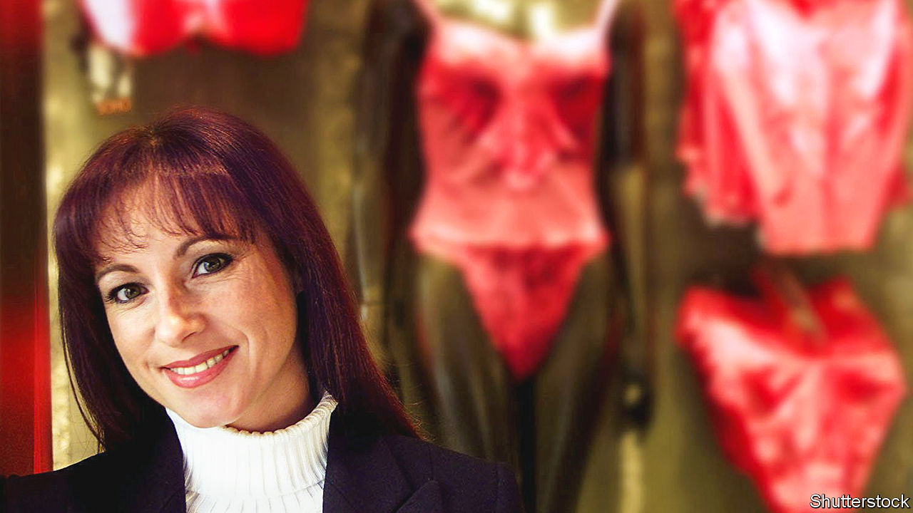

###### Good vibrations

# Jacqueline Gold freed women to shamelessly enjoy themselves 

##### The builder of the Ann Summers empire died on March 16th, aged 62 

 

> Mar 23rd 2023 

The party wasn’t one Jacqueline Gold would normally have gone to. It was in a council flat in Thamesmead, a dreary estate out on the estuary. She was used to more select Biggin Hill farther south, where she grew up in a big detached house with a pool and a view over rolling fields. But in 1981 she went to Thamesmead with a friend, to a Pippa Dee party, where women got together to buy clothes. Home-selling had been a craze for a while, starting with Tupperware, where bored housewives sold each other countless plastic bowls and jugs to get commission and free gifts. Pippa Dee parties were a bit more fun than that. 

This one certainly was. For a start, men were banished to the shed or the pub. The wares were interesting, with quite a lot of lingerie in decent fabrics. Then the wine came out, and the women started to play games. In one, she was asked to draw her husband’s “meat and two veg” off the top of her head. The room was in peals of laughter. They all knew she was handling the payroll for the four run-down Ann Summers sex shops which her father David had acquired. What about an Ann Summers party? someone said. It sounded a great idea. 

Things couldn’t go on as they were. Many women wanted to spice up their marriages, but wouldn’t venture near the blank windows of a sex shop. She wouldn’t dream of it; she was shy enough, painfully shy, as it was. The customers were almost all male and seedy, the dirty-mac brigade, and they bought the sorts of things they, not their wives, thought sexy: slutty, scratchy underwear in red and black nylon, or sky-blue nylon baby-dolls. Women were silently fed up with this, and something had to change. 

In middle-class Biggin Hill she tried her idea out. She held a girls-only party to which, casually, she also brought sex toys. After lingerie time, she switched the toys on and passed them round. The women had never seen such items before. They were giggly, nervous and excited, all at once. Clearly, there was a market there. Into the 2000s she built that hunch up to a peak of 13,000 party hosts (during covid, on Zoom, ardour multiplied), around 150 high-street-worthy shops, a racy online presence and a turnover of £150m a year. Women in Britain had been freed to have the sex lives they wanted, without necessarily involving a man at all. 

Of course men, even in 1981, took some convincing. When she presented her idea to the Ann Summers board, all middle-aged males in grey suits, they were scornful; she was only on work experience and paid less than the tea lady. One member complained that women weren’t even interested in sex. But her father supported her, giving her £40,000 to take the company where she wanted. It was a big change of heart for him, a man who had clawed his way up from East End rags to riches, and who cried when she was born because she wasn’t a son who could carry on his businesses after him. Well, surprise, that was just what she could do. 

So off she went, placing ads for party hosts in the  and driving regularly to the Strand Palace hotel in her mustard-yellow Mini to hold recruiting seminars. She found 500 in a year, bold stuff, since to the authorities this was still illegal sex work. In Bristol, at a trade show, she was arrested and told to close down her stall. Job Centres refused to let her advertise her vacancies, until a judge ruled in her favour. In Dublin, when she opened her “pleasure emporium” on the sacred site of O’Connell Street opposite the Post Office, she was sent a bullet in the post. 

She defused the opposition, first, by being herself. She was not some intimidating over-made-up madam but a small, pretty woman with long brown hair and an easy, open smile. Setbacks simply encouraged her. The party atmosphere spread from suburban living rooms to the shops, where mannequins in microunderwear filled the windows, and where browsers could find strip-search-policewomen’s bustiers up to size 24, fake-silk suspenders, popping candy choco willies, Kama Sutra position cards and almost anything else in that line. She leapt quickly on trends. After the Rampant Rabbit vibrator featured in “Sex and the City” on tv, vibrator sales reached 2.5m a year, and during the “Fifty Shades of Grey” craze she brought in bondage starter kits. Three-quarters of her customers were women and 70%, she reckoned, were ABC1s, upper-middle-class professionals who found it daring, in a good way, to go through those doors. 

Ambition and enjoyment drove her, but there was another motive. To sell sex as fun was a way of reclaiming the worst years of her life, when sex had meant only misery. Her upbringing had been comfortable, but she was a funny little child, fussy about food and not much loved. Her stifling mother kept her away from the street and from friends. When she was 12, her mother began an affair with David’s best friend John. It was carried on in John’s house after her mother had picked her and her sister up from school; they would be dumped in the garden to wait, often in the cold, while the couple cavorted inside. When her mother got divorced John became her stepfather, a terrifying figure who would watch her in the shower and as she slept, and did everything he could to her short of penetration. At 15 she managed to tell him to stop and, surprisingly, he did. But sex for her had become what the shops of the time offered: a furtive, sordid thing. Marriage, at 20, improved her view of it, but by then she was beginning to pour her energies into the lacy, thrilling empire she was building. 

She had not nearly finished the job when breast cancer first attacked her, in 2016. In that very year she was awarded the CBE for services to enterprise and women in business, but there was plenty left to do. Empowering women in both bedroom and boardroom was her aim, but though the bedroom was now a gloriously open playing field, the boardroom lagged behind. Again, she drew on her own experience to explain it. Girls, she said, were brought up to be perfect, and boys to be brave. Most men therefore believed they could do anything; women too often felt they fell short. It would take time to change the attitudes laid down over millennia. But she had given them a satisfying push in the right direction. ■

