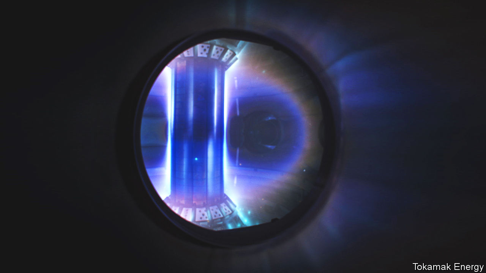
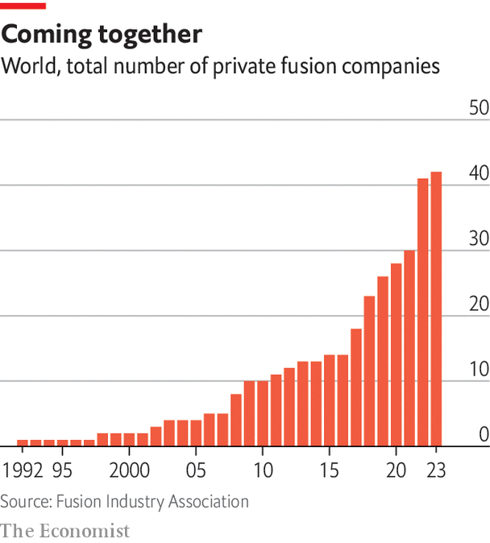
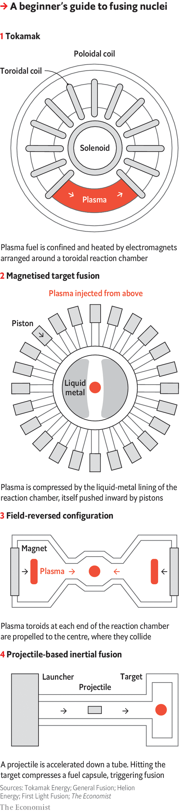

###### Private fusion

# Fusion power is coming back into fashion 

##### This time it might even work 

 

> Mar 22nd 2023 

On January 12th Oxfordshire County Council, in England, gave the go-ahead for a new building near the village of Culham. The applicant, General Fusion, is a Canadian firm, and the edifice will house its Fusion Demonstration Program, a seven-tenths-scale prototype of a commercial nuclear-fusion reactor. The firm picked Culham because it is the site of JET, the Joint European Torus, an experimental fusion reactor opened in 1983 by a consortium of governments. That means there is plenty of local talent to be recruited. 

General Fusion is not alone. On February 10th Tokamak Energy, a British firm, announced plans for a quarter-scale prototype, the ST80, also at Culham. And in 2024 they will be joined there by Machine 4, a pre-commercial demonstrator from another British outfit, First Light Fusion.

Meanwhile, across the ocean in Massachusetts, Commonwealth Fusion Systems is already building, in Devens, a town west of Boston, a half-scale prototype called SPARC. On the other side of America, in Everett, Washington, Helion Energy is likewise constructing a prototype called Polaris. And in Foothill Ranch, a suburb of Los Angeles, TAE Technologies is similarly working on a machine it calls Copernicus.

These six firms, and 36 others identified by the Fusion Industries Association (FIA), a trade body for this incipient sector, are hoping to ride the green-energy wave to a carbon-free future. They think they can succeed, where others failed, in taking fusion from the lab to the grid—and do so with machines far smaller and cheaper than the latest intergovernmental behemoth, ITER, now being built in the south of France at a cost estimated by America’s energy department to be $65bn. In some cases that optimism is based on the use of technologies and materials not available in the past; in others, on simpler designs.

 


Many of those on the FIA’s rapidly growing list are tiddlers. But General Fusion, Tokamak, Commonwealth, Helion and TAE have all had investments in excess of $250m. TAE, indeed, has received $1.2bn and Commonwealth $2bn. First Light is getting by on about $100m. But it uses a simpler approach than the others (“fewer screws”, as Bart Markus, its chairman, puts it), so has less immediate need for cash. 

All these firms have similar timetables. They are, or shortly will be, building what they hope are penultimate prototypes. Using these they plan, during the mid-to-late 2020s, to iron out remaining kinks in their processes. The machines after that, all agree, will be proper, if experimental, power stations—mostly rated between 200MW and 400MW—able to supply electricity to the grid. For most firms the aspiration is to have these ready in the early 2030s.

Un peu d’histoire

The idea of harnessing the process that powers the sun goes back almost as far as the discovery, in the 1920s and 1930s, of what that process is—namely the fusion of protons, the nuclei of hydrogen atoms, to form helium nuclei (He), also known as alpha particles. This reaction yields something less than the sum of its parts, for an alpha particle is lighter than four free protons. But the missing mass has not disappeared; it has merely been transformed. As per Einstein’s equation, E=mc, it has been converted into energy, in the form of heat.

This sounded technologically promising. But it was soon apparent that doing it the way the sun does is a non-starter.

Persuading nuclei to fuse requires heat, pressure or both. The pressure reduces the space between the nuclei, encouraging them to meet. The heat keeps them travelling fast enough that when they do meet, they can overcome their mutual electrostatic repulsion, known as the Coulomb barrier, and thus allow a phenomenon called the strong nuclear force, which works only at short range, to take over. The strong force holds protons and neutrons together to form nuclei, so once the Coulomb barrier is breached, a new and larger nucleus quickly forms.

The temperature at which solar fusion occurs, though high (15.5m°C), is well within engineers’ reach. Experimental reactors can manage 100m°C and there are hopes to go higher still. But the pressure (250bn atmospheres) eludes them. Moreover, solar fusion’s raw material is recalcitrant. The first step on the journey to helium—fusing two individual protons together to form a heavy isotope of hydrogen called deuterium (a proton and a neutron)—is reckoned to take, on average, 9bn years.

What engineers propose is thus a simulacrum of the solar reaction. The usual approach—that taken by General Fusion, Tokamak Energy, Commonwealth Fusion and First Light, as well as government projects like JET and ITER—is to start with deuterium and fuse it with a yet-heavier (and radioactive) form of hydrogen called tritium (a proton and two neutrons) to form He and a neutron. (Fusing deuterium nuclei directly, though sometimes done on test runs, is only a thousandth as efficient.)

Ignition sequence start

The power released emerges as kinetic energy of the reaction products, with 80% ending up in the neutron. The proposal is to capture this as heat by intercepting the neutrons in an absorptive blanket and then use it to raise steam to generate electricity. Reactors will also, the idea goes, be able to make the tritium they need (for tritium does not occur naturally) by including in the blanket some Li, an isotope of lithium which reacts with neutrons to generate tritium and an alpha particle. Deuterium is not a problem. One in every 3,200 water molecules contains it.

Not everyone, though, is taking the deuterium-tritium route. Helion and TAE are instead proposing versions of what is known as aneutronic fusion.

Helion’s suggestion is to start with He (two protons and a neutron), a light isotope of helium which is an intermediate stage in the solar reaction. But instead of fusing two of these, as happens in the sun (yielding He and two protons), it fuses them one at a time with deuterium nuclei, to produce He and a proton. The He would be replenished by tweaking conditions to promote a side reaction that makes it from two deuteriums.

TAE proposes something yet more intriguing. Its fuels are boron (five protons and six neutrons) and ordinary hydrogen, both plentiful. When these fuse, the result breaks into three alpha particles. Indeed, TAE originally stood for Tri-Alpha Energy. The problem is that to work satisfactorily a boron-proton fusion reactor will have to generate not a mere 100m°C but 1bn°C. 

Even with deuterium-tritium fusion there are many ways to encourage nuclear get-togethers. The aim is to create conditions that match what is known as the Lawson criterion, after John Lawson, who promulgated it in the 1950s. He realised that achieving power generation means juggling temperature, density and the time for which the reaction can be prolonged. This trinity gives rise to a value called the triple product which, if high enough, results in “ignition”, in which the reaction generates enough energy to sustain itself.

The most common reactor design, a tokamak, majors on temperature. It was invented in Russia in 1958, and pushed aside two previous approaches, Z-pinching and stellarators, because it appeared to offer better control over the deuterium-tritium plasma used as fuel. (A plasma is a gas-like fluid in which atomic nuclei and electrons are separated.) Its reaction chamber is a hollow torus which contains the plasma. This torus has a set of toroidal electromagnetic coils wrapped around it, paired poloidal coils above and below it, and a solenoid running through the middle (see panel 1). 

 


A plasma’s particles being electrically charged, a tokamak’s magnets can, in combination, control their behaviour—containing and heating them to the point at which the nuclei will fuse. The plasma must, though, be kept away from the reaction vessel’s wall. If it makes contact it will cool instantly and fusion will cease. Stellarators, though also toroidal, required a more complex (and hard to control) arrangement of magnets. Z-pinching used an electric current through the plasma to generate a self-constraining magnetic field. 

A conventional tokamak’s torus resembles a doughnut, but Tokamak Energy’s design (the interior of the current version is pictured, plasma-filled, above) looks like a cored apple. This was calculated, in the 1980s, to be more efficient than a doughnut. The calculation was done by Alan Sykes, who then worked on JET and who is one of the company’s founders. 

The efficiency and compactness of Dr Sykes’s spherical layout have been greatly enhanced by using high-temperature superconductor tapes for the coils’ windings. (“High temperature” means they operate below the boiling point of nitrogen, -196°C, rather than that of liquid helium, -269°C). These offer no resistance to the passage of electricity, and thus consume little power. Such tapes are now available commercially from several suppliers.

Commonwealth Fusion also uses high-temperature superconductors in its magnets. And, though its tokamak will be a conventional doughnut rather than a cored apple, it, too, will be compact. 

At least as important as the magnets is the other improvement both firms have brought to tokamaks: plasma control. Tokamak Energy’s system, for example, is run from a control room that would not disgrace the set of a James Bond film. The software involved is able to track the plasma’s behaviour so rapidly that it can tweak conditions every 100 microseconds, keeping it away from the reactor walls. Come the day a commercial version is built, it will thus be able to operate continuously.

The pressure’s on

General Fusion, by contrast, plans to match the Lawson criteria using pressure, as well as temperature, in an approach it calls magnetised target fusion. As Michel Laberge, its boss, explains, the fuel is still a plasma, but the reaction vessel’s lining is a rotating cylinder of liquid metal—lithium in the prototype, and a mix of lithium and lead in the putative commercial model. 

Once the fuel has been injected into the cavity inside this cylinder, pneumatic pistons will push the metal inward (see panel 2), collapsing the cavity into a small sphere. That compresses and heats the plasma to the point where it starts to fuse. If this system can achieve ignition, the heat generated will be absorbed by the liquid lithium—whence it can be extracted to raise steam. Also, some of the neutrons will convert Li in the lining into tritium.

General Fusion, too, relies on sophisticated software to control the pistons and so shape the plasma appropriately. But Dr Laberge believes that doing without electromagnets has simplified the design and removed potential points of failure.

TAE and Helion, meanwhile, both use so-called field-reversed configurations (see panel 3) to confine their plasma. Their reaction chambers resemble hollow barbells, but with a third “weight” in the middle. The ends generate spinning plasma toroids that are then fired at each other by magnetic fields. Their collision triggers fusion. Again, this would not be possible without sophisticated control systems.

Both Helion and TAE plan to generate electricity directly, rather than raising steam to run a generator. Helion will pluck it from the interaction between the magnetic field of the merged plasma toroids and the external field. How TAE intends to do it is undisclosed, though it says several approaches are being considered.

Several members of the FIA list’s “tail” of 36 are pushing the edges of the technological envelope in other ways. Some are exploring yet further fuel cycles—reacting deuterium nuclei to generate power, rather than just to test apparatus, for instance, or fusing lithium with protons. Others are sticking to the deuterium-tritium route, but examining different types of reactor. 

Zap Energy, in Seattle, for example, is using enhanced plasma control to revive Z-pinching. And several firms, including Princeton Stellarators and Type One Energy Group, both in America, and Renaissance Fusion, in France, are dusting off stellarators—again in the belief that modern computing can deal with their quirks. 

But the most immediate competition for tokamaks, field-reversed configurations and General Fusion’s hydraulic design is an approach called inertial fusion. In this the fuel starts off in a small capsule and the Coulomb barrier is overcome by applying an external shock. 

At the moment, the leader of the inertial-fusion pack is First Light. Its engineers apply the shock in the form of a projectile fired by electromagnetic acceleration (see panel 4). The target is a fuel capsule inside a cube-shaped amplifier. The amplifier boosts the impact’s shock wave (to 80km per second, it is hoped, in the case of Machine 4) and refracts it so that it converges on the capsule simultaneously from all directions. This will implode the fuel, achieving an ignition-level triple-product.

First Light’s approach is, however, unusual. Most other proponents of inertial fusion plan to deliver the shock with lasers. These include Focused Energy, of Austin, Texas; Marvel Fusion, of Munich; and Xcimer Energy, of Redwood City, California. They are all following a path pioneered by the National Ignition Facility (NIF), an American government project to study the physics of atomic weapons.

Green grow my dollars-o

In December 2022 the NIF caused a flutter by announcing it had reached ignition. But the energy released was less than 1% of that expended, meaning it was nowhere near another  of commercial fusion, Q&gt;1. Q is the ratio of the energy coming out of a machine to that going in. Different versions of Q have different definitions of “out” and “in”. But the one most pertinent to commerce is “plug to plug”—the electricity drawn grid to run the whole caboodle versus the energy delivered to back the grid. Focused, Marvel and Xcimer hope to match that definition of Q&gt;1.

It all, then, sounds very bubbly and exciting. But bubbly—or, rather, a bubble—is precisely what some critics worry it is. 

First, many technological challenges remain. Dr Markus’s observation about the number of screws is shrewd. In particular, his firm (and also General Fusion) have dealt with the need for complex magnetic plasma-control systems by avoiding them. 

Finance is also a consideration. Fusion, like other areas of technology, has benefited from the recent period of cheap money. The end of that may garrotte much of the tail. But the pack leaders have stocked up with cash while the going was good. This should help them to hang on until the moneymen and women can judge them on results, rather than aspirations.

Nor should the arrival date of the early 2030s be seen as set in stone. This is an industry with a record of moving deadlines, and a British government project to build a spherical tokamak called STEP has a more cautious target to be ready in 2040.

Moreover, even if a practical machine does emerge, it will have to find its niche. The story told by the companies is of supplying “baseline” power in support of intermittent sources such as solar and wind—and doing so in a way that avoids the widespread public fear of an otherwise-obvious alternative, nuclear fission. That might work, but it will also have to be cheaper than other alternatives, such as grid-scale energy-storage systems. 

For fusion’s boosters, though, there is at least one good reason for hope. This is the sheer variety of approaches. It would take only one of these to come good for the field to be transformed from chimera to reality. And if that happened it could itself end up transforming the energy landscape. ■


