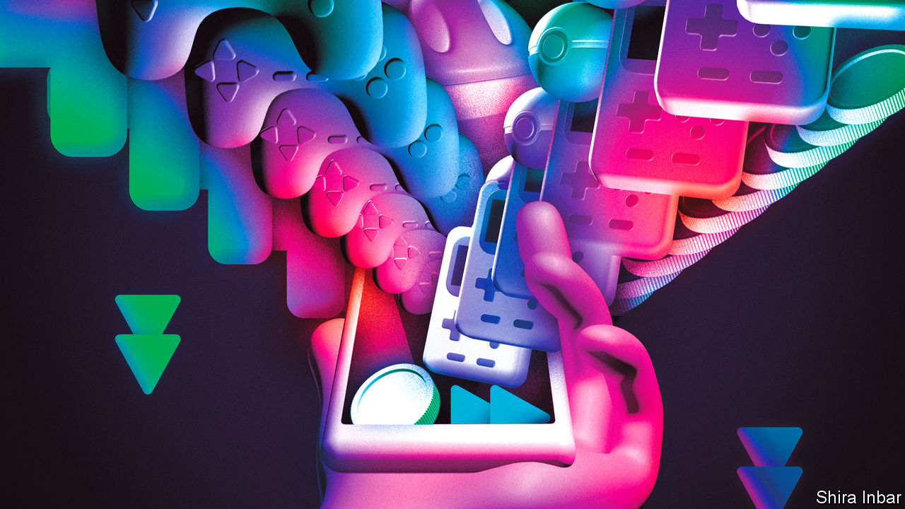
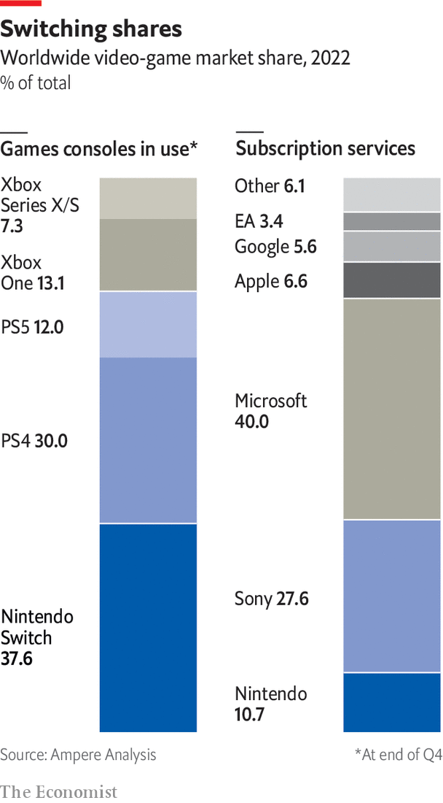

###### Distribution

# Battles over streaming break out for video games 

##### Streaming subscriptions have revolutionised music and television. What will they do to games? 

 

> Mar 20th 2023 

In an airy Los Angeles office with a view of the Hollywood sign, Netflix executives are plotting the next stage of their streaming strategy. The company is the leader in digital streaming of video, with 230m subscribers paying for access to its huge online library of films and TV shows. But now Netflix is looking into whether it could stream something else: video games.

Over the past 15 years the music and TV industries have seen huge changes in digital-media distribution. In 2008 Spotify began offering online access to a catalogue of music for $10 a month. Similar services were offered by Apple and Amazon. Streaming now generates two-thirds of the recorded-music industry’s revenue. Netflix has since done something similar for movies. Most Hollywood studios now have their own streaming platform, selling shows direct to consumers. Streaming accounts for over a quarter of TV viewing in America.

Many wonder if streaming could now disrupt another media industry. Like records or DVDs, video games once came in boxes. Technology now allows them to be streamed over the internet, Spotify-style. And companies are trying out subscription access to game libraries, rather than selling games as one-off purchases. The twin innovations of streaming and subscription could “reshape the competitive landscape” of the gaming industry, says the Competition and Markets Authority, Britain’s antitrust regulator.

Streaming-only services account for less than 1% of games spending, says Ampere Analysis, a research firm. But some are placing bets on it. Microsoft’s Xbox Game Pass Ultimate service lets users stream games to devices ranging from phones to smart-TVs. Sony’s PlayStation Plus Premium offers streaming to its console and to PCs. Nvidia has a game-streaming platform called GEForce Now. Amazon has one called Luna, available only in America. Netflix, which began offering mobile games just over a year ago, says it is “seriously exploring” launching a streaming service.

Streaming games may be more rewarding than streaming music or TV. The most demanding so-called AAA games require users to invest in expensive, often bulky hardware, in the form of a high-end PC or console. Streaming allows a game to be processed in a remote data centre, while its video and audio are relayed to the user’s screen, so the latest games can be played on any internet-connected device. Users can start a game on their TV and pick it up later on their phone or laptop. Removing specialised hardware opens a bigger market. Phil Spencer, chief executive of Microsoft’s gaming division, sees its potential audience as not just 200m households with a console, but 3bn-plus people who play games on any device. In some markets nearly a third of Xbox customers play only by streaming, he says. “We definitely find more and more customers where streaming is the only platform we see them on.”

Yet streaming is a tough business. Google closed its Stadia game-streaming service in January after barely three years. One obstacle is technical. Games’ interactivity makes them less forgiving than video or music over “latency”, or internet speed. Stadia worked well but was not the console replacement that some had expected. “[Google] said, ‘It’s going to be awesome from day one.’ And then that wasn’t true, and I think they turned consumers off as a result,” says Strauss Zelnick, head of Take-Two Interactive, some of whose games were on the platform. Mr Spencer says it is hard to beat the reliability of a console. He expects Microsoft to be making Xboxes for “years and years”.


Even if streaming will not be the main way of distributing games, it could be important. Customers may accept imperfect performance if streaming is a backup when away from home, for instance letting children play games on their grandparents’ TV. Many use the technology to sample games that take hours to download but seconds to start streaming. “We see a healthy percentage of people stream games just to try them out before downloading,” says Jim Ryan, chief executive of Sony’s gaming division. Streaming’s real potential may be for games that are more forgiving of the technology’s limitations. Netflix, which says it is not trying to build a console replacement, has in mind casual and middling games that are not too latency-dependent.

Buy one, get lots free

Many platforms are pinning hopes on subscriptions to sell games. Most gamers buy titles individually, or play free ones that make money from advertising or in-game purchases of power-ups. But paying a monthly fee to download a whole library of games is slowly becoming more common. Subscriptions represent about 7% of consumer spending on games, says Ampere Analysis. Microsoft, which lags behind Sony and Nintendo in console sales, has built an early lead. Its Game Pass, with some 25m members, had 57% of the market for game-library subscriptions last year, says Ampere. Sony’s PlayStation Plus and Apple’s Arcade are trying something similar. Some game developers, such as Electronic Arts and Ubisoft, offer subscriptions to their back catalogues.

Games are less ripe for subscription than other media because their consumption is concentrated, says Utsumi Shuji, co-chief operating officer of Sega, a Japanese giant. Mr Utsumi, who was at Warner Music Japan when music moved to subscription, says listening to a song “takes only two to three minutes, whereas when you play a game it’s going to take a long time. You don’t play 30 games at the same time, but with music you listen to 30 [songs] easily.” Mr Zelnick, who before Take-Two was president of 20th Century Fox’s film studio, says a household may watch 100 TV shows a month, but play only two or three digital games. “If that’s the case, does it really make sense to pay to have access to a couple hundred titles?”

As with music and television, game subscriptions increase people’s consumption. Game Pass subscribers “spend more hours, they play more games, they take chances on games from creators that maybe they haven’t heard of,” says Mr Spencer. He cites the example of “Hi-Fi Rush”, a lighthearted game from a developer better known for horror titles, which recently became a hit on Game Pass. Matthew Ball, a media investor, argues that subscriptions allow gamers to do the equivalent of TV channel surfing. “Frictionless discovery is an underacknowledged part of why TV became the dominant medium,” he says. Cable consumers have always complained they are paying for channels they don’t want, but their consumption has gone up anyway.

 


As in Hollywood, subscriptions involve trade-offs. Film studios have agonised over whether to give their blockbusters a window of exclusive theatrical release or make them available for streaming on day one, delighting subscribers but cannibalising box-office revenue. Similarly games developers face a dilemma over when to add them to subscription libraries. Sony delays putting games like last year’s “God of War Ragnarök” on its PlayStation Plus service until they have had a window as one-off purchases for $70. “For us, a day-and-date approach doesn’t work with the massive AAA games developed by PlayStation Studios,” says Mr Ryan.

Microsoft, which is pushing its Game Pass, takes the opposite approach, releasing most games immediately to subscribers. “Starfield”, a much-hyped title due later this year, will be on Game Pass from day one. The question is “whether they’re going to see enough incremental subscriber growth to more than offset what they otherwise would have expected through just direct sales of those games,” says Nick Lightle, a media consultant formerly at Spotify. If Microsoft buys Activision Blizzard, it promises to make Activision’s bestselling “Call of Duty” series free to Game Pass subscribers—the equivalent of Disney putting a new Star Wars movie straight on Disney+. As Microsoft makes more new titles available, “That’s where I think we’ll start seeing some pressure on that model,” says Mr Lightle. Hollywood studios such as Warner Bros have returned to theatrical windowing, after the cannibalisation of box-office receipts proved too costly.

The hardest task for subscription services is getting third-party developers to add their latest games to a library. Google, which gave up making games of its own, struggled to keep Stadia sufficiently stocked. Some developers see subscriptions as a good way of gaining exposure to wider audiences. Mr Utsumi of Sega says subscription libraries are good for reaching families and occasional “hobby gamers”, so putting “Sonic Racing” on Apple Arcade has got the famous hedgehog in front of more people when Sega is also pushing Sonic movies and other spin-offs.

The biggest games tend to make more money by maintaining a long period of exclusive retail release. With subscriber numbers an order of magnitude lower than those of Netflix, “The subscription services typically don’t have the financial wherewithal to buy us out of our windows,” says Mr Zelnick, who sees subscription working mainly for older titles “at the far end of the value chain”. Some smaller developers are reluctant to sell because their venture-capital backers want to maintain unlimited returns that come with unit sales, rather than cash out upfront. Many of the largest games, such as “Fortnite”, already have direct-to-consumer subscriptions of their own.

Subscriptions are likely to grow. Microsoft’s Game Pass should get a big boost with Activision Blizzard, whose trove of popular titles would make the bundle much more attractive (perhaps too attractive, say regulators in America, Britain and the European Union, who are scrutinising the deal). As consumers manage their inflation-eroded budgets more carefully, subscriptions may also appeal more. A year’s access to hundreds of games for roughly the price of two new ones can seem good value. Yet gaming’s concentrated consumption patterns, and the difficulty of acquiring third-party content, will limit their appeal. Unlike music and television, streaming and subscription seem more likely to complement existing forms of distribution than replace them.■

