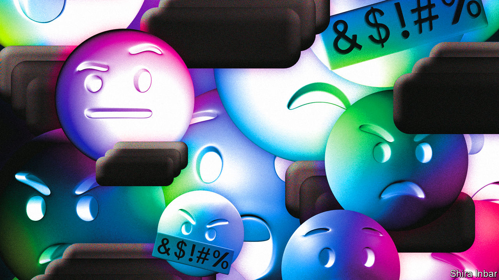

###### Censorship

# Complexities of moderating and classifying video games 

##### Classification borrowed from the film industry is adapting to resemble that of social media 

 

> Mar 20th 2023 

Censors at the British Board of Film Classification were puzzled in 1986 by a copy of “Dracula”. The BBFC normally reviewed films and videos. But after playing the game it deemed its gory scenes, splattered with red pixels, too shocking for children and banned its sale to those under 15. The game’s publisher, CRL, delighted by the publicity, set its sights on getting an “18” certificate for its next game, “Jack the Ripper”.

As games became more realistic they attracted more regulation. After the home release in 1993 of “Mortal Kombat”, which set a new standard in gruesome violence, America’s Congress pushed the games industry into setting up an Entertainment Software Ratings Board to dish out age ratings. In 2003 the Pan European Game Information rating did a similar job. Games settled into a classification regime similar to that of movies.

Nowadays concerns about content in digital games are less about what developers have included than about other players. Most big games are online, multiplayer affairs, in which players are exposed to strangers who communicate by text or microphone. The main challenge is moderating what millions of users say and do. The content debate has moved from being similar to the movie industry’s to one more like arguments over regulating social media.

Meta, which has experience of content moderation on Facebook, has found problems on its virtual-reality platforms. When users of “Horizon Worlds”, its main VR space, complained of being virtually groped, it introduced a minimum distance between avatars. After the Christchurch shootings in 2019, users of Roblox, a platform on which they can create games of their own, began re-enacting the event before the company intervened. Roblox employs “thousands” of human moderators, as well as artificial intelligence, to check user-submitted games and police chat among its 60m daily users, who have an average age of about 13.

As with social media, regulators are unsure how far to go in censoring speech. Mark Zuckerberg, Meta’s boss, has said social networks are like newspapers, because users can publish to a mass audience, but also like phone companies, since they allow one-to-one communication. In 2018 Germany introduced a new law holding social networks responsible for content on their sites, treating them like publishers. Politicians debated including video games as well, before deciding in-game chat was more like one-to-one conversation, which is protected by the constitution, says Niko Härting, a tech lawyer.

Gamemakers are doing their best to design out bad behaviour before it occurs. In “World of Warcraft”, players join either the “Alliance” or the “Horde”. They can talk to their own team, but if they try talking to the other side, their speech is translated into unintelligible orcish or elvish. The result, says Allen Adham of Blizzard Entertainment, which makes the game, is that “players play really nicely with each other, because they have a common enemy.”

