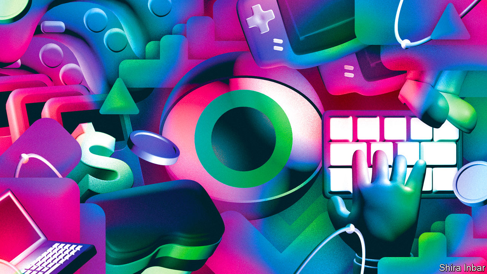
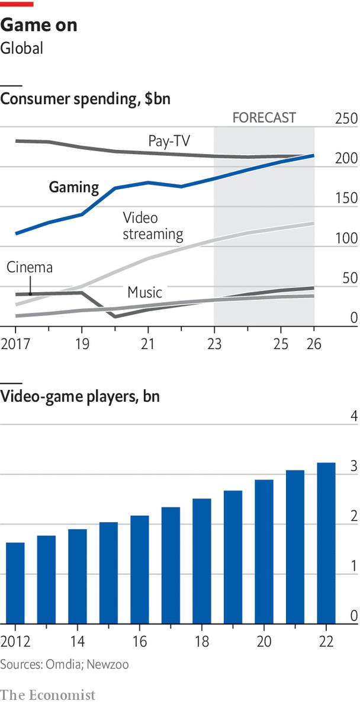

###### Insert coin

# Ready, player four billion: the rise of video games 

##### As video games move from teenage distraction to universal pastime they are following the path of other mass media, says Tom Wainwright 

 

> Mar 20th 2023 

GAMES HAVE become a daily habit for Trichur Rukmani. Sometimes she taps away for ten minutes, but other times she plays for longer. “I do it when I am free from other things,” she says. The main draw is the excitement of competing, but gaming is also a social experience. Online, from her home in Bangalore, she shares her scores with family members on the other side of the world.

Teenagers have spent pocket money on video games for decades. But the business has changed, and Ms Rukmani shows how. Her gaming rig is not a Japanese console but a mobile phone and tablet, with operating systems made by two American firms, Google and Apple. Her favourite game, “Wordle”, is free to play, and owned not by a game publisher but by the . Like over half the world’s gamers, she lives in Asia. And at 92, Ms Rukmani is older than the archetypal player—though younger than the other gamer in the household, her 93-year-old husband.

Last year some 3.2bn people played video games, about four in ten people worldwide. The number has risen by about 100m a year, with a big jump during covid lockdowns in 2020. In rich countries two-thirds of people play, nearly half of them women. And though gaming is disproportionately a young person’s hobby (nine out of ten British 16- to 24-year-olds play games) older folk are picking up the habit, including half those aged 55-64. Worldwide, there are more console owners aged 35-44 than aged 16-24, says Karol Severin of MIDiA Research, an entertainment advisory firm. As he puts it, gamers are no longer just “young guys covered in crisps”.

Gaming’s growth has been driven by the spread of the smartphone, which has put a powerful gaming machine in nearly everyone’s pocket, giving them access to app stores stocked with thousands of games, mostly free to download (though often expensive to get hooked on). Mobile apps account for about half of consumer spending on digital games. In total the game market will be worth around $185bn this year, according to Omdia, a data company. That figure excludes hardware and accessories, as well as in-game advertising, which is reckoned to be worth an extra $65bn.

As gaming’s value has swollen, it has attracted large companies. Seven of the ten most valuable tech firms are active in gaming, and they have brought in tech-sized budgets. Microsoft, which launched the Xbox console in 2001, agreed last year to pay $69bn for Activision Blizzard, a game developer. If it gets past antitrust regulators, this will be one of the largest ever tech deals. Apple and Google are now giants in game distribution, as they control the two main app stores, 60% of whose sales are of games. The online titan Amazon and the chipmaker Nvidia are streaming games on the internet. Tencent, a Chinese media giant, has made gaming central to its business and attracted players far beyond China. Meta has pivoted from social networking to virtual reality, which is used mainly for gaming.

 


Last year, unusually, consumer spending on gaming fell. Inflation dented households’ budgets, and the end of lockdowns let them do other things with their time. Apple’s stricter rules on mobile advertising made it harder for games to reach new customers. Supply-chain problems limited the availability of consoles. Yet this year growth should return. Gaming is likely to expand faster than any other broad entertainment category. Its value has already surpassed that of books, music or the cinema. It now vies with television to be the largest media business. Consumers spend more on digital games than on streaming services such as Netflix, and will soon spend more than on pay-tv. Overall television revenues are still greater than those for games, but the gap is narrowing. A poll in 2021 by Deloitte, a consultancy, found that whereas previous generations of Americans picked TV and film as their favourite home entertainment, Generation Z (those under 25) ranked gaming first. “The dominant position that video entertainment has held could be challenged,” Deloitte suggested.

This special report argues that, as gaming evolves into a mass medium comparable to television, its development will mimic other media. Consider distribution, where Hollywood has been upended by a revolution in streaming and subscription models. Companies like Netflix are exploring whether something similar might work in gaming. Or look at changing production. As games become more technically sophisticated, making a smash-hit title starts to resemble making a blockbuster movie, and game studios have to mitigate the risk and cost just as film studios did.

The new champion

Parallels between TV and video games can also be seen in so-called user-generated content. YouTube and TikTok have turned home movies into a multi-billion-dollar industry that steals attention from professional media. Apps such as “Roblox” and “Minecraft” are finding ways to exploit home-made creations in gaming. Online hits like “Fortnite” derive the most fun from interaction with other players. As games rely more on input from other users, developers are grappling with the same content-moderation dilemmas that social networks found when they invited hundreds of millions of people to mix anonymously online.

Just as moving pictures helped shape society in the 20th century, gaming exerts growing influence on the culture of the 21st. The soft power of Hollywood to project norms and ideals is complemented by the cultural influence of games, which are grabbing the imaginations of the young. The difference is that game production is far from the American monopoly that film has long been. China’s growing power is already causing a similar disquiet to TikTok, a video app that many American congressmen want to ban.

From consoles to phones, and from “Fortnite” to “Wordle”, gaming is becoming a true mass medium, with all the social consequences that entails. This report will draw lessons from other media to understand better the development of an emerging industry in which nearly everybody will soon be a player. Ready?■

