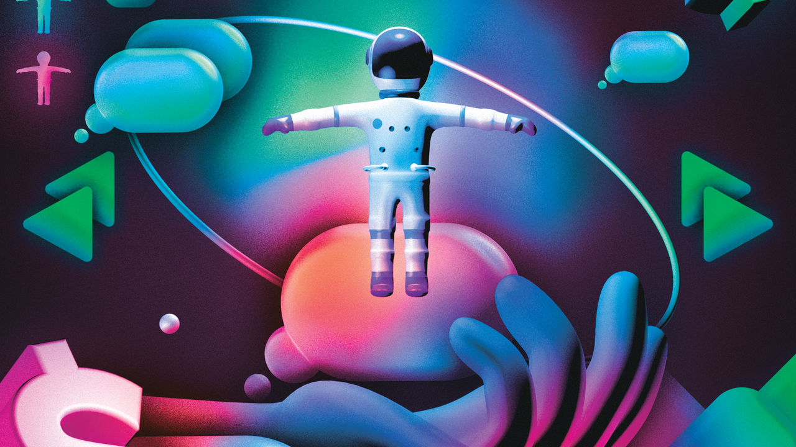
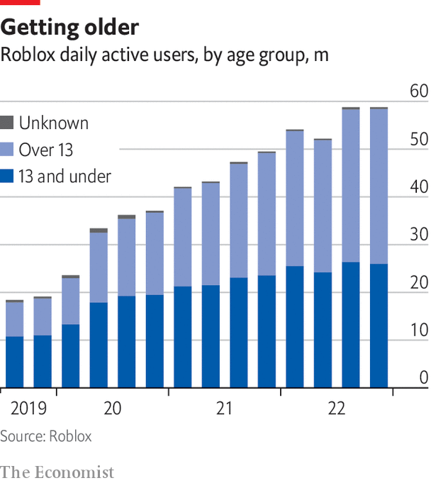

###### User-generated content

# The rise of user-created video games 

##### Do-it-yourself games are taking off just as DIY video did 

 

> Mar 20th 2023 

“Stop that or someone could get injured!” shouts the teacher, as a pupil stands on her desk, dancing the Macarena. “You are a student, not a baby!” A class of avatars snigger. This is “The Presentation Experience”, a game on Roblox, an app popular with schoolchildren. As one player gives a presentation, others do their best to interrupt and make a nuisance of themselves. By pressing different buttons they can heckle, burp or go to sleep. If they pay they can be even more disruptive: for 99 robux, Roblox’s in-game currency (about $1.25), they can “make everyone mega fart”.

The gameplay is basic and the graphics rudimentary. But “The Presentation Experience” has had 190m plays since it was launched less than 18 months ago. It is one of 32m “experiences” on Roblox, which lets users design and publish homemade games. Never mind that the gameplay looks fairly low-fi; some 60m people play Roblox a day, generating revenue in 2022 of over $2bn in purchases of in-game items—mega farts and all.

The TV business has gone through a revolution in what media types call user-generated content. Smartphones give everyone a way to record and publish home videos in seconds. The result is that even as professional content has become more plentiful and lavishly financed, viewers spend more time on amateur content. Americans under 18 spend almost twice as much time on TikTok and YouTube as on Netflix and Disney+, says Qustodio, which makes parental-control software.

Many wonder if this may happen to gaming. User-made games already have a vast reach among young people. In 2020, amid covid-19 lockdowns, Roblox estimated that three-quarters of American 9- to 12-year-olds were using the platform. “Minecraft”, a Microsoft-owned game that lets players visit each others’ constructions, has 120m monthly players. Like YouTube and TikTok, most user-made stuff is low quality. But like those sites, algorithmic sifting of a near-infinite variety serves up plenty for users.

As on YouTube, ever more content on platforms like Roblox is professionally made. Some small developers have shifted to the platform, aiming for a share of the $600m earned by creators each year. Big brands use it as a place to reach new audiences. Sega has licensed a Sonic game to Roblox. As on YouTube, where creators like Jimmy “MrBeast” Donaldson began as amateurs before turning professional, many successful developers made games as a hobby before going full-time. Simple Games, which makes such Roblox titles as “War Simulator”, began as a hobby for its founder, Nathan Clemens, and now employs his whole family.

 


The big difference between films and gaming is that game developers have proved more adept at incorporating user-made content into their productions. Whereas home-made content has emerged as a competitor to professional film-makers, game studios have made it part of their business model, monetising it themselves.

Since the earliest days of PC gaming, players with programming expertise have “modded”, or modified, games by taking the source code and altering it to change the game, sometimes trading their “mods” online, with various degrees of consent from the developer. Built-in features such as map editors let players make their own designs, and it has become standard to allow players to customise in-game avatars.

Do it yourself

The most important user-generated input comes in multiplayer games, where users generate “content” by acting as each other’s opponents. Many recent hits have been online titles like “League of Legends” or “Fortnite”, in which the thrills come from interaction with other users. “Because players are infinitely creative, you can make the sandbox, throw some people in there, and the player stories that come out of that emergent play are endless,” says Allen Adham of Blizzard Entertainment.

Enlisting players to entertain each other means games stay entertaining for longer. “If you look at the biggest games, there is demand from the players that it’s constantly refreshed…and creating game content is a long process,” says Tom Wijman of Newzoo, a game analyst. “Part of the reason why gaming companies are so eager to stimulate [user-generated content] and incorporate it into their day-to-day business is because it helps them crowdsource this content creation that has become expected by the gaming community”. Mr Adham says “player v player” games “can be very production-efficient, because the players are providing the diversity of play”. Sometimes the creation of new content is well managed. Online fans of games like “Grand Theft Auto” organise together to plan elaborate role-playing scenarios—bank heists, police chases and so on—before playing them together, often broadcasting the action on video platforms such as Twitch.

The complexity of making a game is a natural brake on how much original content users can generate. Meta’s flagship virtual-reality app, “Horizon Worlds”, has struggled to attract users, partly because it relies on user-made virtual environments that few amateurs are able to build. Yet there is an expectation that artificial intelligence (AI) will make things much easier. Roblox has shown off a forthcoming feature that will let developers use ai to program games with simple text prompts, such as “make it rain”. Microsoft has reportedly come up with a voice-activated ai assistant for “Minecraft” that builds structures on demand. Niantic, which makes augmented-reality games and apps, has developed a tool to create interactive 3D models using voice instructions. Apple, which may release a virtual-reality headset later this year, is working on similar technology.

Whether in film or in gaming, demand for user-made content is growing. “This younger generation doesn’t just want content thrown at them,” says Craig Donato, Roblox’s chief business officer. “They want to feel a sense of agency or co-ownership of the medium…[and] that they are not just consumers of content, but that they can also be participants in the creation of the content.” The video-game business has done a better job than Hollywood of turning this to its advantage.■

