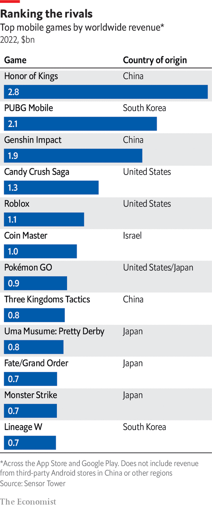

###### Geopolitics

# Video games, power and diplomacy 

##### Gaming is a growing source of soft power, influence—and perhaps espionage 

 

> Mar 20th 2023 

Of all the shrines in Kyoto, the most sacred for some is in the south. As snow falls, a guard stands watch, making sure no pilgrims get too close. The site is surrounded by a wall, but over it a grey building is visible, marked with eight characters that spell out its name: Nintendo. Japan’s gaming industry has a following bordering on the religious. In Tokyo foreigners flock to Akihabara, the “electric town” of game arcades, or roar around by go-kart in homage to “Mario Kart”. Osaka has a Super Nintendo World theme park. When Japan shows off to the world, it reaches for games as often as for samurai or sushi. Collecting the Olympic torch in Rio in 2016, its then prime minister, Abe Shinzo, emerged in the stadium from a green drainpipe, dressed as Mario.

Popular culture’s “soft power” has been evident ever since Hollywood began. In 1950 Walter Wanger, an American producer, said film exports were more important “than the H bomb”. Every movie reel exported was an American ambassador, he said, dubbing this “Donald Duck diplomacy”. A new soft power is now on the rise: Super Mario diplomacy. As games take up a bigger share of people’s time, they become a weapon in the battle of ideas. And unlike movies, in which America remains the world’s only superpower, the contest in gaming is wide open.

Japan conquered Western living rooms in the 1980s when Atari, an American game pioneer, collapsed and Nintendo saw an opening. Japan’s cartoons had a niche following, but gaming was the cultural export “that would really monetise and become an influential cultural phenomenon,” says Nakamura Akinori of Ritsumeikan University in Kyoto. The university’s Centre for Game Studies, stacked with 10,000 video games and 150 pieces of hardware, shows how Japan led the gaming market by the 1990s, with Nintendo, Sega and later Sony dominant. More American children recognised Mario than Mickey Mouse. Unlike Japanese consumer-electronic successes, notes Matt Alt, author of “Pure Invention”, a book on Japanese culture, games represented not just efficient manufacturing but “a triumph of ideas”.

Some ideas are stylistic: the two-dimensional artwork in games such as the “Pokémon” series follows a Japanese tradition which Hirabayashi Hisakazu, a writer on gaming, traces to the artwork of the Heian period. Others concern gameplay mechanics. The “loot box”, a now-ubiquitous monetisation feature allowing players to buy a package of random power-ups, is derived from the Japanese market for , vending machines that sell surprise toys. Japanese games have a greater emphasis than Western ones on co-operative play, and less on firearms, says Mr Hirabayashi, who talks of a culture of “the , not the gun”.

But Japan’s grip is now weaker. Microsoft’s Xbox gave America a share of the console market. Western developers found it easier to write games for the Xbox’s Windows-based system. Sony and Nintendo still have a lead in consoles. But gaming has shifted to mobile, and the two main operating systems, Google’s Android and Apple’s iOS, are American-owned. The production of games is also more varied. Whereas the global movie business is still dominated by America (which produced 17 of last year’s 20 highest-grossing films, with China making the other three), the games business is international: last year’s 20 highest-grossing mobile games came from nine different countries.

 


Japan is also held back by a large domestic market with a culture that others can find baffling. In “Uma Musume” (“Horse Girl”), the world’s ninth-highest-earning mobile game of 2022, the player trains young women to compete in races. The game made $800m in Japan last year, but has yet to be released elsewhere. South Korea has become the emerging new power, encouraged by a government that declared games part of the , or Korean cultural wave, that includes K-pop music and such movies as the Oscar-winning “Parasite”. Many of its games mimic Japanese style, but that is changing. Krafton, a big Korean developer, is working on a game adaptation of “The Bird That Drinks Tears”, a series of novels based on Korean mythology.

If any country is now winning the race, it is China, which produced six of last year’s top 20 mobile games, including two of the top three: Tencent’s “Honor of Kings” and miHoYo’s “Genshin Impact”. China’s success contrasts with failed efforts in old media. Chinese movies compete with Hollywood in quality, but they are geared firmly to the home audience (“Water Gate Bridge”, last year’s biggest hit, is mainly about killing Americans). Yet though Chinese film-makers can focus on a domestic market, Chinese game developers cannot. China’s government has dubbed games “spiritual opium” and slapped restrictions on them, limiting children’s gaming time to three hours a week and rationing new releases. Developers have had to look to international markets instead. “Honor of Kings” has a medieval European look. “Genshin Impact” looks so like “Zelda: Breath of the Wild” that Nintendo fans publicly smashed up rival consoles in protest. Chinese developers have earned a reputation as “copycats”, says Suh Bo-kyung of Bernstein, a broker. But their games are worldwide hits.

This Chinese success has sparked concerns, and not only among developers in other countries who feel ripped off. One worry is security. As with TikTok, a Chinese-owned social-media app that has spread like wildfire in the West, Chinese games are seen as tools gathering data for China’s government. Games often seek personal information—name, date of birth, payment details—or record voice clips. The move to online play makes for better spying tools, since “people’s boxes will be connected directly to China”, says James Lewis of the Centre for Strategic and International Studies, a think-tank in Washington, DC. Some players accused “Genshin Impact” of installing spyware on their PC after finding its anti-piracy software running even after the game was removed (the developer said this was a mistake and issued a fix).

Chinese whispers

Even American firms with Chinese investment are under scrutiny. In 2020 America’s Committee on Foreign Investment in the United States (CFIUS), the Treasury-chaired security committee that is looking into TikTok, reportedly wrote to Riot Games and Epic Games (respectively wholly and partly owned by Tencent) to ask how they handle personal data. In December Epic was fined $275m by American regulators for illegally collecting children’s data. CFIUS is not yet alarmed, Mr Lewis believes. But as gaming technology is adapted to purposes beyond mere play, security concerns become more sensitive. Game engines, 3D-modelling tools for developing games, are used for everything from airport management to war-gaming simulations for the armed forces.

A second worry is over broader Chinese influence. Western studios may change games in China to tone down sex or violence, or replace skeletons with zombies to skirt laws against “superstition”. But the reach of Chinese censors extends far beyond China. The chat function in “Genshin Impact”, for instance, blots out such sensitive words as “Taiwan” and “Falun Gong” (alongside “Hitler” and “Putin”). And some Western developers bend the knee to the Chinese government. In 2019 Ng Wai-chung, a Hong Kong-based e-sports player, used a post-match interview to declare: “Liberate Hong Kong, revolution of our time!” The American game company that ran the league, Activision Blizzard, which counts Tencent as an investor, cancelled his $10,000 prize money and suspended him from competing. A message on the game’s Chinese social media account--run by a Chinese business partner, Blizzard says--promised to “resolutely safeguard [China’s] national dignity”. (After an outcry in America the firm partly backtracked.) Riot Games, which is wholly owned by Tencent, later announced that it would ban political speech from its “League of Legends” tournaments.

Game studios are “increasingly savvy and increasingly paranoid” in their dealings with China, says James Tager of PEN International, a free-speech pressure group. Like old-media companies worried that an offensive film might jeopardise not just a single title but their other interests in China, game developers that are part of big companies are likely to practise self-censorship to preserve market access, he says.

So far the trade-offs have attracted less controversy at home than the equivalent moves by Hollywood studios, which have been accused by American politicians of “kowtowing” to China. As Mr Tager puts it, one reason may be that “the average representative in Congress is not playing video games, but they are watching movies.” As gaming’s popularity grows, Chinese-made games find their way into more living rooms and more gamers enter Congress, Western politicians’ complaints may grow louder.■

