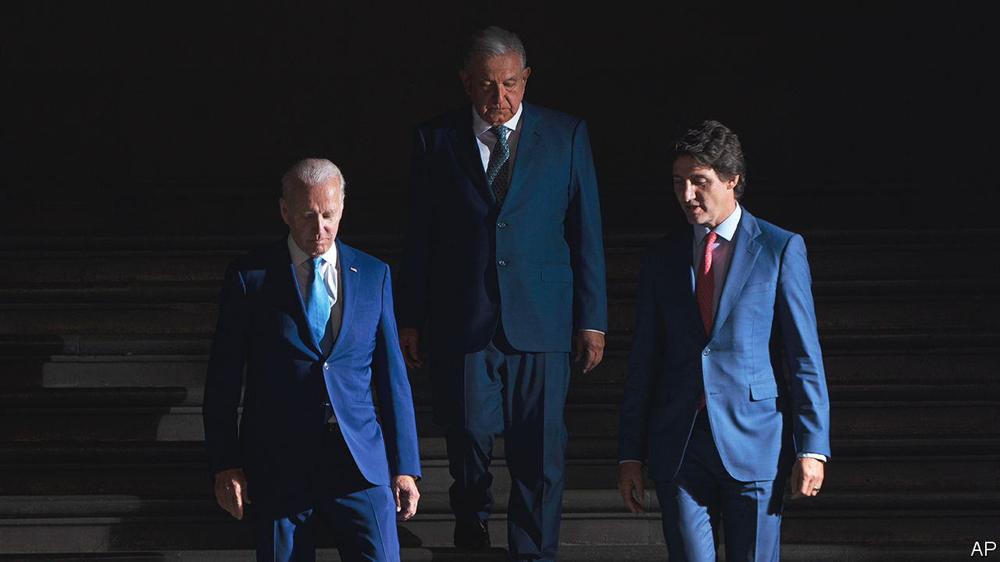
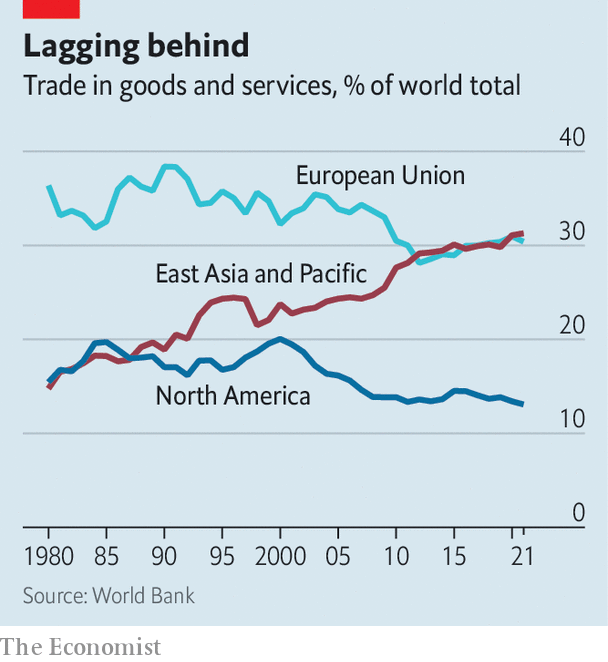
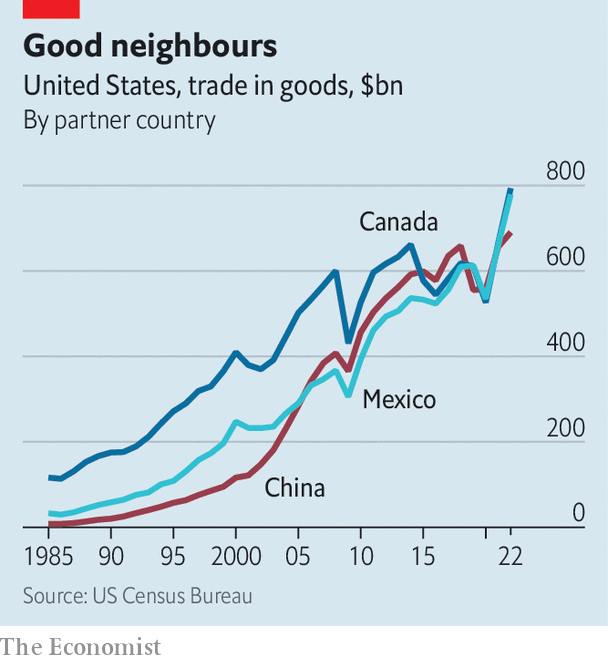

###### NAFTA 3.0

# The Americas face a historic opportunity. Will the region grasp it? 

##### As the United States pulls away from China, it needs its neighbours more than ever 

 

> Mar 21st 2023 

Economic integration in North America tends to inspire extreme views. The most famous recent critic, Donald Trump, referred to the continent’s original free-trade pact as “the worst trade deal maybe ever”. By contrast, evangelists for cross-border links say they are making North America the world’s most dynamic region.

Roughly equidistant between these two poles is North America’s solid, though unspectacular, commercial reality. The continent’s trade in goods and services has quadrupled in nominal value since the North American Free Trade Agreement (NAFTA) went into force in 1994, to more than $7trn, or roughly 30% of GDP. But that is slower than the sixfold growth in trade experienced by the rest of the world over that time. Intraregional trade connections have become denser in Europe and Asia. Canada and Mexico do oodles of business with the United States but little with each other. 

The regional economy may be on the threshold of something bigger. A few forces are coming together now to boost its prospects. As tensions between the United States and China increase, companies that had come to rely on China for manufacturing are shifting to other bases. Production snafus during the covid-19 pandemic illustrated the fragility of globally dispersed supply chains. And the embrace by President Joe Biden’s administration of industrial policy, fuelled by generous subsidies for electric vehicles (EVs) and clean energy, has super-charged investment in the United States. That inevitably is spilling over into Canada and Mexico. 

In 2022 the United States’ trade with its neighbours to the north and south far outstripped its trade with China. On March 15th American regulators approved the first big railway merger in two decades, which will link all three countries. And on March 23rd, as  went to press, Mr Biden was due to meet Justin Trudeau, his Canadian counterpart, during his first visit to Canada since he came to office in 2021.

The theory of the North American economy has always been compelling. Many of the world’s biggest and most innovative companies are based in the United States. Mexico offers inexpensive labour and land right on its doorstep. Canada is richly endowed with natural resources, with a burgeoning tech ecosystem to boot. The heft of the consumer market in the United States plus the potential of Mexico’s round off the enticing package. In practice, though, the car industry stands out as one of the few to truly embrace cross-border models, with production networks from Monterrey to Ontario tightly intertwined.

The question for North American officials and executives is whether they can pursue the same kind of integration in a wider range of strategically important sectors, from batteries to semiconductors. It is also a test of whether a shift now under way from globe-spanning trade to more regionally concentrated commerce is viable. Where North America goes, the rest of the world may follow.

 


Mexico once had deep misgivings about NAFTA. Those days are long gone. Even under President Andrés Manuel López Obrador, a populist nationalist, nobody questions the United States-Mexico-Canada Agreement (USMCA), NAFTA’s similar-looking replacement negotiated by the Trump administration (which Mr Trump, naturally, called the best trade deal ever). More than three-quarters of Mexico’s exports go north of the border. The decision in February by Tesla, an American EV manufacturer, to build a plant in the northern state of Nuevo León has been hailed as a sign of things to come. It will start with a $1bn investment and may grow to $10bn. 

Last year Mexico’s economy minister said some 400 companies were interested in relocating facilities from Asia to Mexico. Andrés Benavides of Daikin, a Japanese air-conditioning manufacturer, says the company is moving some of its production for the American market from Thailand to Mexico. It plans to hire 2,000 people in Mexico over the next 18 months. The company has also brought lines of manufacturing down from the United States. A big draw is the availability of labour. And manufacturing wages are far cheaper in Mexico than in China.

Investments tend to be in well-established industries, especially car-manufacturing, Mexico’s primary export industry. Many also represent expansions by companies already in Mexico. Volkswagen, BMW and Kia were among those to announce investments last year, partly focused on shifting production towards EVs. Optimists think there could soon be a large batch of new arrivals, too. Lorenzo Berho of Vesta, an industrial-park builder, says they have demand “as never before”.

Mexico’s banking body reckons that Tesla’s investment could encourage as much as $25bn more. Given the concerns about globally dispersed production, that knock-on effect might be more potent than in the past. Harald Gottsche, head of a BMW plant in San Luis Potosí, says that for one production line the share of locally produced parts will increase, “to be more resilient against supply-chain disturbances”.

But Alberto de la Fuente, who heads the Council of Global Companies in Mexico, a body that represents big international companies, warns that the wave of investment is still more hoped-for than real at this point. Foreign direct investment rose to $35.3bn in 2022, or nearly 3% of GDP, the highest figure since 2015, but local analysts say this can be accounted for by a couple of big investments. Banorte, a Mexican bank, estimates the country could gain $168bn in exports over the next five years, on top of its annual exports of about $500bn now, but it puts the gains in a range between $84bn and $300bn.

As well as the usual headaches such as security and logistics, new ones are being added by the government. The primary one is energy. In an attempt to protect Mexico’s ailing state electricity company, CFE, Mr López Obrador introduced reforms which give priority to CFE’s electricity, no matter how dirty or expensive its plants. This will reduce the scope for profitable investment in private generation, which in turn leaves Mexico potentially short of electricity. It also makes it more expensive. Meanwhile companies are struggling to get clean energy, which they need to meet their goals for reducing carbon emissions. 

Mexico is throwing less public money at investors, even as the United States boosts its industrial policy. Mr López Obrador got rid of ProMéxico, an organisation that promoted investment. Now states go out and sell themselves. There exist few federal incentives for investment. Some states offer cheap land, but not the tax breaks that many of their American counterparts do. Nevertheless, this lack of support is more likely to slow the tide than stop it. An executive at a manufacturing firm quips that even on “automatic pilot” Mexico benefits from nearshoring.

Canada does not have the same luxury. Whether looking at wages, land costs or green regulations, Canada is sufficiently similar to the United States to mean that the introduction of major subsidies for EVs, battery production and clean energy has the potential to alter the competitive balance between the two countries. 

 


The budget, due on March 28th, is expected to offer a bundle of tax credits and other subsidies as Canada’s response to the United States’ muscular industrial policy. With an economy less than a tenth the size of the United States’, Canada cannot compete dollar for dollar, but it can target specific parts of supply chains. Dennis Darby of Canadian Manufacturers and Exporters, an industry group, says that, without more support from the government, Canada faces the risk of capital draining away. Some companies, he says, are being told by their American customers that they could cut costs by moving south of the border. 

An indication that Canadian officials may be up to the challenge came on March 13th when Volkswagen, a German carmaker, announced that it would build its first EV battery plant outside Europe in Ontario. Neither the federal government nor the provincial government has spelled out the incentives involved, but the budget may shed light on them. Volkswagen’s investment also reflects the fact that at least some of the Biden administration’s policies are designed with the broader region in mind. Tax credits for buyers of EVs specify that the content can be made anywhere in North America.

Canada has a partial head start in shifting towards a cleaner growth model. Mr Trudeau’s government introduced a carbon-pricing system in 2018, pushing businesses to invest in more efficient facilities. Many in industry complain that Canada’s policies amount to a big stick, whereas the United States is lavishing carrots on its companies with its suite of incentives. On closer analysis, though, the problem in Canada is sometimes not a lack of incentives but rather that its carrots are chopped-up and messy. The Canadian Climate Institute, a campaign group, calculates that subsidies due in 2030 for carbon-capture investments in Alberta’s oil industry are spread across several pools but run to C$135-275 per sequestered tonne, more than the C$115 per tonne on offer in Texas. Rather than piling on more subsidies, the task for Canada is to streamline what it already offers.

Perhaps the biggest thing that Canada brings to the North American table is its richness of natural resources. Canada has a relatively small share—3% or so—of the world’s known reserves of critical minerals such as lithium and manganese, which are needed for batteries, semiconductors, hydrogen fuel cells and more. But the government believes that much more lies beneath the ground, and is working to encourage more exploration, unveiling its first critical-minerals strategy at the end of 2022. Marc Gilbert of Boston Consulting Group thinks Canada needs to get a foothold in higher-value segments of the industry. 

Canada, like Mexico, is already heavily dependent on the United States, with three-quarters of its exports going there. That figure would probably only increase if Canada ramps up its production of critical minerals. Some of the businesses that straddle the continent are bullish. At his company’s headquarters in Vaughan, Ontario, Rob Wildeboer of Martinrea, a car-parts company, sits in an office that displays both a bottle of fine tequila from Mexico and a large photograph of a Canadian ice-hockey match. He envisions a more closely integrated North America, in which he would be able to bring workers from Mexico into the United States and Canada for short stints. “It’s going to be North America’s century,” he says.

Economic data counsel caution. Manufacturing in North America is worth about $2.5trn per year. In Asia it is closer to $7.5trn. China’s factory sector alone is about 20 times larger than Mexico’s. Nevertheless, it is salutary to remember that the United States is not attempting to lure all industry away from China. Rather, it is focused on segments such as batteries and semiconductors that it has deemed especially important to its national security and its economic future. It will not be easy. But with Canada and Mexico pulling in the same direction, it has a far better shot than going it alone. ■

