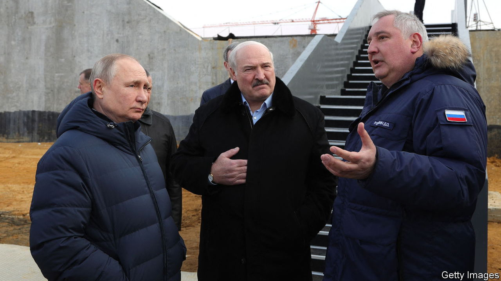

###### The Economist explains

# How Belarus’s role in the invasion of Ukraine could grow 

##### It can offer ammunition and morgues, but not military might 

 

> Mar 17th 2023 

RUSSIA TREATS Belarus, a nominally sovereign, independent country, as a satellite—in effect an extension of its own territory. It subsidises Belarus’s struggling economy, feeds it cheap energy and keeps the country’s , Alexander Lukashenko, in power, for now. In return, it expects unwavering allegiance. Belarus has helped Russia from the first days of the invasion of Ukraine—but Mr Lukashenko has stopped short of sending his own soldiers to fight. What is Belarus’s role in the conflict, and how might it change?

At the start of 2022 Russia sent 30,000 soldiers—along with a host of military gear, including jets, air-defence systems and missiles—to Belarus, ostensibly for joint military exercises. The war games turned out to be cover for Russia’s invasion of neighbouring Ukraine. It used Belarusian territory to attack Kyiv, Ukraine’s capital, from the north.

As the war ground on, Belarus became the Russian army’s , or “rear”. Its airfields and railways (which use Russia’s 1,520mm gauge) have resupplied the frontlines. It has provided ammunition and military-grade components to Russia’s army. According to independent Belarusian researchers, the country contributed roughly 65,000 tonnes of ammunition, 100 Soviet-era tanks and 20 armoured vehicles between March and September last year. 

Russian casualties have been ferried in the opposite direction, to Belarusian hospitals and morgues. After the botched attack on Kyiv, buses believed to have been transporting bodies through Gomel, Belarus’s second city, moved at night, apparently to conceal the extent of Russian losses. 

When Russia’s war effort further faltered in the autumn, senior Belarusian officers probably helped to train thousands of mobilised Russian reservists. The country has also been a launch-pad for missile strikes against civilian infrastructure in Ukraine. In January, ground and air drills between Belarus and Russia raised concerns that Russia might launch another offensive from the north—though Western officials said this was unlikely. Ukraine has mined territory near its northern border and kept 20,000 troops in the area to deter any such venture. 

Belarus is wary of taking a more active role. On February 16th Mr Lukashenko said that he would send soldiers to fight in Ukraine only if attacked. Anti-war sentiment is high: only around 7% of Belarusians support sending their soldiers to fight alongside Russia, according to a poll conducted in November by Belarus Change Tracker, an independent research group. Its forthcoming poll conducted in March (which previewed) shows no change. “Unlike Russians, Belarusians do not have any post-imperialistic trauma, nor need to reclaim lost territories,” says Philipp Bikanau, one of the researchers.

This aversion to war, and Belarus’s long-standing reliance on Russia for security, means that its own capabilities are limited. Its standing army is believed to comprise roughly 45,000 soldiers—fewer than the estimated number of mercenaries in Russia’s —of whom no more than 10,000 are trained and equipped for combat.  between Belarus and Ukraine would make it difficult to pit the two countries against each other, says Emily Ferris of the Royal United Services Institute, a think-tank in London. (The same is true of Russia, which may help explain why it has drawn conscripts so heavily from regions far from Ukraine.) So, for Belarus, direct involvement risks an embarrassing defeat or surrender. “It would be a huge liability, and I don’t see any massive boost,” says Ms Ferris. 

Mr Putin may have other reasons for maintaining some distance between the actions of the two countries for now. The European Union has imposed fewer sanctions on Belarus, meaning that Russia may use the country to smuggle in goods. Belarus could also import weapons and ammunition from third countries, such as China, that want to avoid directly supplying Russia. Even without Belarusian boots on the ground, the country could step up its support for the war. ■

