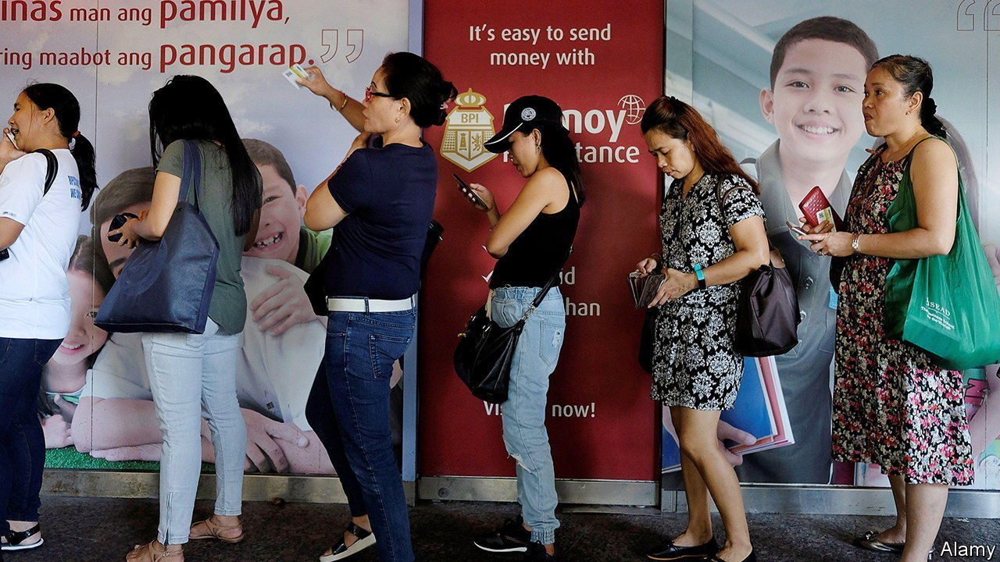

###### The Economist explains

# How remittances affect a country’s development 

##### They lift people out of poverty—but the cost to send money is much higher than it should be 

 

> Mar 20th 2023 

IN 2022 MIGRANTS sent home nearly $800bn, according to data from the World Bank. Around 80% of these remittances were sent to low- and middle-income countries. India received $100bn; Mexico got $60bn. Remittances were the biggest source of capital inflow for low- and middle-income countries in 2022, exceeding foreign direct investment and aid. Their importance is growing. In 2023, global remittances are expected to increase to $815bn. Can that money help drive growth in recipient countries?

In theory it should. In many places, cash from abroad is large as a share of GDP. Tonga, for instance, received remittances worth 50% of its GDP in 2022. Big injections of money can boost consumption by allowing households to spend more on things such as food, education and transport—all of which could help growth. They can also spur investment. In poor countries with large informal sectors and limited access to credit, remittances can provide the start-up capital needed to spur entrepreneurship. 

But remittances can also have bad effects. One is the risk of . The concept, coined by in 1977, described how the inflow of foreign currency into the Netherlands following the discovery of natural-gas deposits pushed up the value of the local currency, making exports less competitive and hurting markets. Remittances could have a similar effect. 

Estimating the overall effects of remittances on growth, then, is tricky. But according to an analysis of 95 studies published in , a journal, in 2020, on balance they have a small but positive effect on growth. That finding, however, masks significant variation. According to a study published in , another journal, in 2022, a 1% increase in remittances increased real GDP by 0.6% in the Dominican Republic but decreased it by 0.5% in Bosnia and Herzegovina.

Although the impact of remittances on an economy is ambiguous, the effect on poverty is clearer. Remittances allow recipients to spend more on nutritious food or children’s education. Another important benefit is allowing people to build up savings. During the covid-19 pandemic, for instance, remittances provided additional cash that helped  of lockdown-induced slowdowns. Several studies have found that increases in remittances are associated with reductions in poverty. 

These effects could be made more powerful yet. For a start, the volume of remittances could increase if countries let in more migrants (though few rich countries seem keen to relax immigration rules). And reforms could help remittance recipients keep more of the money their relatives send. According to the World Bank, in 2022 the average cost of sending $200 to low-and middle-income countries was $12, or 6%. For transfers to sub-Saharan Africa, that figure is 8%. 

Developments in  should lower costs. M-PESA, a Kenyan mobile-payments platform that provides low-cost transfers, has spawned imitators and is expanding globally, targeting the remittance market. India has similar ambitions for the  (UPI), its national payments platform. From March 31st Indian migrants in Singapore will be able to send money home using UPI. Should such plans succeed, they will bring transfer costs closer to the UN target of 3%. If that had happened in 2022, remittances recipients’ would have been $24bn richer, collectively. ■

