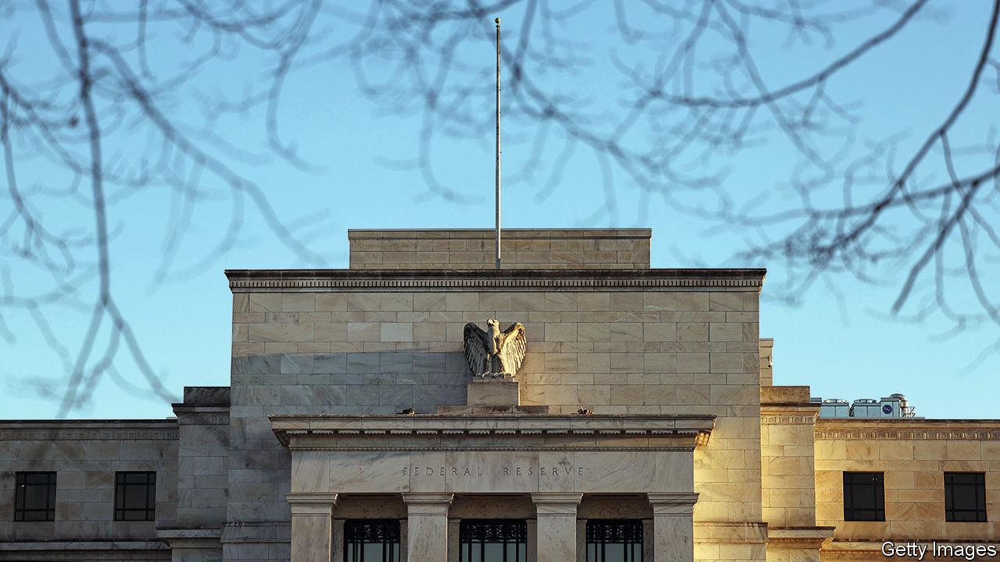

###### Politics this week

# Business 

#####  

 

> Mar 23rd 2023 

The  raised its benchmark interest rate by another quarter of a percentage point and signalled that more rate increases could come in its fight against inflation, despite higher rates triggering a series of bank failures. In a statement, the Federal Open Market Committee said America’s banking system was sound and resilient. The committee voted to raise the federal funds rate to a target range of 4.75% to 5%, its highest since 2007. The decision followed the European Central Bank’s decision to lift rates on March 16th. 


America’s treasury secretary, Janet Yellen, ruled out an expansion of  or blanket guarantees for savers after four bank failures in 11 days. Her comments came more than a week after the Treasury, the Fed and the Federal Deposit Insurance Corporation took swift action to protect depositors at Silicon Valley Bank, which specialised in banking services for tech startups, and Signature Bank, which is based in New York. Yet on March 22nd Mr Powell said that depositors “should assume” they are safe. 

Switzerland’s biggest bank, acquired , its troubled rival, in an all-share emergency deal brokered by Swiss authorities for around SFr3bn ($3.2bn), a 60% discount on Credit Suisse’s stockmarket valuation. Holders of “Alternative-Tier 1” bonds issued by Credit Suisse were written off altogether. FINMA, the Swiss financial regulator, defended its decision to write down the bonds.

, a lender based in California, has hired Lazard and JPMorgan Chase, two investment banks, as advisers amid discussions with potential investors and government officials to shore up its balance-sheet. It follows attempts to rescue the lender by 11 Wall Street banks. First Republic’s share price has fallen by 89% this month. 

rose unexpectedly in February. Annual consumer-price inflation rose to 10.4% in February, up from 10.1% in January. That was higher than the 9.9% forecast by analysts. 

Inflation in eased to 5.2% in February, down from 5.9% in January. It follows the Bank of Canada’s decision to keep interest rates unchanged for the first time in nine meetings, making it the first central bank across the g10 group of large economies to pause its rate-tightening cycle.

, a crypto exchange, received a notice from the Securities and Exchange Commission, America’s main financial regulator, warning it of potential violations of securities law. Coinbase shares fell by more than 15% in extended trading on Wednesday.

The boss of , a video-sharing app, was due to appear in front of America’s House of Representatives Energy and Commerce Committee on March 23rd, after  had gone to press. In prepared remarks released ahead of the hearing, TikTok’s CEO, Shou Zi Chew, said the company would never share American user data with the Chinese government. Lawmakers have raised national-security concerns about TikTok over its links to China through its Beijing-based parent, ByteDance.

The earnings of  soared in 2022, with gross profits hitting a record of more than $115bn, up by 60% from the previous year. Profits were driven by price volatility as a result of Europe’s energy crisis, which was sparked by the invasion of Ukraine.


A  boosted online searches by Americans for flights to Europe, despite sky-high air fares, inflation and an uncertain economic outlook. Kayak, a travel search engine, said searches for travel to Europe this summer are up by more than three-quarters from last year.

, a troubled Chinese property developer with more than $300bn worth of liabilities, unveiled plans for its delayed restructuring of around $19bn in debt held by overseas investors. Creditors will either be able to swap debt into new notes with maturities of up to 12 years, or convert them into new notes with a maturity between five and nine years and equity-linked instruments. The restructuring is expected to take effect from October.

The Competition and Markets Authority, Britain’s antitrust watchdog, warned that the $69bn takeover of , a cloud software company, by , an American chipmaker, could drive up the cost of computer parts and software. The deal, which is the biggest in Broadcom’s history, is also being scrutinised by competition authorities in America and Europe.

, a sportswear brand, reported $12.4bn in revenues for the quarter ending February 28th. This was up by 14% from a year ago and exceeded the $11.5bn expected by Wall Street analysts. That was despite weak sales in China, where covid-19 restrictions weighed on earnings.

