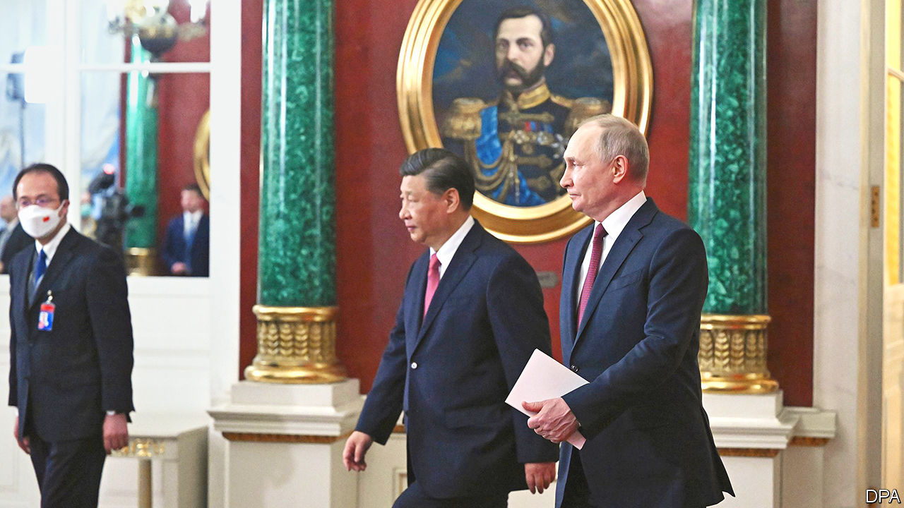
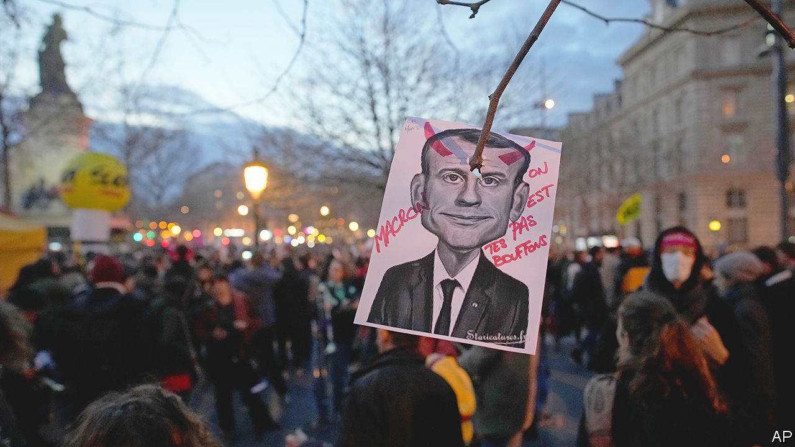

###### The world this week

# Politics 

#####  

 

> Mar 23rd 2023 

, Russia’s president, , his Chinese counterpart, in Moscow. Mr Putin endorsed a Chinese plan for a ceasefire and negotiations in the war in Ukraine. The plan does not acknowledge Russia’s aggression or Ukraine’s territorial integrity. Volodymyr Zelensky, Ukraine’s president, has rejected it, as have Western leaders. Ukraine said an explosion had damaged a Russian munitions train in Crimea, while Russian missiles struck Ukrainian cities, killing civilians.

A grand jury in Manhattan reconvened to consider charges against . The former American president is suspected of falsifying business records to hide hush money paid to Stormy Daniels, whom he allegedly slept with in 2006. Prosecutors must prove that this facilitated a second crime, of falsifying campaign expenses. The grand jury is expected to vote on whether to indict Mr Trump in the coming days.

Nicolás Maduro, autocratic president, appointed the head of PDVSA, the state oil company, as his new oil minister. Pedro Rafael Tellechea replaces Tareck El Aissami, an ally of Mr Maduro who resigned unexpectedly this week. More than 20 PDVSA officials have been detained as part of a corruption probe. The company is reportedly owed over $21bn in unpaid bills. The probe could allow Mr Maduro to sideline potential rivals.

In  Gustavo Petro, the left-wing president, suspended a ceasefire with the Gulf Clan, the country’s largest drugs gang. Mr Petro has grand plans for “total peace” in the country; the ceasefire was at the heart of these ambitions. 

passed a law that would impose long prison sentences on anyone who says they are gay or lesbian, or on organisations or journalists that promote gay rights.

Somalia and international aid agencies said that 43,000 people died in Somalia’s last year in the first official estimate of its toll. They estimated that 18,000-34,000 people may die from hunger in the first six months of this year.

Better call Sall

Macky Sall, the president of , said that in his interpretation of the constitution its two-term limit would not prevent him from running again in next year’s election. Mr Sall, who was elected in 2012 and again in 2019, has not yet declared his intention to run, but is expected to do so.

Olivier Dubois, a French journalist, and Jeffery Woodke, an American aid worker, were freed by jihadist groups who had been holding them in various parts of . Mr Dubois was abducted in Mali in 2021 and Mr Woodke was snatched in Niger in 2016.

parliament, reflecting the influence of parties on the far right, voted to let Israeli citizens back into four Jewish settlements in the West Bank which had been evacuated after Israel disengaged from Gaza in 2005. Israel’s high court had previously ruled that the settlements were on private Palestinian land. 

British MPs grilled the former prime minister, , over the “partygate” scandal. Mr Johnson is accused of deliberately misleading the House of Commons in his account of several boozy gatherings in Downing Street during the pandemic lockdown. If found guilty, MPs could suspend him from Parliament.

A scathing report found London’s  guilty of “institutional racism, misogyny and homophobia” and recommended that Britain’s largest police force should be overhauled or risk being broken up. The report was commissioned by the Met after the rape and murder of Sarah Everard by a serving officer in 2021.

MPs passed a new post-Brexit deal for , negotiated between the British government and the EU. But two former prime ministers, Mr Johnson and Liz Truss, rejected it, as did the Democratic Unionist Party, the province’s main unionist party. The DUP fears that it does not adequately protect Northern Ireland’s place in the United Kingdom’s internal market.

 


 government survived a no-confidence vote in France’s parliament after pushing through his  pension reform, which raises the minimum retirement age from 62 to 64, without a vote. Elisabeth Borne will stay on as prime minister, but the president will have even more trouble governing and street protests are expected to continue.

The IMF agreed to lend $15.6bn to , its first loan to a country at war. The fund recently changed its terms to allow loans to countries facing “exceptionally high uncertainty”. Ukraine said the money would support infrastructure and ensure the country’s economic stability.

The IMF also approved a $3bn bail-out for . The country has been beset by severe shortages and high inflation. The loan will be issued in nine tranches, each conditional on Sri Lanka’s adoption of reforms, including a restructuring of its reported $95bn-worth of public debt.

prime minister, Prayuth Chan-ocha, dissolved his country’s parliament, paving the way for elections in May. Mr Prayuth, a former general who came to power in a coup in 2014, will run for re-election. But his bid to extend his military-backed rule may be thwarted: Paetongtarn Shinawatra, the leading opposition candidate, is already significantly ahead in the polls.

Australia’s prime minister, Anthony Albanese, revealed the question that will be asked in a national referendum about recognising  in the country’s constitution. A “yes” vote would create a body to advise parliament on policies and projects for Aboriginal communities. The referendum will be Australia’s first in 24 years.

The Intergovernmental Panel on Climate Change published its “synthesis report”, reviewing the scientific evidence relating to . It reiterates scientists’ message that rising temperatures are already having more severe impacts than expected. To meet climate goals, greenhouse-gas emissions must peak in the next few years—but they are predicted to keep rising beyond then. 

Shiny happy people

Covid-19 has not permanently dampened people’s spirits. The  surveyed more than 100,000 people, asking them how they felt about their lives. The global average score in 2020-22 was as high as in 2017-19, before the pandemic. Among the 137 countries surveyed, Finland was the happiest; Afghanistan the most glum.

