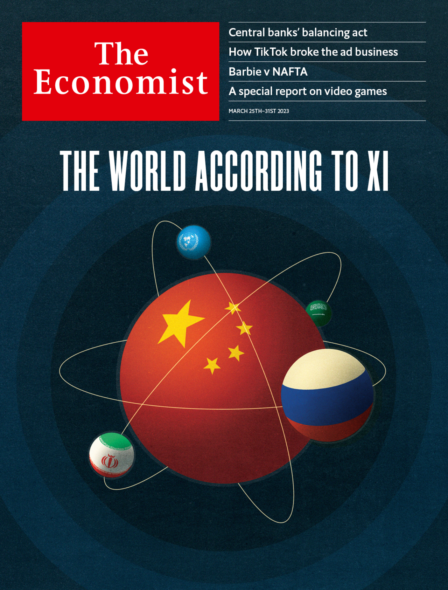

###### The Economist

# This week’s cover 

##### How we saw the world 

> Mar 23rd 2023 

This week’s worldwide cover focuses on China and its president, Xi Jinping, who recently finished a three-day trip to Moscow. Mr Xi aims to twist the American-led world order into a more transactional system of deals between great powers. Even if this form of diplomacy brings some gains it contains real peril.

 


: 

: 

: 


