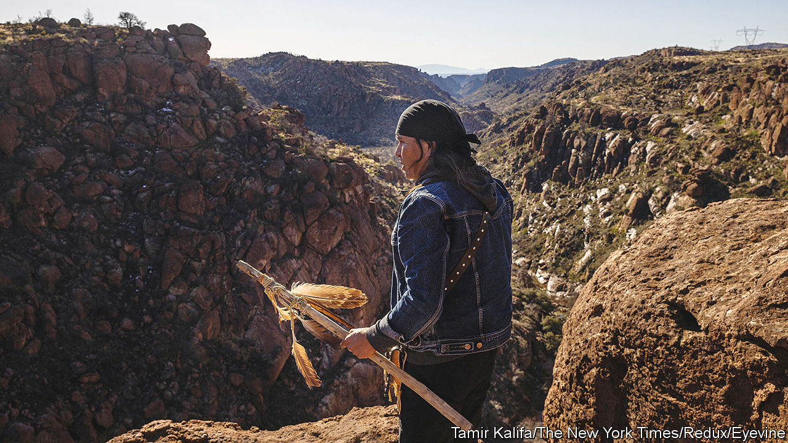

###### An Apache battle

# A fight in Arizona over sacred land and a mine raises big issues 

##### A tricky religious-liberty dispute is coming to a head 

 

> Mar 19th 2023 

ABOUT 50 MILES (80km) east of Phoenix, Arizona, the desert turns to mountains. Some 3,000 feet above the plain lies Oak Flat, an 800-acre expanse known in Western Apache as Chi’chil Bildagoteel. The land is sacred to several native American tribes. “For us it’s a female place,” says Wendsler Nosie, a former chairman of the San Carlos Apache, evoking its life-giving quality. “You can be born there and die there and it has everything for you.”

One of the world’s largest copper deposits sits beneath Oak Flat. Mining it would supply a quarter of the copper America needs for at least four decades, and provide thousands of jobs. Copper is used in renewable-power generation, and demand is growing. The federal government, the owner of the land, plans to transfer it to Resolution Copper, a joint venture between Rio Tinto and BHP, two multinational mining companies. 

Hoping to block the transfer, Apache Stronghold, a group of tribespeople led by Mr Nosie, has taken the government to court. Its members say that establishing a mine at Oak Flat would violate their religious freedom by destroying the centre of their faith. In June 2022 they lost in a two-to-one decision in the 9th Circuit Court of Appeals. But in November the court said it would rehear the case (meaning with a panel of 11 judges). The judges duly heard oral arguments in Pasadena, California, on March 21st.

A ruling in Apache Stronghold’s favour could save Oak Flat. But it could also be costly to Arizona, which stands to gain $60bn over the life of the mine. And scrapping the project could hinder America’s green transition. Unless domestic copper-mining were expanded elsewhere, imports would have to make up the shortfall. And as competition for copper grows elsewhere, too, America risks losing out. 

Fewer than 1% of requests for rehearing  are granted. It is rarer still for a court to decide to rehear a case of its own accord, as it did in this instance. That suggests that many 9th-circuit judges are interested in thinking through the conundrum posed by Oak Flat. Though American law is designed to protect all faiths equally, native American claims have often fared badly. Courts have ruled that when the government prevents a church from building an extension, it may be curtailing religious freedom. But sacred native American sites have been lawfully bulldozed. 

Stephanie Barclay, of the University of Notre Dame, who represents the National Congress of American Indians in the Oak Flat case, argues that the federal government has a history of showing “callousness, disregard and, I think, contempt” for native American faith. In one instance the federal government changed the design of a road to protect a tattoo parlour, but destroyed a native American holy place. 

The First Amendment protects freedom of religion in broad terms. In 1993, following a Supreme Court decision in 1990 that watered down that liberty, Congress passed the Religious Freedom Restoration Act. This law forbids the federal government to place a “substantial burden” on religious practice unless it can show a “compelling interest” in doing so. However, it did not clarify how that burden should be defined. At the hearing this week the judges probed the parties on the concept of substantial burden.

In 2008, in , the 9th Circuit Court ruled that the government was not imposing a substantial burden on native American faith by allowing a ski resort to use treated sewage water to make artificial snow on a sacred mountain. Drawing on earlier cases, the court held that the government creates a substantial burden only when it penalises a person for upholding their religious beliefs, or when it denies them something to which they are entitled, such as unemployment benefits. 

Burdens and proof

When the court considered the fate of Oak Flat last year, it was bound by the ruling. But  cases can revisit precedents. Apache Stronghold wants the court to adopt a less pinched reading of “substantial burden”. A mine that destroys a site of such significance is clearly burdensome, it says. If Oak Flat is destroyed, Mr Nosie says, “our children will no longer be who they are”. Outside the courtroom on Tuesday protesters in native dress drummed home the message.

Those on the government’s side say that applying those standards to cases involving federal land would create a slippery slope. It would be easy, they argue, for faith groups to make demands on huge tracts of federal land, unreasonably hindering the government. If the mine were abandoned local people—including native Americans who support the project—would lose jobs and money. But a ruling in Apache Stronghold’s favour would narrow the gap between how Western and native religions are protected by the law. 

Whatever the outcome at the 9th Circuit, the Supreme Court will probably have the last word. In the past a conservative bench might have spelled trouble for Apache Stronghold. Today’s court may be different. Justice Neil Gorsuch, appointed by President Donald Trump, is an expert on American Indian law and has championed native American religious rights. And the current bench seems invested in protecting religion. Of 22 religious-freedom cases brought before the court since 2012, 21 decisions have expanded those freedoms, 18 of them unanimously. ■


