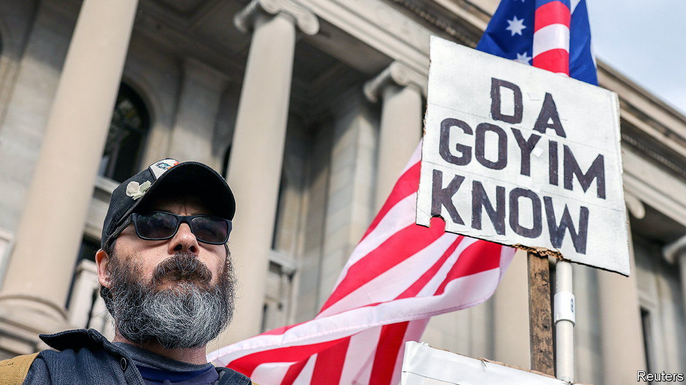
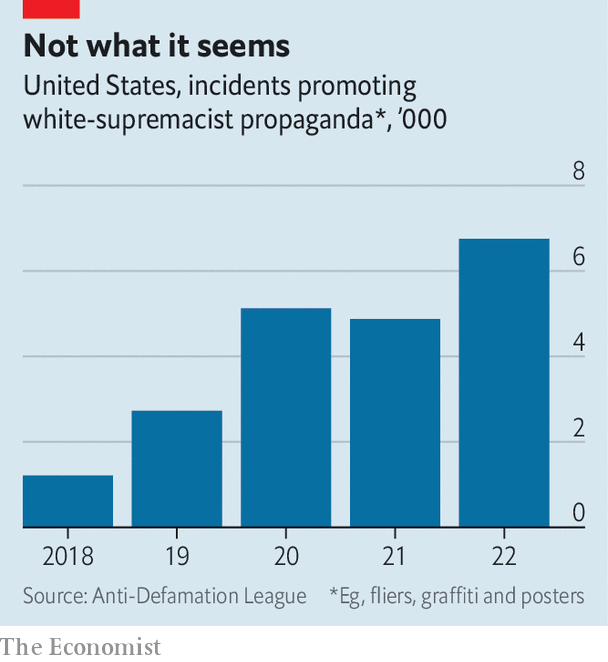

###### Quantifying hatred

# Anti-Semitism in America is becoming flashier, louder and rarer 

##### Incidents of anti-Semitic hate are up, while assaults are down. How can this be? 

 

> Mar 23rd 2023 

One chilly morning in January residents of Blackstone, a posh neighbourhood in Providence, Rhode Island, woke up to find Ziploc bags strewn across their lawns. Stuffed inside were recruitment pamphlets looking for men “of European descent” who wish to see a “better future for [their] people”. The pamphlets were distributed by NSC-131, a New England-based neo-Nazi group. Targeting Blackstone was no fluke—the neighbourhood is home to Rhode Island’s largest Jewish population. Adam Greenman, head of a Jewish community centre there, says it is part of a growing trend. According to his office’s tally, anti-Semitic incidents in Rhode Island have more than doubled in the past year.

On paper anti-Semitism would seem to be rife in America. The Anti-Defamation League (ADL), an advocacy group, recorded about 2,441 hate incidents targeting Jews in 2022, after a peak of 2,717 in 2021. Yet by some measures anti-Semitism is also declining. According to ADL’s data, incidents of isolated harassment and vandalism decreased last year by 35% and 30% respectively. The FBI has also seen a decline in hate crimes against Jews, from a high of 963 in 2019 to 817 in 2021, the most recent year on record. About 6m American adults identify as Jewish.

 


One answer is that white supremacist groups have taken online trolling and applied it to the offline world. In 2022 white supremacist groups staged 40 demonstrations, 25% more than in the previous year and a tenfold increase since 2017. Some groups, such as Goyim Defence League, which ADL describes as “a small network of virulently anti-Semitic provocateurs” founded around 2018, send its members on cross-country tours.

Their numbers may be fairly small, but white supremacists have found an old-fashioned way to seem ubiquitous. Carla Hill, head of ADL’s Centre on Extremism, says white supremacist groups have embraced printed propaganda as the way forward for their movement. In 2017 a handful of groups distributed anti-Semitic pamphlets a few dozen times across 20 states. Last year more than 30 groups spread anti-Semitic messaging 852 times in every state except Hawaii and New Mexico.

A tactical turn came after a violent gathering at the Unite the Right rally in Charlottesville, Virginia, in August 2017 left one person dead and dozens injured. The rally triggered a split among white supremacists, some of whom thought the violence went too far. “Do you do the openly and blatantly white supremacist in their face? …or do you put it in a more acceptable framing, so that more people will come over to your side and then work at them over time to get them on board?”, Ms Hill says they asked themselves.

Often done under the cover of night, leaflet drops allow perpetrators to remain anonymous. If caught, they may get away with a minor citation for littering or trespassing. As deplorable as it may be, in many cases hate speech is protected by the First Amendment, though some states are trying to find ways to curb it. In New Hampshire the Department of Justice recently brought civil charges against two members of NSC-131 who hung a banner from an overpass reading “Keep New England White”. The argument is the two men trespassed on government property to terrorise people through racial hatred, an offence punishable under the state’s Civil Rights Act. If successful, it would allow prosecutors to pursue criminal charges against the group for future violations.

Pamphleteering is now a membership requirement for several groups. The Texas-based Patriot Front, most prolific of the pamphleteers, requires members to do it every week. Ms Hill says some groups have even started working together to spread each other’s propaganda. Patriot Front has softened the tone of its leaflets to mask its horrible ideology, scrubbing white supremacist language and including lines such as “Defend American labour” and “Strong families make strong nations”. 

The greatest harm, says Ms Hill, comes from online amplification of the stunts, which often get posted on group chats and social-media channels, giving hate groups an outsize impact. “A dozen people or so can do a lot of damage to a community, making them feel like [their presence] is much bigger than it is,” Ms Hill says. That knowledge might offer Providence’s Jewish residents some comfort. ■


