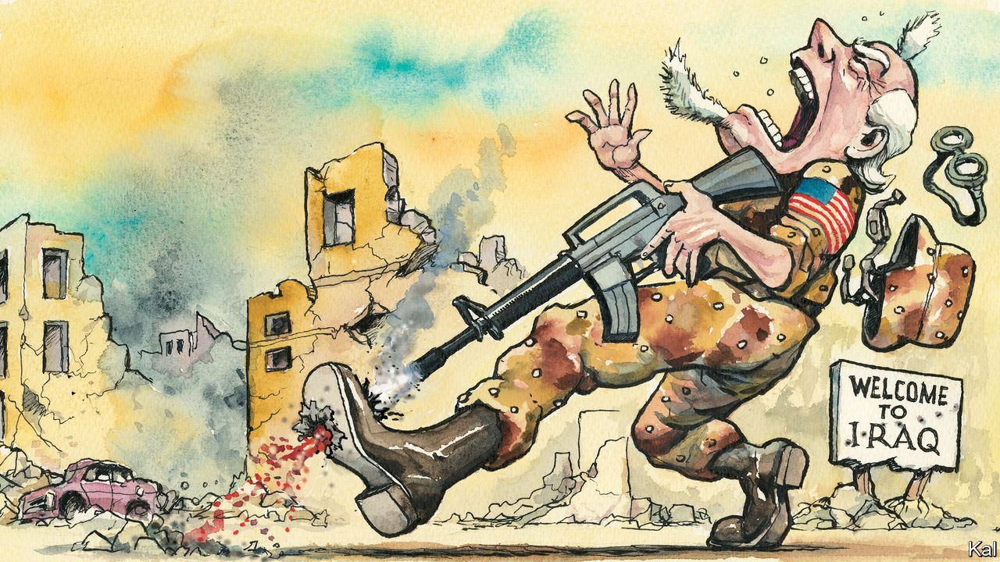

###### Lexington

# How the Iraq war became a threat to American democracy 

##### The country has yet to recover from its bitter lessons 

 

> Mar 22nd 2023 

Twenty years ago, President George W. Bush stood before the American people and proposed a radical intervention to head off a growing menace in one of the world’s most troubled regions. “Seldom has history offered a greater opportunity to do so much for so many,” he said in his state-of-the-union message in 2003. 

The years would prove him right. Millions more people would have died of HIV/AIDS in Africa if Mr Bush had not defied his party’s isolationist wing, ever contemptuous of foreign assistance, and pressed Congress to spend billions of dollars on what became, at least pre-covid, the largest commitment ever by a nation to fight a single disease. Mr Bush’s initiative was not just compassionate but wise. Would that it was his defining act. 

In that same speech Mr Bush pivoted from his few sentences about fighting AIDS to the threat he said Saddam Hussein posed to America and his own people. “If this is not evil,” he said, in his moralistic key, “then evil has no meaning.” He said that the secretary of state, Colin Powell, would soon disclose intelligence to the UN Security Council about Iraq’s weapons programmes and links to terrorists. But he made clear that, if he thought it necessary, he would act against Saddam without the UN’s blessing. 

Pick a sorrow from the millions that ensued: an Iraqi child who lost both parents to an American missile; a man standing on a box in the Americans’ Abu Ghraib prison with a sack over his head and his arms spread, wires twisting from his fingers; an American veteran who cannot stop drinking, cannot sustain a relationship, cannot sit without his back to a wall. Any one is enough to make you wish you could run back down the hall of history, calling to Mr Bush to stop. You need not even pause to survey the bigger picture—the empowerment of Iran, the rise of Islamic State, the metastasis of the Syrian civil war, the soiling of America’s image, and self-image, as competent, honest and decent.

There were voices raised against the invasion, of course, but America’s interlocking political, security and media elites—its establishment—rallied behind it. During a Senate debate over the Iraq-war authorisation, Senator Joe Biden recalled “the sin of Vietnam” and “the failure of two presidents to level with the American people” over that war’s costs. Then he voted for the measure. Three years later, he called that vote a mistake.

Not all America’s woes can be traced to that fateful invasion, when America’s arrogance rather than its generosity—the flip sides of its idealism—became its global calling-card. The global financial meltdown later that decade rounded out the failure of the establishment. But the Iraq war propelled America down the road to Donald Trump.

Barack Obama represented hope of sharp change from Mr Bush, yet those two leaders were much more like each other than like the president who came next. They obeyed the conventions of American politics, probably unaware of how brittle those had become: that expertise mattered; that the press, though flawed, was after the truth; that the meritocracy was real; that not everyone was out just for money and power. They both promoted two central ideals of American public life: that in the world America had causes beyond the pursuit of raw national interest, and that at home the national interest superseded the political one.

Mr Trump told Americans what they had come to suspect, that all this was crap. America should have taken Iraq’s oil. Generals could be fools, and even so-called war heroes could be losers. America should use more severe forms of torture than waterboarding. China was raping America while its leaders did nothing. The press lied. The experts lied. Politicians, of course, lied all the time. The establishment was out for itself. You were a sucker if you did not assume corruption and self-seeking were the essentials of human behaviour. “You think our country’s so innocent?” Mr Trump said, when asked how he could defend Vladimir Putin.

Mr Biden, a throwback in so many ways, is trying as president to restore the idea of American idealism. America is meant again to be the guardian of a rules-based international order. Much has been made of the administration’s decision, on the eve of Russia’s invasion of Ukraine, to share intelligence about what was to come. Yet that is what Mr Powell did, in greater detail, at the United Nations. The difference was that this time the intelligence was correct. This time America has matched its words and deeds. It has sought and sustained support within the UN. It has led competently, in Ukraine if not Afghanistan, and meant what it said about rights and democracy. So far. 

Who are the trusted?

Mr Biden recently recalled how, after he assured European leaders two years ago that America was back in the struggle against autocracy and climate change, Emmanuel Macron of France replied: “For how long?” Mr Biden is right to feel haunted by that challenge. If Mr Trump has his way with the Republican Party, and he usually does, it will swing from imagining just 20 years ago it would swaddle the planet in democracy to advocating its surrender to Russian dominion in Europe.

At home, idealism may seem to be staging a comeback, but that is only on the surface. On the right, the American Greatness school has yet to clothe Trumpism in an ideology amounting to more than grandiose self-interest. On the left, identity politics has licensed the meritocratic elite—including the new socialists—to ignore class, to celebrate their own enlightenment and to feel contempt for poor white Americans. Americans’ embrace of consoling ideologies is making them even more righteous and credulous than they were on the eve of the Iraq war, provided the propaganda comes from their own side. 

Mr Bush is said not to regret the Iraq war. He should. In service to his decency rather than his hubris, his persistence might have endured as an example for a far better America. ■


