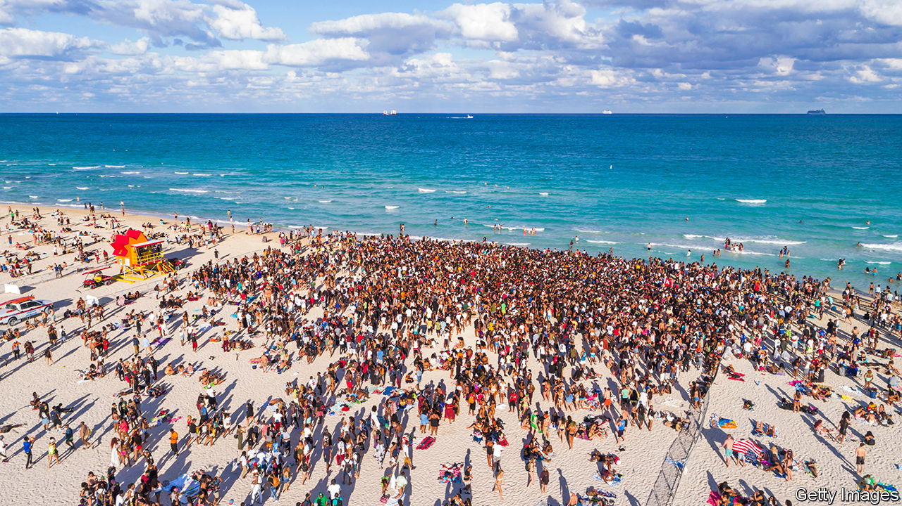

###### Breaking news

# Spring break is an economic nightmare for the hottest host cities 

##### America’s beach towns are looking for ways to repel badly behaved college students 

 

> Mar 23rd 2023 

Few things are as rowdy and reckless as college spring break. Each year swarms of students make a pilgrimage to America’s southern beach towns for a booze-fuelled week-long party. According to Airlines for America, a trade group, this year an astonishing 2.6m Americans are expected to fly on each day of March and April—a number boosted, no doubt, by spring-break travel. Many of their destination-cities are dreading their arrival. 

Miami Beach never wanted spring-breakers. This year, as partiers flooded the beach, things got raucous. On March 19th, after two consecutive deadly shootings, the mayor imposed an emergency midnight curfew and banned the sale of takeaway alcohol after 6pm in part of the city. The rules could legally last just 72 hours.

Compared with other tourists, college students barely spend money. They pile into cheap (and sometimes dodgy) rented rooms and chug supermarket booze rather than buying cocktails. If they dine out, according to vexed restaurateurs, they hardly tip. After dark they get drunk and drugged.

The wildness attracts undesirable characters: on the South Beach shore a middle-aged man offers a teenager an unlabelled bottle of “champagne”. Non-college-goers who come to join in the debauchery commit more serious crimes—feuds become perilous when partiers bring pistols. Nearly half of the 800 arrested at last year’s spring break were county residents from outside the city; just a quarter were from out of state. This year police arrested 322 people and seized over 70 guns in the first three weeks of March. 

More than 400 Miami Beach police officers are working overtime to tame the crowds. Resort-tax revenues do not cover the costs. The mayor, the police and the chamber of commerce are all desperate for the spring-breakers to retreat. But an attempt to ban liquor sales after 2am was crushed when a nightclub sued. Busting illegal Airbnbs is a game of whack-a-mole. And when the city withheld permits for beach parties, entrepreneurial hosts took to the sea, selling tickets for lawless cruises. (The city swiftly put more officers on boats.) “Every single city in Florida that has been a spring-break destination has done everything it could to end its spring break,” says Miami Beach’s mayor, Dan Gelber. For him, it’s not working.

Fort Lauderdale, nicknamed “Fort Liquordale” for booze-smuggling during Prohibition, was the first to host a roaring spring break and the first to shut it down. When a 1960 film brought the hedonistic escapade there to the big screen, Americans became mesmerised. By the mid-1980s spring-breakers mobbed the place. Bad behaviour made residents rally. Florida raised the drinking age from 19 to 21; the city tightened open-container laws. The numbers plunged. “Back in the day it was belly-flop contests, nickel beers and hot-dog stands,” says Stacy Ritter, head of the city’s tourism agency. “These days it’s a different kind of college student, the kind that carries daddy’s American Express card.” Though police expect double to triple as many students as last year, Fort Lauderdale’s spring break remains largely peaceful. 

Farther west, city efforts have also had more of a bite. After students wrecked motels and trashed the waterfront of Gulf Shores, Alabama, in 2016, a ban on alcohol at the beach and a forceful crackdown sent them scurrying. “We had the gun loaded, ready to pull the trigger,” says the mayor, Robert Craft. Few have returned. 

Spring-breakers are not unwanted everywhere. South Padre Island, off the Texas coast, spent $15,000 advertising on college campuses this year. Its population more than doubles when students arrive. It is easier to patrol than bigger cities, and its proximity to the Mexican border means there is already an overload of officers. But if its campaign is too successful, it may want to boot the college crowd out too. 

Back in Miami Beach police are afraid to lay down the law. “With social media these days, whatever we do will be wrong,” one says. The city is sponsoring night-time shows to tempt visitors away from the chaos. But volleyball tournaments are not what lured the fraternity brothers south.■


