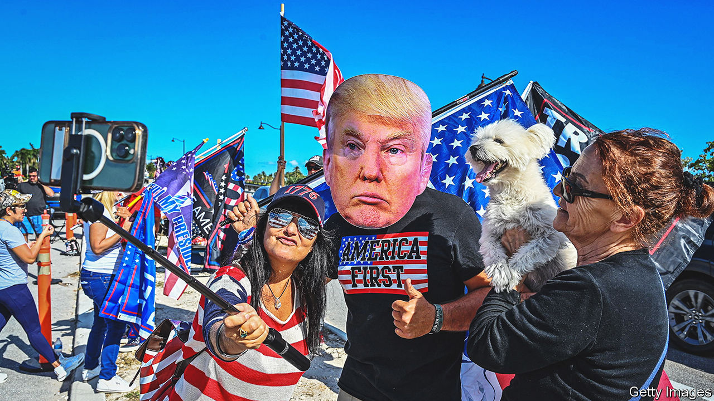
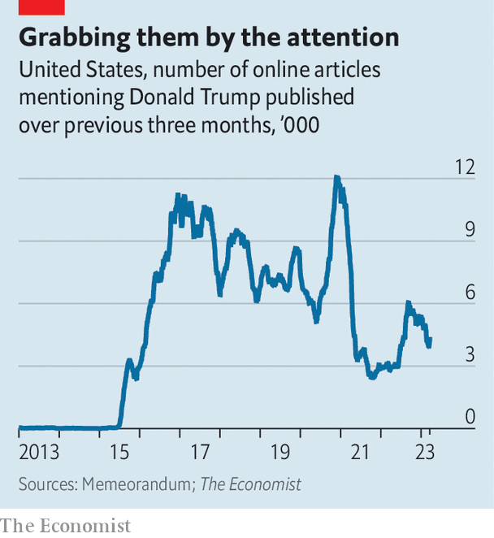

###### Stormy whether

# The cases against Donald Trump are piling up 

##### The Manhattan DA’s indictment, if it comes, will not be the last one 

 

> Mar 23rd 2023 

SOME COUNTRIES are fonder of chucking former leaders into prison than others. South Korea has convicted three prime ministers and two presidents in the past decade. In the span of a single year, French courts handed convictions down to Nicolas Sarkozy, its former president, and François Fillon, his former prime minister. In this regard, America is exceptional—having jailed no ex-president in its entire history. Even Richard Nixon was given a pardon to spare him the indignity of a trial after the Watergate scandal.

But Donald Trump may soon break that precedent, too. Manhattan prosecutors are weighing whether to arrest the former president for covering up hush-money payments in the waning days of the 2016 presidential campaign to Stephanie Clifford (better known by her performing name, Stormy Daniels), a former adult-film actress, who says they had sex once. Such an extraordinary sentence would have felled a lesser politician, who might have permanently slunk out of the public eye. But not Mr Trump.

The past (and would-be future) president called for his supporters to rally to his defence—in ways that echoed his messages ahead of the  by his supporters on January 6th 2021. “THEY’RE KILLING OUR NATION AS WE SIT BACK &amp; WATCH” he wrote on the social-media platform he started, Truth Social, where “all caps” seems to be the default setting. “PROTEST, TAKE OUR NATION BACK!”. Mr Trump’s deduction from January 6th seems to be that summoning a mob works well for him. Police set up barricades outside Manhattan’s criminal court in anticipation of the indictment. Numerous bomb threats have already been made.

 


So begins a years-long spat which will upend American politics. Having received a respite from Trumpian storm and stress, American media are returning to their previous patterns of coverage (see chart). Mr Trump will, in all likelihood, fight to be president while his lawyers try to defuse a criminal trial—rather like Israel’s prime minister Binyamin Netanyahu, who is busy defanging his country’s supreme court now that he is back in power. The news plays into Mr Trump’s fearmongering about , which he has recommitted to destroying once he is back in the White House in January 2025. Grandees in the Republican Party have rallied to the president’s defence, including would-be rivals for the party’s presidential nomination in 2024, whose task has just become more complicated.

Prosecuting Mr Trump for the campaign-finance violation relies on a convoluted argument. In 2016 Michael Cohen, the president’s personal lawyer (who later went to prison himself), paid $130,000 to Ms Daniels out of his own pocket. Mr Trump allegedly reimbursed Mr Cohen with payments disguised as routine legal expenses. Falsifying business records can be a misdemeanour under New York law. The felony indictment would indicate that prosecutors are going to argue that the minor crime facilitated a more serious one: failing to declare the payment, which was made a few weeks before the election, as a de facto campaign expense.

The payment probably did benefit the campaign and it was indeed undeclared. Mr Cohen, the lawyer, pleaded guilty to breaking campaign-finance law. But legal theory for prosecuting Mr Trump in Manhattan is untested. The campaign-finance rules that he may have broken are federal. The accounting rule is a state one. Linking the two in this way is unusual, and a judge may decide it is unwarranted.

The payment, which occurred six-and-a-half years ago, was scrutinised by federal prosecutors, campaign-finance regulators and one past district attorney for Manhattan—all of whom declined to press charges. But Alvin Bragg, the new progressive district attorney (DA) who has earned the ire even of fellow Democrats like New York’s mayor Eric Adams, seems to have decided that the case against Mr Trump is stronger than they did. He is no party hack, though. Last year two lawyers who had been working in Mr Bragg’s office resigned, citing his reluctance to bring a case against the former president.

Of the four active criminal investigations into the former president—over the stolen-election claims that preceded the January 6th attack; over his mishandling of classified documents after leaving the White House; and his attempts to encourage election fraud in the state of Georgia—the New York case is the weakest. Meanwhile, the others are grinding their way through the courts.

Fight, flight, indict

In February a special counsel investigating the scheme to overturn the 2020 election subpoenaed Mike Pence, the former vice-president, to compel him to testify before a grand jury. On March 17th a federal judge ruled that one of Mr Trump’s lawyers was required to testify before another grand jury. On March 21st ABC News reported that this was because the president may have misled his own lawyers about classified materials kept at his Florida estate of Mar-a-Lago, which the FBI recovered in an unannounced search in August 2022.

A third grand jury in Fulton County, Georgia, has been examining the president’s exhortation, recorded on tape, to state officials to “find 11,780 votes” and help him overturn his narrow election loss in the state. The DA there promised in January that a decision on prosecution was “imminent”. Mr Trump, who became the only president to be multiply impeached, may also become the only president to have been multiply indicted.

In the short run, the legal drama in Manhattan will complicate , which is well under way. Even if top donors and officials detest the former president, they cannot afford to anger his devoted base. Nearly every elected Republican of note and every candidate who is, or is thought to be, seeking the presidency has felt compelled to inveigh against Mr Bragg. Mr Pence, whom Trump supporters wanted to lynch on January 6th, came to his former boss’s defence, calling it “another politically charged prosecution”. Nikki Haley, a former Trump cabinet member who is , called the prosecution “more about revenge than it is about justice”.

Ron DeSantis, the Florida governor who is seen as the president’s chief rival, delivered the catechism with a twist. “I don’t know what goes into paying hush money to a porn star to secure silence over some type of alleged affair. I just, I can’t speak to that,” winning some laughter in the crowd and later howls of discontent from Mr Trump’s most fervent supporters. That is one sign of the hotting-up of the cold war between the two Floridians. Mr Trump has taken lately to brainstorming nicknames that impugn the governor’s integrity (“Ron DeSanctimonious”), physicality (“Meatball Ron”) and masculinity (“Tiny D”). Congressional Republicans have already requested testimony and documents from Mr Bragg, to put his trial on trial.

The backlash may temporarily make Mr Trump’s standing with the Republican field more solid. But many primary voters, particularly the wealthier ones who make donations, are exhausted with the antics. Several of Mr Trump’s primary opponents are former courtiers who are trying diplomatically to offer a trade to his supporters: keep the policies but ditch the immorality plays. The unpredictability of criminal prosecutions may upset this delicate process. If Mr Bragg’s case against Mr Trump were to implode at the wrong moment, it could help sweep the former president to the nomination. Other prosecutors are taking their time. “If you go after the king, you better kill the king,” says Jennifer Beidel, a former federal prosecutor.

That said, it is hard to imagine all these cases rendering Mr Trump more viable in a general election. All else being equal, a criminal indictment is still unhelpful to a presidential candidate.■


