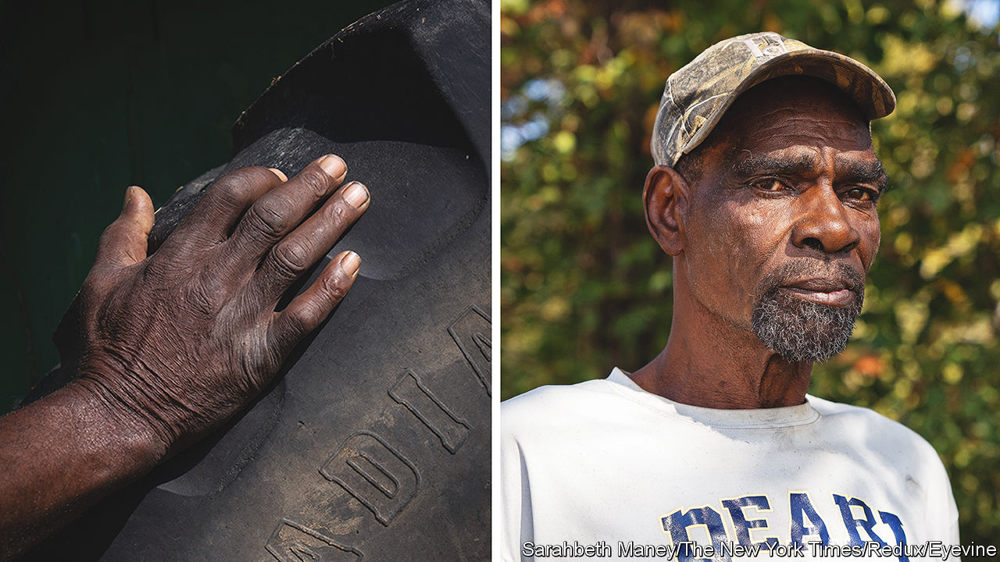

###### Delta veld

# White South African farmers are thriving in Mississippi 

##### They are also becoming entangled in an old southern story 

 

> Mar 23rd 2023 

White south africans started working on farms in Mississippi more than two decades ago, if Andrew Johnson (pictured) remembers correctly. At Pitts Farm, where the sexagenarian farm worker was formerly employed, records show that clipped accents became a mainstay in 2014. The South Africans were good guys, hard-working and kept to themselves. The fact that they were getting paid 60% more wasn’t their fault, Mr Johnson says. “They didn’t know what we was getting, we didn’t know what they was getting.” 

Each year, several thousand South Africans come to America on seasonal H-2A visas as temporary agricultural workers. The visa was first introduced in 1986. Employers must pay for flight tickets, housing and food, and dish out a premium hourly wage. Persistent farm-labour shortages across America have pushed visas up by 211% from 2011 to the 2021 fiscal year. South African hires, leaving behind a poor economy and high crime rates, have increased by 692% in that same period, and now make up the second-largest group of H-2A workers—exceeded only by Mexicans.

But those arriving in Sunflower County, Mississippi, face a strange reality. Since over 70% of the population is black, the temporary hires have become entangled in the oldest story in the South. A spate of recent lawsuits in the state of Mississippi alleges that what first appeared to be a temporary need for foreign hands may have become a preference, to the detriment of the local, black and poor workforce.

In 2021 the Mississippi Centre for Justice, a non-profit law firm, brought the first lawsuit on behalf of six black workers, including Mr Johnson. Although the visa programme requires locals to get a rise if the calculated H-2A wage is higher than local salaries, they alleged they never received a pay bump, claiming that in 2020 they made $7.25 for every $11.83 the South Africans received. Toilet use, too, revealed a hierarchy: 74-year-old Walter Griffin, one of the plaintiffs, recalls the indecency of having to “use the elements” while the South Africans used indoor facilities.

Because the South Africans were new to the equipment, climate and the farming techniques of the American South, they required training. And this responsibility fell on the shoulders of the black workers, who say they realised too late that they were teaching their replacements. According to a Department of Labour audit of the farm’s operations from 2020 to 2021, four local workers lost out on shifts when new recruits arrived. The Pitts Farm lawsuit was settled in December for an undisclosed figure, as was another lawsuit brought in 2021 against Harris Russell Farms. Four more lawsuits are now in the works.

According to several white farm-owners in the region, hiring from abroad is a necessity. Asking to speak anonymously because they feared a fine, or being perceived as racist, many farm-owners say the local folks are lazy, doing only the minimum work and waiting to receive handouts. By contrast, one Clarksdale farm manager says of the South Africans, “if I say jump, they say how high?” This attitude, he adds, is worth paying more for.

The language that some of the owners use, however, makes it difficult to know whether what’s happening is just the laws of supply and demand in operation, or evidence of straightforward racism. Or, maybe, it is both. One Robbinsonville-based farmer, who hires about 15 South African workers every year, is not shy to say that rural black Mississippians have “babies like damn rabbits” and “live on food stamps”.

Though the lawsuits have focused on farms in Mississippi, other states with high numbers of H-2A workers and historically poor, black farming populations should face similar scrutiny, suggests Amal Bouhabib, a lawyer at the Southern Legal Migrant Service, who worked on the Pitts lawsuit. In November 2022 the department fined 11 farms in the Delta, eventually recovering more than $130,000 in wages for 45 workers. Louisiana and Arkansas are next on the list. As H-2A workers start coming to America for the beginning of the sowing season, the feds will start knocking on barn doors. ■


