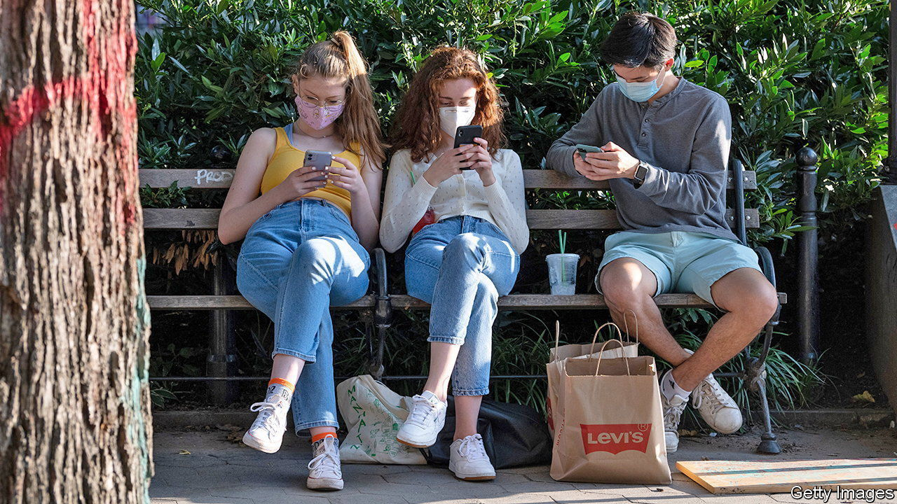
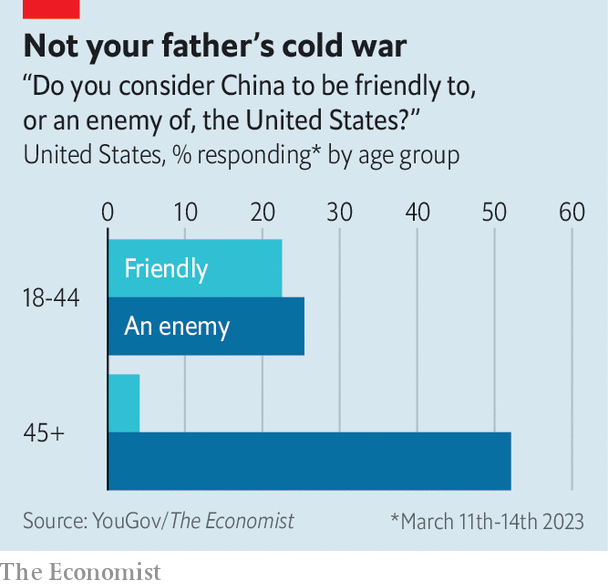

###### Generational divide

# Younger Americans are friendlier to China 

##### They are much less likely to see the country as an enemy than their parents 

 

> Mar 23rd 2023 

THE competition between America and China is infiltrating college dorm rooms. Citing national security concerns, at least 29 states have banned TikTok, the video app owned by ByteDance, a Chinese firm, on government devices. Many universities also banned students from using the app on campus wifi. In practice, that means students will use data, not wifi, to watch videos of friends revealing their outfits for sorority recruitment. But young people’s surprise over the TikTok bans may also reveal how differently they view China from their parents. 

 


Recent polling from  and YouGov shows the startling difference in Americans’ views of China by age group. Roughly 25% of Americans aged 18 to 44 said they view China as an enemy, compared with about 52% of those 45 and over (see chart). Almost as many young Americans said they view China as “friendly” as those who said the country was an “enemy”. Just 4% of older Americans see China as friendly. 

Young Americans were also less likely to see Russia as an enemy than their older peers, though all ages expressed more hostility towards Russia than China. This is probably due to the war in Ukraine, and older Americans’ lingering dislike for the Soviet Union during the cold war.

Meanwhile, views of China among partisans are shifting. Republicans have long been more likely than Democrats to view China as an adversary. But both parties have become more hawkish. When Donald Trump took office in 2017, just 10% of Democrats and 20% of Republicans said they believed China to be an enemy. As of last week, 34% of Democrats and 48% of Republicans took this view.


