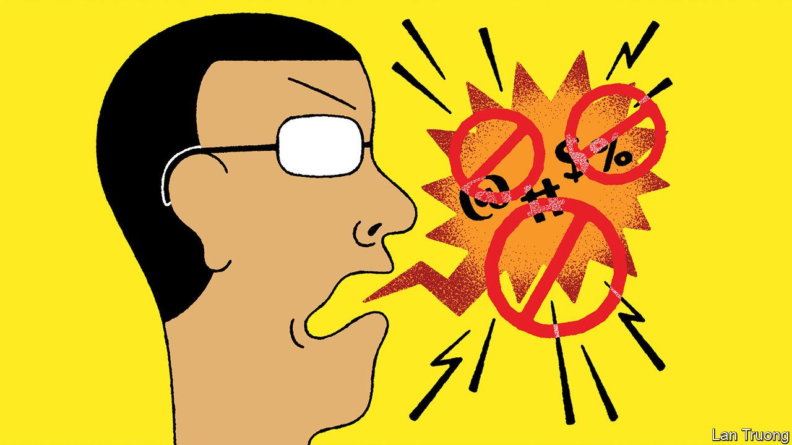

###### Banyan

# In much of Asia, race is just too hard to talk about 

##### Malaysia’s former prime minister, Mahathir Mohamad, shows how not to do so 

 

> Mar 30th 2023 

IN HIS POMP as a cantankerous prime minister of Malaysia (1981-2003 and 2018-20), Mahathir Mohamad would speak for a continent. “Asian values are universal values. European values are European values,” he declared in 1996. These days, as a cantankerous 97-year-old troublemaker, Dr Mahathir tends to speak for just one of his country’s ethnic groups, the majority Malays, who, he tweeted on March 9th, “get nothing from multiracialism”. This was part of a long thread attacking Malaysia’s Chinese and Indian minorities for failing, in his view, to adapt to Malay culture.

Not for the first time, Dr Mahathir was breaking a taboo. In Malaysia and many other Asian countries, open discussion of race is considered divisive and dangerous; it is often illegal. Yet that does not erase the political issue that race represents in Asian societies, many of which became multiracial as a result of colonialism in the 19th and 20th centuries, and witness enduring racial tensions. Asia needs to talk about race—even if Dr Mahathir demonstrated precisely how not to do so. Security was stepped up ahead of a “Malay Proclamation” convention in Kuala Lumpur on March 19th at which he was due to speak. The event moved online after the hosts of two proposed venues withdrew their offers.

The sensitivity was understandable. Race riots in the 1960s cast a shadow over the politics of both Malaysia and Singapore (which left the Malaysian federation and became independent in 1965). In Malaysia, to counter an imbalance in which much of the national wealth was in ethnic-Chinese hands, Malays have enjoyed the sort of affirmative-action policies and privileges more often afforded a disadvantaged minority. Singapore, which has an ethnic-Chinese majority, restricts inflammatory speech to prevent race rows, and practises social engineering, such as ethnic quotas in public housing, to enforce integration. 

Malaysia and Singapore, it should also be stressed, look comparatively harmonious in a region scarred by racially motivated horrors. In some Asian countries, minorities have been driven out: Chinese from Vietnam; Vietnamese from Cambodia; Nepalis from Bhutan; Indians from Fiji; Rohingyas from Myanmar; and on and on. The Chinese minority in the Indonesian capital, Jakarta, suffered horrific violence in 1998; hundreds were killed. Sri Lanka endured a bitter 26-year civil war, fuelled by discrimination against Tamils and then that minority’s fight for a homeland, which ended in 2009.

So race is almost everywhere a delicate topic. Yet Asia’s lack of almost any open discussion of it makes the issue vulnerable to rabble-rousers, as Dr Mahathir has demonstrated. His argument is that Malaysia’s Indians and Chinese, who retain their own languages and culture, should conform to Malay norms. He does not insist that they convert to Islam. But he reminds readers that he is of Indian heritage, yet accepted as a Malay; and that he meets the definition in Malaysia’s constitution of a Malay as someone who speaks Malay, follows Malay customary laws and is Muslim. He suggests that only Malays can be full citizens, and that the loyalties of the Chinese and Indian minorities are somehow suspect.

Similar racial finger-pointing and suspicion is sometimes fostered by the attitudes of the two continental giants to their diasporas. India grants “overseas citizen of India” status and easy access to the country (but not full citizenship) to those with parents, grandparents or great-grandparents born there (and to their spouses). Since 1954, overseas Chinese have not been automatically eligible for citizenship. But public opinion and official statements both sometimes suggest China’s government feels it has special responsibility for ethnic Chinese abroad. In 2015, after an ugly anti-Chinese demonstration in Kuala Lumpur, China’s ambassador visited the affected area to warn that China would “not sit by idly” if things got worse.

Such misconceived interventions fuel the suspicions of those like Dr Mahathir who refuse to accept that Malaysia is a multicultural, multiracial society, and all the better for it. Like the Hindutva ideology embraced by Narendra Modi’s government in India, this serves a political end, to win support among the majority by representing minorities as a threat. It is far more dangerous than the frank conversation about race most Asian governments fear. It also flouts the Asian values that Dr Mahathir espoused so fiercely in the 20th century. They include prizing consensus-building over confrontation and harmony over hatred.■


