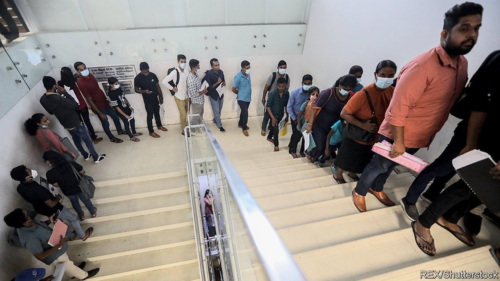

###### So long, farewell

# Middle-class Sri Lankans are fleeing their country 

##### In despair for their future, skilled workers are leaving in droves 

 

> Mar 30th 2023 

At the height of the economic crisis in Sri Lanka last year, winding queues for fuel and cooking gas were matched only by lines at the immigration and emigration department. The nearly 875,000 passports it issued in 2022 was an all-time high. Most of those outside the nondescript building in Colombo were not looking for a post-pandemic getaway but workers aching to flee shortages, inflation and uncertainty.

Official records suggest that 300,000 of Sri Lanka’s 22m people left for jobs abroad in 2022, most of them low- and semi-skilled workers. From January to March this year, another 73,000 left. And there is evidence that middle-class professionals have now joined the exodus.

Business leaders in many industries say they are bleeding staff, including managers they need to train replacements. Companies are used to churn among those aged 20 to 35—especially in it and other in-demand professions—but now seasoned employees in their 40s and 50s are taking off.

Sri Lanka’s prolonged crisis gives them many reasons to go. Annual inflation was 50.6% in February. Wages are not remotely keeping up, even as taxes climb. In January, President Ranil Wickremesinghe imposed more hikes to fix what the IMF—which last week approved a long-awaited $2.9bn package for Sri Lanka—called “one of the lowest revenue levels in the world”. At 36%, the highest income-tax rate is still modest. The opposition National People’s Power party may nonetheless be right to predict the tax rises will cause “the biggest brain drain” in Sri Lankan history.

Foreign recruitment agents are hiring young professionals on social media, says Rajitha Seneviratne, a 37-year-old air-traffic controller mulling an offer from the Middle East. Last month, his union warned that if “four or five more” of its members left, air-traffic control could break down.

Thousands of young IT workers have also decamped, potentially cramping one of Sri Lanka’s fastest-growing industries. Hundreds of doctors have gone, including 477 from January to August last year. A continuing outflow could cripple rural hospitals. There soon “won’t be anyone left to serve up a glass of wine in a hotel”, Mr Wickremesinghe is said to have quipped.

Yet the government is actively encouraging the drain, both to lighten the public-sector wage bill and in the hope of increasing remittances, Sri Lanka’s biggest source of foreign currency. The fugitive doctors are availing themselves of a facility for public-sector workers that the government introduced last June: up to five years of unpaid leave provided they remit $100-500 a month if they find work abroad.

The foreign employment minister, Manusha Nanayakkara, is trialling various schemes to push Sri Lankan workers overseas. His office advertises job openings with foreign governments on social media. A WhatsApp group and YouTube channel called “Rata Yamu”, or “Let’s Go Abroad”, publicises jobs Sri Lankans can secure through a state-run employment agency.

The government is also ramping up training in nursing, care-giving and other professions where Sri Lankans are in demand overseas, especially in Kuwait, Qatar and Saudi Arabia, where over 40% of registered émigrés went last year. New vocational training centres are being opened, some with private-sector support.

These policies seemed to be having their desired effect. Remittances, which slumped last year, have increased over the past four months. Yet there is an obvious danger that, by pushing out its brightest talent, Sri Lanka is depriving itself of the people it needs to rebuild at home.

Mr Nanayakkara admits that skill shortages are already emerging in manufacturing and hospitality. Some private firms have launched modest countermeasures. Several IT companies have introduced, in effect, loyalty bonuses for their employees. A big tea company, Dilmah Ceylon Tea, is covering the recent tax rise for its workers. Even so, says its ceo, Dilhan Fernando, the “uncertainty of not knowing what tomorrow might bring” remains a powerful reason for them to emigrate. ■

