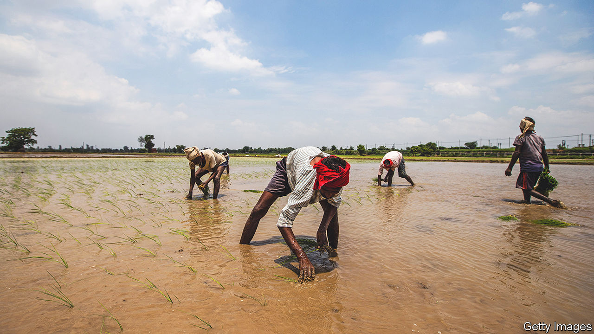
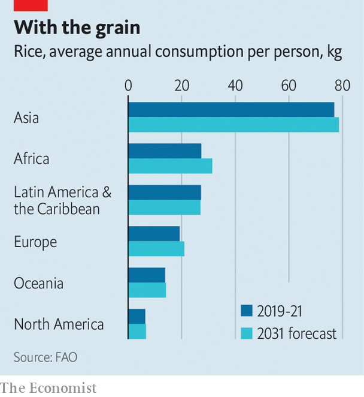
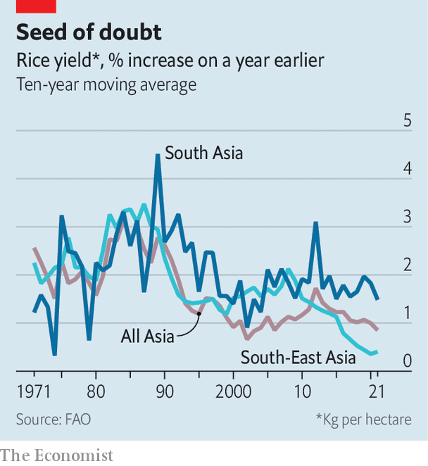

###### Agriculture in Asia

# The global rice crisis 

##### Rice feeds more than half the world—but also fuels diabetes and climate change 

 

> Mar 28th 2023 

According to Indonesian legend, rice was bestowed upon the island of Java by the goddess Dewi Sri. Pitying its inhabitants the blandness of their existing staple, cassava, she taught them how to nurture rice seedlings in lush green paddy fields. In India, the Hindu goddess Annapurna is said to have played a similar role; in Japan, Inari. Across Asia, rice has been conferred with a divine, and usually feminine, origin story.

Such mythologising is understandable. For thousands of years the starchy seeds of the grass plant  (often called Asian rice) have been the continent’s main foodstuff. Asia accounts for 90% of the world’s rice production and almost as much of its consumption. Asians get more than a quarter of their daily calories from rice. The UN estimates that the average Asian consumes 77kg of rice a year—more than the average African, European and American combined (see chart). Hundreds of millions of Asian farmers depend on growing the crop, many with only tiny patches of land. Yet the world’s rice bowl is cracking. 

 


Global rice demand—in Africa as well as Asia—is soaring. Yet yields are stagnating. The land, water and labour that rice production requires are becoming scarcer.  is a graver threat. Rising temperatures are ; more frequent floods are destroying them. No mere victim of global warming, rice cultivation is also a major cause of it, because paddy fields emit a lot of methane, a potent greenhouse gas. The crop that fuelled the rise of 60% of the world’s population is becoming a source of insecurity and threat.

Rising demand exacerbates the problem. By 2050 there will be 5.3bn people in Asia, up from 4.7bn today, and 2.5bn in Africa, up from 1.4bn. That growth is projected to drive a 30% rise in rice demand, according to a study published in the journal And only in the richest Asian countries, such as Japan and South Korea, are bread and pasta eating into rice’s monopoly as the continental staple.

Yet Asia’s rice productivity growth is falling. Yields increased by an annual average of only 0.9% over the past decade, down from around 1.3% in the decade before that, according to data from the UN. The drop was sharpest in South-East Asia, where the rate of increase fell from 1.4% to 0.4%. Indonesia and the Philippines already import a lot of rice. If yields do not increase, these countries will be increasingly dependent on others to feed their 400m people, according to the study.

For years production kept pace with rising demand thanks to the enduring effects of the green revolution, which began in the 1960s. To tackle poor yields, scientists at the International Rice Research Institute (IRRI), based in the Philippines, developed IR8, a variety that flourished with the use of fertiliser and irrigation systems. Introduced when China was emerging from famine and India on the brink of one, IR8 proved a mass life-saver. 

As IR8 spread across Asia, from the Philippines to Pakistan, rice yields increased. Greater productivity made rice a more attractive crop, so more resources were dedicated to it. Reduced worries about food security freed Asian governments to focus on industrialisation and economic growth. 

irri has developed new varieties of rice that could repeat some of this success. They are more productive and climate-resilient, and require less water. Still, meeting growing demand looks harder than it did in the 1960s. Urbanisation and relentless sub-division are eating into land holdings. Between 1971 and 2016 the size of the average Indian farm fell by more than half, from 2.3 hectares to 1.1. 

This makes productivity gains harder, especially where labour is scarce. Planting seeds in neat rows, replanting seedlings and harvesting them is back-breaking drudgery that Asian workers increasingly have the means to escape. Water, another big input, is scarcer. In many places soils are depleted and poisoned by excessive use of fertiliser and pesticide.

And no crop is as vulnerable to global warming as rice, say scientists at IRRI. A study in 2004 found that a 1°C increase in minimum temperatures leads to a 10% decline in yields. Rising sea levels, another result of warming, are already causing salt intrusion in low-lying areas of the Mekong delta, eroding rice yields there. Massive floods last year in Pakistan, the world’s fourth-biggest rice exporter, are estimated to have destroyed 15% of its harvest.

Rice’s contribution to global warming represents an underappreciated feedback loop. Irrigating paddy fields starves the underlying soil of oxygen. This encourages methane-emitting bacteria to flourish. Consequently, rice production is responsible for 12% of total methane emissions—and 1.5% of total greenhouse-gas emissions, comparable to aviation. Vietnam’s paddy fields produce more carbon equivalent than the country’s transportation.

A carbon culprit

Rice’s nutritional quality is another growing concern. The grain is high in glucose, which contributes to diabetes and obesity, and low in iron and zinc, two important micronutrients. In South Asia the prevalence of diabetes and malnutrition can be traced to over-reliance on rice. 

Tackling so many problems is complicated. If the first green revolution was about productivity, says Jean Balié, director-general of IRRI, the next one should focus on “systems rather than solutions at the plant or plot level”. This calls for better rice policies as well as better varieties.

Poor or outdated government interventions underlie most of the productivity and environmental worries. They distort markets and blunt incentives for change. Consider the case of Sandeep Singh of Bassi Akbarpur, a small village in the northern Indian state of Haryana. Though he grows rice, he prefers to eat , a bread made of wheat, a crop far better suited to Haryana’s hot, dry climate. Yet Mr Singh has been pushed by government incentives into a rice-wheat cropping cycle.

India procures rice from farmers at a guaranteed price, often set above the market rate. The crop is then sold to the poor at a subsidised price, promoting rice consumption. Fertilisers and water are also subsidised. Such interventions are prevalent across Asia. Most were introduced at a time of persistent food insecurity, when diabetes and environmental costs were much less of a concern than they are today.

Untying policy knots that have tightened over decades is hard. Farmers are vote banks that governments dare not antagonise. India’s ruling Bharatiya Janata Party, which prides itself on implementing tough but necessary measures, learnt this in 2021 when it was forced to roll back agriculture reforms in the face of protests by farmers.

Though there is no single solution for the deepening rice crisis, there are many partial ones. In parts of Asia where yields are low, such as Myanmar and the Philippines, it is possible to raise productivity by using more fertiliser and pesticide without doing serious environmental damage.

 


Scientists at IRRI and other research outfits have developed rice varieties resistant to floods, drought and heat. They have also produced more nutritious strains. These changes, combined with innovations in cultivation such as direct seeding—a planting method that requires less water and labour—can reduce environmental damage and increase yields. 

Experiments across Asia have confirmed this. In Bangladesh farmers growing Sub1, a flood-tolerant rice variety, achieved 6% higher yields and 55% greater profits, according to a study published in the journal  in 2021. A review of field trials in  suggests drought-resistant varieties enjoy a yield advantage of 0.8-1.2 tonnes per hectare.

The challenge is to get improved seeds and methods adopted at scale. Many farmers do not know they exist. Some are averse to trying something new. A nationwide survey of rice farmers in India in 2017-18 found that only 26% had adopted varieties released since 2004.

Governments can play a big role in highlighting the benefits of new varieties and methods. Vietnam’s is leading the way. It recently announced an ambitious plan to cultivate “low-carbon” rice on 1m hectares. It promotes this as a means to save labour and improve efficiencies. It is essential to avoid advertising emissions-mitigation as a burden to farmers, says Bjoern Ole Sander, a climate scientist at IRRI.


A bottom-up approach is also important. Agriculture-extension workers can play a big role in transmitting know-how, but are often neglected by policymakers. Most public agriculture spending goes on subsidies and irrigation, which tend to benefit richer farmers with bigger landholdings. 

Governments also need to do a lot more to reduce people’s dependency on rice. At India’s request, the UN has declared 2023 the year of millet. India is hoping to sell farmers and consumers on this crop, which is far more nutritious than rice or wheat and requires a lot less water. Indonesia is also promoting it. Today only health-conscious hipsters in Delhi would choose a millet  over a rice one. But where elites lead, masses often follow. If a big market emerged, it would entice some farmers to switch and even ardent rice growers to diversify.

The first green revolution averted an Asian catastrophe. The situation may not be as precarious today, but the challenge is in some ways bigger. Countries need to produce more with less—and with much greater care for the environment. That would amount to a “truly green revolution”, says Mr Balié, IRRI’s boss. 

The rewards could also be unprecedentedly large. More sustainable cultivation and increased yields would give farmers higher and steadier incomes. It would help them adapt to climate change and contribute to it less. This success, by no means assured, would help guarantee food security for Asians—and for the world. ■


