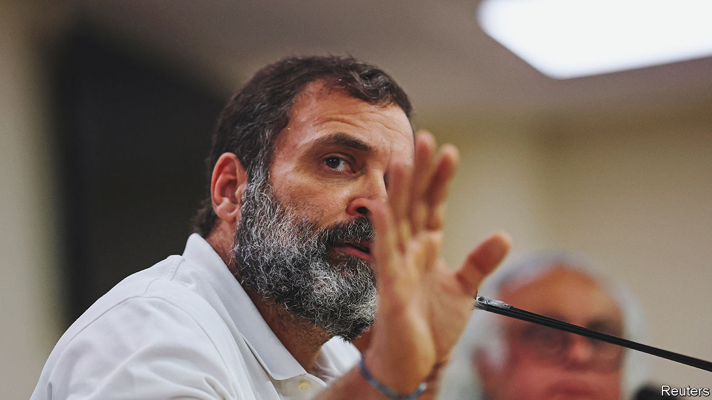

###### Rahul Gandhi

# The world’s biggest democracy is becoming less free 

##### Narendra Modi’s party seems keen to eliminate any significant dissent 

 

> Mar 27th 2023 

The world’s biggest democracy has taken a serious hit. On March 24th Rahul Gandhi, leader of India’s Congress party and by far the country’s best-known opposition figure, was disqualified from parliament after a court sentenced him to two years in prison on what Mr Gandhi says is a spurious defamation charge. A son, grandson and great-grandson of prime ministers, he has vowed to appeal against his conviction, which was handed down by a district court in Gujarat, home state of Narendra Modi, India’s prime minister. Yet even if Mr Gandhi avoids prison, he may not clear his name in time to lead his party into the general election due next year.

The court ruling followed weeks of tussling between Mr Gandhi and members of Mr Modi’s Bharatiya Janata Party (BJP). Mr Gandhi had repeatedly called for an inquiry into the relationship between Mr Modi and Gautam Adani, a billionaire tycoon whose business practices and closeness to power have come under scrutiny. In a series of speeches in Britain he also criticised the state of Indian democracy, prompting the BJP to block parliamentary business while demanding that Mr Gandhi apologise for supposedly insulting India abroad.

The Congress leader had been sued for defamation in Gujarat over a sardonic remark he made on the stump in 2019. He had noted that a pair of well-known fugitives from Indian justice were called Modi, a common family name in western India. Any observer of India’s roughhouse politics would recognise such rhetoric as par for the course; the BJP’s standard moniker for Mr Gandhi is (“dimwit”). Yet Purnesh Modi, a minor BJP politician unrelated to the prime minister, claimed that he and his community had been deeply wounded by Mr Gandhi’s remark.

The court found in Purnesh Modi’s favour on March 23rd. The sentence it meted out to Mr Gandhi was unusually harsh, legal experts said. It was also precisely the minimum jail time that triggers automatic expulsion from India’s parliament. Mr Gandhi was chucked out the following day.

India’s opposition leaders have increasingly found themselves facing legal difficulties. Two leaders of the Aam Aadmi Party, another important opposition outfit, are in hot water with the government’s Enforcement Directorate, which investigates economic crimes. Yet Mr Gandhi’s troubles appear to represent a major escalation in the bjp’s hounding of its opponents. Even if his appeal is successful, it will take time. The episode will therefore make Mr Gandhi even less effective at the helm of Congress than he has been hitherto (which is saying something). His treatment may also be regarded by other opposition leaders as a warning not to be too forthright in criticising Mr Modi and the BJP.

This might seem gratuitous, given the modesty of the threat posed to Mr Modi by Mr Gandhi. Congress has been trounced by the bjp in two successive general elections, and shows little sign of a resurgence ahead of next year’s vote. Nor has the government struggled to fend off Mr Gandhi’s demands for an inquiry into Mr Modi’s involvement in the Adani saga. Even so, suggests Milan Vaishnav of the Carnegie Endowment for International Peace, a think-tank in Washington, Mr Gandhi’s needling was too much for senior bjp members to stomach: “One reason for their success is that for them, no threat is too small to obsess over.”

It is at least possible that Mr Gandhi’s harsh treatment will backfire. His disqualification from parliament was condemned by other national opposition leaders, in a rare show of solidarity. Yet the Gandhi princeling makes an unlikely victim. His party activists have so far failed to rally street protests on his behalf. And the leaders of the biggest regional parties, Mr Modi’s most serious challengers, show little inclination to work with him.

More likely, the long-winded legal process that lies ahead of Mr Gandhi will benefit the bjp government. His case will continue to dominate the headlines, making it hard for Congress or any other opposition party to sustain a serious attack on its record. The only indisputable victim of this sorry farce will be India’s increasingly Modi-stressed democracy.■

