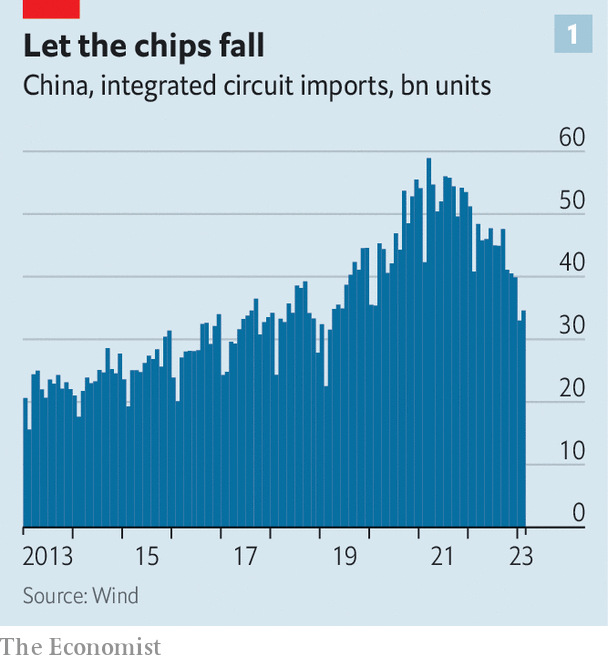
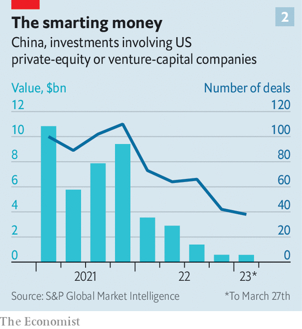
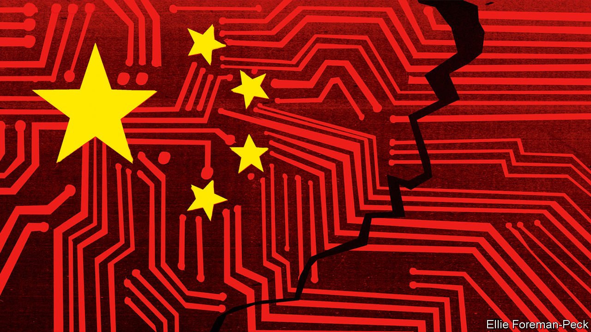

###### A daunting arsenal

# America’s commercial sanctions on China could get much worse 

##### And China could retaliate in kind 

 

> Mar 30th 2023 

THE CHINESE custom official’s suspicions were first aroused by the size of the woman’s stomach. She said she was only five to six months pregnant, yet her belly protruded as if she were close to term. When she was searched, her baby bump turned out to be fake. Inside an improvised pouch she was smuggling not drugs or weapons, but computer chips—202 of them. Since America imposed a ban on sales of certain semiconductors and related equipment to Chinese entities last year, firms in China have been running short. Imports have plunged (see chart 1). Entrepreneurial middlemen (and women) have been coming up with all manner of schemes to obtain the desired goods, and to avoid customs duties to boot.

 


It is not just small operators who are feeling the effects of the sanctions. Before the new rules were imposed in October, Yangtze Memory Technologies Corp (YMTC), a big state-owned maker of memory chips, was widely seen as the Chinese firm with the best chance of becoming a global force in chipmaking. Overnight, however, it and all other Chinese firms were barred from buying the equipment they needed to make the most advanced chips. YMTC’s inability to procure this gear, in turn, has stopped it from finalising a business plan for 2023, analysts say. It may have to delay the construction of a new production facility. 

The impact is reverberating through supply chains. YMTC cannot build production lines with foreign components, which means it is having to cancel orders for Chinese equipment, too, that would have gone into the same lines. It has reportedly cut orders from one local firm by 70%. It may in time be unable to fulfil orders for chips from Chinese customers. In January it began laying off workers and asked former staff to repay generous housing subsidies. Disgruntled former employees claim it is desperately trying to save cash and that its troubles stem from the sanctions. 

The ultimate effect of all this will be to set back China’s chip industry. International Business Strategies, a consultancy, had previously estimated that Chinese firms would be making more than half of the chips their country needed by 2030. After the American sanctions came into effect, it lowered that forecast to 33%.

This is just what America’s policymakers want. The latest sanctions are different from past measures against China, Russia and, during the cold war, the Soviet Union. They seek to deny China access not just to advanced weapons or narrowly defined technologies, but to undermine whole industries. In a speech in September Jake Sullivan, America’s national security adviser, explained that the government wanted to hobble China’s capabilities in “foundational technologies” such as artificial intelligence, biotech and clean energy, to allow America to maintain as much of an edge as possible in these areas. Some call this plan the “Sullivan doctrine”. 

FDPRgy-bargy

So far, America’s main technique for hobbling Chinese industry has been export controls using “foreign direct product rules” (FDPRs). These orders, issued by the Department of Commerce, can be used to restrict the sale not just of goods made in America but also of any item made anywhere using American intellectual property. Firms that break the rules risk prosecution if they do business in America and crippling sanctions even if they do not.

The FDPR that has spurred chip-smuggling and upended YMTC was issued in October. In keeping with the Sullivan doctrine, it attempts to cut China off from the most advanced chips involved in the machine learning that underpins all ai. It also bars American engineers, and even Chinese nationals with American green cards, from working at many Chinese chip companies. This abrupt escalation, says Joerg Wuttke of the European Union Chamber of Commerce in Beijing, was tantamount to “a declaration of tech war”.

In fact, the war had already begun. America has been cudgelling Huawei, a Chinese tech firm, with various weapons, including an FDPR, since 2019. Donald Trump, the previous president, attempted to force ByteDance, another Chinese firm, to sell TikTok, an app adored by teens around the world. But America’s assault is clearly intensifying. Congress has been loudly debating a ban on . The mandarins of the commerce department and the Treasury have many more potential sanctions up their sleeves. China, meanwhile, will not sit idly by as its industries are pummelled. And, as in any conflict, bystanders are being pulled into the fight.

How far will the battle escalate and how severe will the damage be? At the very least, the fighting will force a drastic reorganisation of supply chains in the $570bn market for computer chips. It may well spill into other industries such as clean technology, biotech and even agriculture. It will in effect split the world into two distinct and mutually exclusive blocs for many products, and thus undo many of the gains brought about by globalisation. And it will harm the companies and countries that are forced to choose between the two rivals. 

Processing oriented

The next salvo is likely to be a strengthening and widening of the new export rules. The FDPRs on chips focus on two factors: processing power and the speed at which they communicate with other chips. Although in theory Chinese firms could get around these twin restrictions by using lots of less sophisticated chips, that would make it very cumbersome and expensive to train large AI models. But the performance of chips is always improving, and algorithms used for training are becoming more efficient. This means that the sanctions will gradually lose their potency, as more can be done with less.

Such advances may prompt America to modify its sanctions on chips, says Bill Drexel of the Centre for a New American Security (cnas), a think-tank in Washington. It might choose to focus purely on the computational power of chips. This is a simpler approach than trying to find a “sweet spot between computing power and interconnect bandwidth”, says Mr Drexel. But it would entail broadening the restrictions to less powerful chips. That could ensnare the graphics-processing units used in the video-games industry, a rapidly growing market worth $40bn last year Both American chipmakers and their Chinese customers would suffer.

The commerce department might also target other industries with FDPRs. Chinese biopharmaceuticals, an industry with projected sales of more than $100bn by 2025, are highly dependent on American intellectual property. American firms supply lots of biological materials, technical information and lab equipment to Chinese facilities which produce new medicines and therapies, notes Ajay Kuntamukkala of Hogan Lovells, a law firm. Some of these exchanges could be banned. One possible target is American-developed software that Chinese companies use to make medicines that are then exported back to America. Many companies in the West also export data to China in order to develop new treatments. In future, such transfers of data could also be restricted, notes Emily Benson at CSIS, another think-tank.

Another option the American government is weighing is an expansion of FDPRs on companies. The test case for this is Huawei, which continues to operate despite an array of American sanctions. One of its subsidiaries, Kunpeng, makes servers used in data centres and licenses its designs for central processing units (CPUs) to several Chinese tech firms. Those groups are still able to buy kit from Intel and AMD, two American companies, and chipsets from TSMC, a Taiwanese chipmaker. But America could add these Huawei suppliers to the “entity list” of blacklisted firms, impeding the expansion of Huawei’s data centres.

Other big Chinese conglomerates with global holdings could also get dragged into the fight. In early March America’s Department of Agriculture announced it would form a working group to promote fair competition in the seed industry. The value of bonds issued by Sinochem, a Chinese agro-industrial group, fell on the announcement, owing to fears that the new body could recommend restrictions on its seeds. This is a frightening prospect for China Inc, which has spent years acquiring technologies overseas and, more recently, bringing intellectual property to America and Europe. Sanctions against Sinochem could devastate the operations of Syngenta, a Swiss agribusiness giant that it bought in 2017 for $43bn.

Some industries in Mr Sullivan’s sights will be hard to injure with FDPRs. China’s nascent quantum-computing firms, for instance, rely very little on American-made equipment or intellectual property. But Chinese researchers in the field do collaborate energetically with their American counterparts. American quantum-computing specialists write more papers with Chinese ones than with people from any other foreign country, notes Edward Parker, a scientist at the RAND Corporation, an American think-tank. Hence the significance of another of the commerce department’s munitions: “deemed export” controls, which prohibit the disclosure of certain types of technical information to foreign nationals, even on American soil. 

America may also place limits on capital flows in its attempt to stifle certain Chinese industries. It is already illegal for American people or companies to provide funding to firms suspected of close ties to China’s armed forces. But American financial sanctions could get much fiercer. The Treasury is unlikely to try to cut China off from the use of the dollar altogether, as it has Iran, for example—at least unless relations deteriorate much more. But American authorities are trying to refine and develop the use of the dollar as a weapon in international relations. Observers expect the Treasury may soon try to ban the use of dollars to invest in some advanced technologies in China.

All these measures, however, have drawbacks. Barring Americans from collaborating with foreigners in research on quantum computing, for instance, would set back the American industry as well as the Chinese one, by preventing it from recruiting talented foreigners.

 


By the same token, restricting American investment in Chinese technology would have only a limited effect. The growing hostility between China and America and the closing of China’s borders for nearly three years during the pandemic have already crimped the flow of investment (see chart 2). American money is no longer that important to China’s venture-capital industry, says Alexander Kremer of Picus Capital, an investment group. Anyway, American regulators would struggle to enforce sweeping financial restrictions. Monitoring every dollar fund based in Hong Kong and in offshore havens such as the Cayman Islands is probably beyond them, at least without a massive increase in staff and resources. 

And then there are the repercussions for American firms. China’s airlines are reliant on imported planes and parts, many of them American. America could therefore bring aviation in China to a standstill with a sweeping FDPR—a prospect that alarms Chinese officials. But such a move would probably also provoke a crisis at Boeing, a giant American aircraft-maker.

Artful dodgers

What is more, China will also eventually find ways around whatever new restrictions America lobs at it. The phoney baby bump is a crude form of evasion, but there are more sophisticated ones, culminating in the development of a domestic capacity to replace whatever America’s regulators have withheld. Huawei is a good example. Its telecoms-equipment and smartphone divisions have been dealt savage blows by its regulatory pounding. But a recent speech by its founder, Ren Zhengfei, described the company’s attempt to push foreign IP from its systems. So far, Mr Ren claims, it has secured domestic supplies of 13,000 components and redesigned 4,000 circuit boards. Most strikingly, in April it will launch its own enterprise-resource-planning (ERP) system, the software that underpins operations across the corporation. (Until now it has used one developed by Oracle, an American software firm.)

 


The new system is meant to “plug all the holes” created by the many American strictures on Huawei, say analysts at Jefferies, an investment bank. The ERP system was developed alongside a home-grown operating system that has helped further diminish ties with foreign suppliers.

These substitutes are expensive to develop and may not prove as good as the systems they replace. But China’s Communist Party is undaunted. “Self-reliance” in science and technology is one of the top priorities of Xi Jinping, China’s leader. His government has poured funding into semiconductor development, among other technologies. Much of the money has been wasted—but not all. For example, China uses lots of SerDes circuits, vital components that connect chips, and that were mainly produced by foreign firms until recently. But local manufacturers have learned to make them relatively quickly, says Hexigetu of Sincere Capital, a private-equity firm based in Shanghai. American sanctions may end up spurring the very thing they are intended to impede: the development of strategic Chinese industries.

Meanwhile, the fiercer America’s restrictions become, the more businesses around the world wince. Many businessmen and some foreign governments complain that America is rewriting the rules of globalisation at great cost and to little benefit. Western corporations have been forced to think about their operations in China more like stand-alone, ring-fenced entities with fewer and fewer links to their research departments elsewhere. The looming threat of future sanctions means executives are putting off big decisions on investments and hiring. Chinese tech firms, too, are likely to delay investment and expansion in Western countries while they wait to see what happens to TikTok. 

America is moving so quickly that it has not always managed to persuade its allies to form a united front. The FDPRs issued in October, for instance, were announced before it had secured the support of the Netherlands, South Korea and Japan. Yet these countries make lots of advanced chips and chipmaking equipment. If they do not go along with America’s new rules, the attempt to blockade China will fail.

After the announcement American officials did elicit reluctant agreement from the Dutch and Japanese governments to adopt similar measures, even though they will be painful for ASML, a Dutch manufacturer of chipmaking equipment, and several big Japanese firms. South Korean firms have been granted a one-year reprieve but will eventually have to comply, according to reports. South Korea exports about half of its memory chips to China, notes Sam Howell at CNAS. Samsung and SK Hynix, two big South Korean chipmakers, have invested billions of dollars in manufacturing facilities in China. They risk penalties from America if they do not fall into line, and from China if they do. America’s vast sanctions programme faces many such hurdles, Ms Howell notes.

China has so far refrained from dramatic retaliation. Its leaders are happy to see big American firms such as Apple expanding in their country. On his first trip to China in three years, Apple’s chief executive, Tim Cook, sought to allay fears of an economic decoupling between America and China. He told an audience in Beijing on March 25th that the “symbiotic” relationship between the two countries over the past 30 years has helped them both grow.

China’s commerce ministry, however, is said to be mulling a ban on exports of some advanced silicon wafers used in solar panels, which would hurt many American firms. (It would also be devastating to Chinese exporters.) Perhaps a likelier target is biotech, since lots of American companies have an “uncomfortable dependency” on China for pharmaceutical inputs and medical devices, says Reva Goujon of Rhodium, a research firm. Some of the ingredients used in antibodies for anthrax, for instance, are produced only in China. The more sanctions America announces the greater the risk of a tit-for-tat cycle.

Critics of America’s approach say that it is not just harming its own companies, but also hindering the development of technologies that will benefit all humanity. It will certainly raise costs for companies in the affected industries. The sanctions drive also risks making America look like a bully. Preventing Chinese nationals from participating in high-level quantum-science research might slow the development of quantum computing in China, notes Mr Parker, but it would also erode the notion of American openness. “I was totally shocked,” says a Chinese economist of the FDPRs imposed in October, “It goes against everything I was told: free trade, a rules-based order, open competition.” ■

