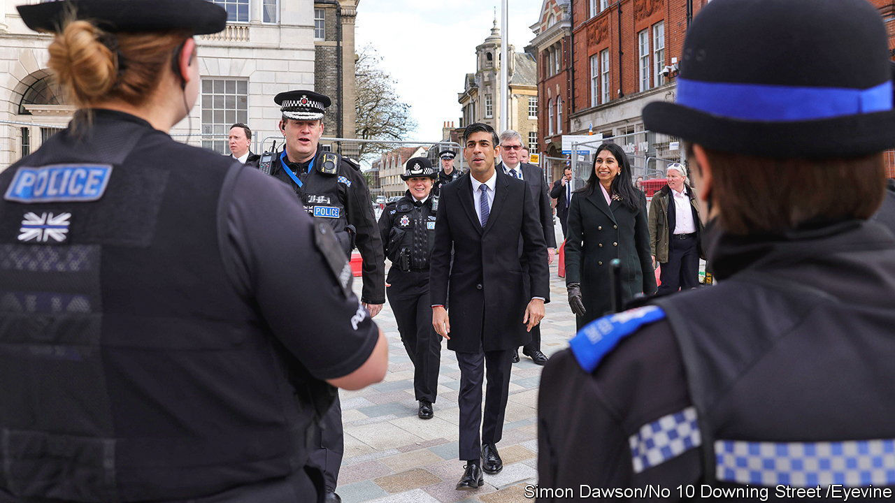

###### Neighbourhood watch

# Britain announces another crackdown on anti-social behaviour 

##### Good ideas jostle with bad ones 

 

> Mar 30th 2023 

PLANS TO combat anti-social behaviour in Britain tend to elicit hollow laughter. Understandably so. Successive governments have introduced similar-sounding initiatives to tackle what is defined in law as behaviour “likely to cause harassment, alarm or distress”, before quietly shelving them. And now there are fewer police officers around to tackle low-level crimes. The number providing the visible neighbourhood presence that might deter nuisance-makers has fallen over the past decade. 

The government itself is resolutely undeterred. On March 27th Rishi Sunak, the prime minister, said that 16 areas in England and Wales would be given extra funding for one or both of two schemes. One is “hotspot” policing: the targeted deployment of more officers to specific areas. This type of policing, which has been tested in several parts of Britain (and elsewhere), has an impressive record. A study by Cambridge University in 2019 found that a heightened police presence in crime hotspots on the London Underground at certain times of day reduced crime throughout the Tube network by 14% compared with the previous six months. 

The other scheme is an “immediate justice” programme whereby vandals, dressed in high-visibility vests “or jumpsuits”, would be made to repair the damage they have done, sometimes within 48 hours. They might also be made to wash police cars. The hope, presumably, is that the prospect of humiliation will be a disincentive to misbehave. The government’s plan also includes increasing fines for fly-tipping and graffiti-scrawling and making it easier for landlords to evict unruly tenants.

When  like rape often go unpunished, critics ask why the government is launching a push against anti-social behaviour. The data suggest it is falling, after all. The police recorded 1.1m incidents in the year to September 2022, compared with 3.5m in 2009-10. 

But that may be partly because police have recategorised some episodes as public-disorder offences. Self-reported incidents have risen in that time. And Lawrence Sherman, a professor of criminology at Cambridge University who is the first chief scientific officer of the Metropolitan Police, points out that incident logs may not be the best way to measure anti-social behaviour. By the time police turn up the miscreants have often disappeared, so incidents are not logged. Counting the calls that report anti-social behaviour would be better, he says, both to identify hotspots and to tell how well policing is working. 

For people who live in areas with high levels of anti-social behaviour, it is a blight. Some, especially old people, say it prevents them from going out as often as they would like. Anti-social behaviour can lead to more serious criminality (and to prison, a particularly harmful place for young people). Political considerations also play a part. In February the Labour Party pledged its own crackdown.

Politics may explain the more scattergun aspects to the government’s plan. Stopping nuisance begging beside cashpoints seems sensible; in shop doorways less so. The plan to class , a mild stimulant known as laughing gas, as a category C drug (thus criminalising its users) contradicts a recent report by the government’s own Advisory Council on the Misuse of Drugs. The anti-social behaviour that the government attributes to its use seems to consist of the littering of canisters, which are smaller than beer cans, and “loitering” by youngsters in parks, which is hardly the stuff of nightmares.

Organisations that work with young people point out that austerity brought brutal cuts to youth services in areas where they are needed most. “We know young people need hope and opportunity,” says Campbell Robb, the chief executive of Nacro, which works to prevent offending. The government has said its push will include extra funding for youth clubs. Achieving a balance between that and the harsher elements of a crackdown will be key. ■


