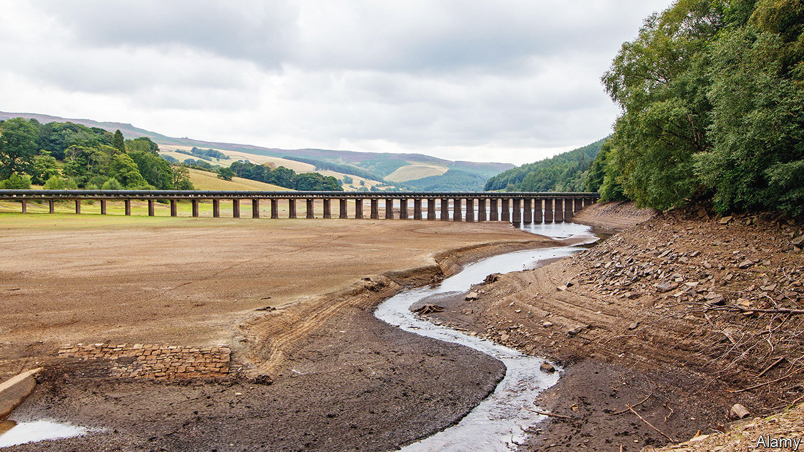
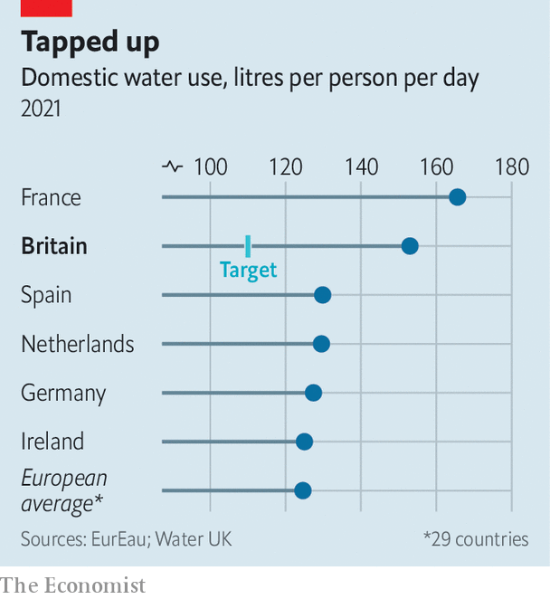

###### Drip, drop, tick, tock

# Fixing Britain’s national water supply will be a marathon 

##### But there’s no time to waste 

 

> Mar 30th 2023 

THE TOWN of Havant, explains Bob Taylor, was founded on Europe’s largest natural field of springs, which is fed by rainwater falling on the South Downs and percolating into a chalk aquifer. Much of the water goes out to sea. But in three years it will start to fill a reservoir.

Due to open in 2029, Havant Thicket reservoir—a collaboration between Portsmouth Water, where Mr Taylor is chief executive, and neighbouring Southern Water—will be Britain’s first since the early 1990s. Others are on drawing boards elsewhere, along with schemes to transfer water between rivers, via canals and long-distance pipes, and to recycle treated wastewater. Water companies in England and Wales (Scotland and Northern Ireland have their own, publicly owned companies) also plan to cut leaks by half and demand by more than a fifth. Supplies should be resilient to extreme drought by 2050. 

After 2022’s , the driest for 27 years, mid-century seems worryingly far away. Despite Britain’s damp reputation, climate change portends more scorchers, especially in south-east England. It also threatens more heavy rains, which can overwhelm sewers and storage rather than replenish stocks, treating Britons to the stomach-turning spectacle of sewage pouring into rivers and the sea. A rising population will add to demand.

Meanwhile the Environment Agency, a regulator, wants less water taken from overused sources, forcing suppliers to find alternatives. Almost all the water from Havant Thicket will go to Southern Water, which must cut its abstractions from environmentally sensitive rivers. (Southern, which is financing the reservoir, also hopes to send recycled wastewater to it, from a nearby works.) 

The Climate Change Committee (ccc), which advises the government, said on March 29th that the country was “strikingly unprepared” for the effects of a warming planet. Turning to water supply, the ccc added a little less gloomily that plans for reducing leaks and demand, at least, were “credible”, and noted progress in planning new sources.

The overall scheme is in essence one drawn up by the National Infrastructure Commission (NIC), another advisory body, in 2018. The plan is to add capacity of 4,000 megalitres a day (Ml/d) by 2050, over a quarter of current typical availability. The NIC reckoned that would provide resilience up to an extreme drought—ie, one with just a one-in-17 chance by 2050. 

 


Those 4,000Ml/d are expected to come in roughly equal parts from cutting demand, reducing leaks and new infrastructure. Demand ought to be easiest. At 145 litres each per day—35 litres above the long-term target—Britons use more than many other Europeans (see chart). But as the NIC noted in a report on March 27th, little has changed in the past decade.

Many households have no incentive to cut back. Just over 60% have  (others’ bills are based on outdated property values), but only 3% have the “smartest” type, giving them the most frequent, granular data. Ofwat, the industry’s economic regulator, has held price rises below inflation; in 2023-24 the average annual water and sewage bill will be £448 ($550). The government has balked at making meters compulsory outside “stressed” areas.

Suppliers have meanwhile been exhorting customers to check for “leaky loos”, from which 400 litres a year can drain away, and other hidden seepage. Nevil Muncaster, strategic resources director at Thames Water, says leakage from customers’ pipes account for a third of his company’s total. 

Persuasion might be easier if companies’ own pipes were less leaky. The NIC’s report applauds recent improvements—leakage is down by 11% since 2019—but adds that companies’ combined plans fall short of the 2050 target. New detection techniques, says Mr Muncaster, include advanced listening devices that compare what they hear to online libraries of more than 1m sounds. 

Building new infrastructure will be demanding practically, financially and politically. Recent organisational changes should help. In 2019 the industry’s three regulators (Ofwat, the Environment Agency and the Drinking Water Inspectorate) formed a joint unit, RAPID, to oversee “strategic” projects. And the companies are making plans in five regional groups. Some projects, including a pipe to carry water from Britain’s longest river, the Severn, to the second-longest, the Thames, pencilled in for 2050, also cross regional boundaries.

Big projects are costly. In 2019 Ofwat allowed for companies to spend £469m just on initial assessments of capacity projects when it set their prices for 2020-25 (work on the next review, covering 2025-30, is well under way). Companies will have to put schemes costing more than £200m out to tender. For the biggest, there may be separate regulated companies. 

New reservoirs are sure to be unpopular with those whose land and peace are threatened by lorries and bulldozers. Environmental objections are also certain. Near Abingdon, in Oxfordshire, for instance, there is vocal opposition to a prospective reservoir by the Thames that is planned for around 2040. Planning for schemes deemed nationally important may be streamlined when the government publishes a long-awaited “” on water infrastructure which will, in effect, shift decisions from local councils to ministers. But locals will still have to be listened to.

There is a big job to be done, a multi-decade task involving continual argument and reassessment. It has barely begun, and it might have been started sooner—for which the government, regulators and the industry share the blame. Better late than never. But late all the same. ■


