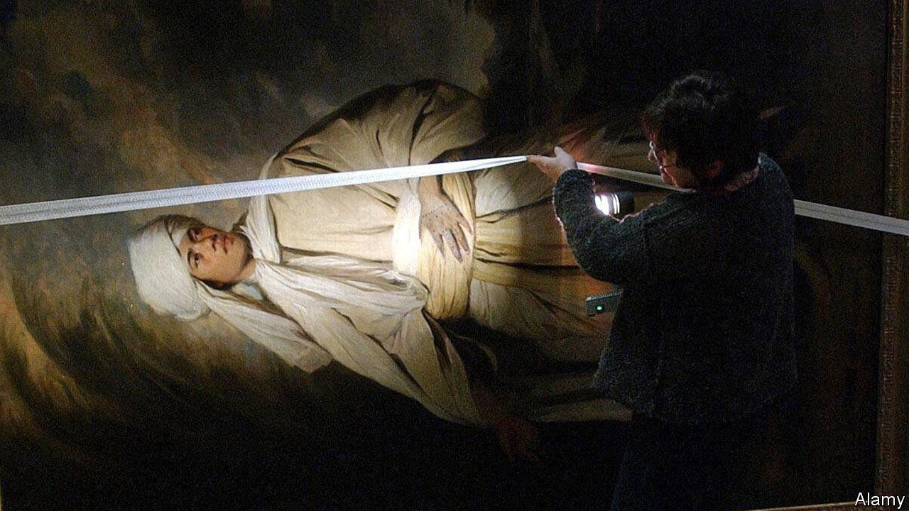

###### National treasures

# The battle to keep “Portrait of Omai” in Britain 

##### A joint acquisition with an American museum may be the answer 

 

> Mar 30th 2023 

The young man in the picture was the first Polynesian to visit Britain. He was brought to London from the South Pacific by Captain James Cook, a British explorer, in 1774, and presented to King George III. He learned to ride and play chess, and sat for a portrait by Joshua Reynolds, the first president of the Royal Academy of Arts. 

For more than 200 years after Reynolds’s death, ”Portrait of Omai” was owned by the Howard family and hung at Castle Howard in Yorkshire. But in 2001 the painting was sold to John Magnier, an Irish magnate, sparking a protracted stand-off. Mr Magnier wants to take the painting out of the country for good. The government believes it is of historic importance to Britain and has repeatedly denied him permission to do so. Yet British buyers have been unable to raise the money needed to get it back from Mr Magnier before a ban on exporting the portrait expires. A solution may now be in sight, involving the J. Paul Getty Museum in Los Angeles; it could be a template for other treasured artworks that are too expensive for the nation to buy. 

More than 150 countries impose export restrictions on their cultural treasures. America is an outlier, curbing only the sale of works by American artists that are owned by the federal government. Japan has a list of 906 treasures, including swords, that cannot be sold or even moved. Many European countries operate a right of pre-emption, allowing the government to step in and buy any work offered for sale. 

Britain operates a hybrid system that balances the aims of keeping hold of important pieces and protecting the rights of their owners. Every year about 30,000 items are sold to buyers who want to take them abroad. Britain has no inventory of national treasures, nor does it use pre-emption rights. Instead, all works that are over 50 years old or are worth more than £65,000 ($80,000) need an export licence. Most are waved through. Older or more valuable pieces are assessed at monthly meetings of the Reviewing Committee on the Export of Works of Art and Objects of Cultural Interest, a group of curators, dealers and art historians. 

These are judged by three measures known as the “Waverley criteria”, after the chairman of a government committee in the early 1950s: historic significance, aesthetic importance and a work’s contribution to scholarship. The most important works are kept in Britain under a temporary bar while domestic institutions try to raise the funds to buy them. In 2020, for example, the National Maritime Museum in Greenwich used this system to buy a sledge that  had used on one of his expeditions to Antarctica. An anti-slavery poem handwritten in ancient Greek by Samuel Taylor Coleridge is subject to an export ban; would-be British buyers have until mid-May to raise £20,400 to buy it.

This system is being tested as never before by rising art prices. Mr Magnier paid £10.3m for “Portrait of Omai”. Now he wants £50m for it (a fair value, according to Anthony Mould, an independent dealer). The National Portrait Gallery (NPG) in London has been trying to raise the cash, but by the time the export ban on the picture was last extended, in March, only half the money had been raised. Another extension is unlikely, so the NPG has until June 10th to find the money. 

The NPG’s answer is to acquire the painting jointly with the Getty, and in all probability for it to spend half its time in London and the other half in California. That sort of agreement is unprecedented in Britain, but in 2015 a similar arrangement was agreed between France and the Netherlands to share ownership of a pair of important portraits by Rembrandt. 

The Waverley criteria were meant to keep Britain’s cultural treasures at home so that people could see them whenever they wanted. But safeguarding an artwork for the nation some of the time may increasingly be all that can be achieved. The NPG will not see its efforts as a halfway house if they come off (insiders say the deal with the Getty is close to being finalised). After being closed for three years for refurbishment, the gallery hopes it will be able to throw open its doors again in triumph on June 22nd, with “Portrait of Omai” as its crowning glory. ■


