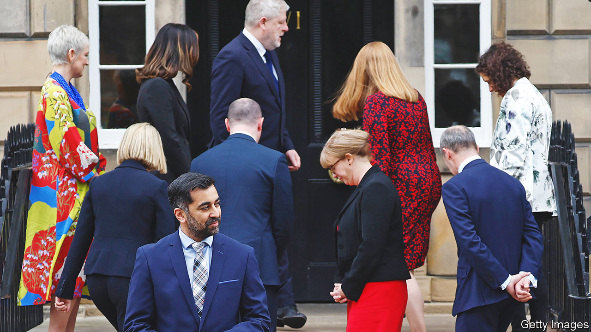
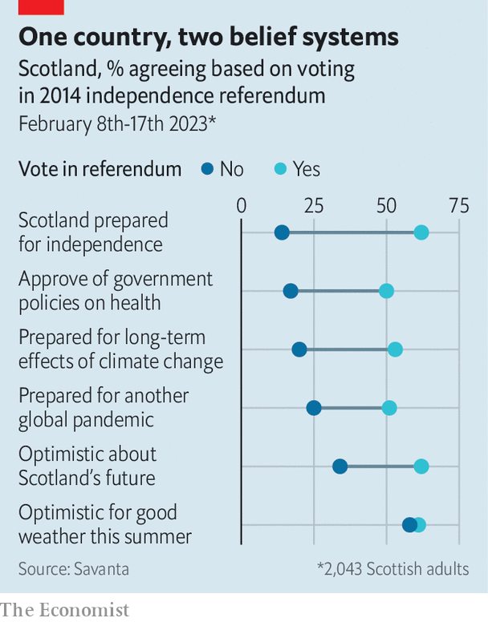

###### Slowing the centrifuge

# Under Humza Yousaf the forces that polarised Scotland are weakening 

##### He will struggle to replicate the momentum Nicola Sturgeon brought to separatism 

 

> Mar 30th 2023 

Whereas the chamber of the House of Commons comprises tiers of opposing benches, set two swords’ length apart, the Scottish Parliament in Edinburgh takes the form of a hemicycle. The seating reflected a hope that the assembly, which was formed at the turn of the millennium, would bring a more consensual, more European form of politics to Scotland. 

That hope is unfulfilled. The independence referendum of 2014, and the years of confrontation between the Scottish government and the British government in Westminster that followed, have acted as a centrifuge, flinging the Scottish electorate into opposing poles. The constitution is the main dividing line of Scottish politics. 

That split drives party choice at elections. Some 90% of Scottish National Party (SNP) supporters say they would back independence in another referendum tomorrow; 96% of Tory voters would oppose it. It predicts how Scots see much else, too, suggests polling by Savanta for  that was conducted at around the time of  as SNP leader in mid-February. 

 


It shapes how they see the Scottish government: pro-independence voters are by a wide margin more approving of its handling of a range of domestic policies, and more likely to think it good at communicating, economic management and international relations. It also shapes how they think about the country’s prospects (see chart): they are much more likely than unionists to say Scotland is prepared for another global pandemic or for the effects of climate change. On only one question do the two groups see things similarly: the weather in Scotland this summer. 

The election of , who became Scotland’s new first minister on March 29th after winning a ballot of SNP members, may mark a turning-point. Since 2014, and particularly since the Brexit referendum of 2016, Ms Sturgeon kept the nationalist movement on high alert. In her tenure she announced a succession of deadlines for a second referendum; no sooner would one be passed than a new one declared. Yet the idea that break-up is coming is suddenly much harder to sustain. The centrifuge is slowing.

To understand why, start with Mr Yousaf himself. Although he was Ms Sturgeon’s favoured candidate, he inherited little of her authority and lacks her charisma. He secured a slim majority in a shrinking party, winning 52% of the ballot after two rounds of voting among the SNP’s 72,000 members (down from 125,000 four years ago). That in part reflects dissatisfaction with the  that set in under Ms Sturgeon: posts running transport, justice and health have earned him the unkind sobriquet “Humza Useless”. 

Kate Forbes, his main rival, did surprisingly well given she is a socially conservative Christian running in a self-consciously progressive party. Her warning that “more of the same” would be an “acceptance of mediocrity” hit home with members. Among the public all three candidates in the race (the other was Ash Regan, a former community-safety minister) were more poorly rated than Ms Sturgeon, but Mr Yousaf ranked worst. That raises the question of how he managed to win at all; one answer is that when constitutional concerns dominate, the normal feedback loops that weed out less popular politicians get short-circuited.

Mr Yousaf’s lack of clout will be felt. When Ms Sturgeon lobbied successive British prime ministers for a second referendum, she did so with the conceit that she spoke for all of Scotland. Mr Yousaf will struggle to claim he speaks for all the SNP. The contest widened deep rifts on taxation (he promises to raise it), social policy (he backs ) and the party’s administration (Peter Murrell, the party’s chief executive and Ms Sturgeon’s husband, resigned in a row over those falling membership figures). On March 28th Ms Forbes rejected the post of rural-affairs secretary in Mr Yousaf’s cabinet—a demotion—and returned to the backbenches. 

As a result Mr Yousaf must lean more heavily on the one thing that does unite the party: a redoubled pursuit of independence. Yet the SNP does not have a credible plan to circumvent the veto that the British government possesses over a new referendum, and which left Ms Sturgeon’s government roadblocked. Mr Yousaf finds himself trapped between the monomania of his party and what he knows to be electoral reality. In the campaign he correctly observed that a road to independence required a “sustained majority” in its favour which did not yet exist. Yet his first acts in office have been to declare that the “grassroots, civic-led” campaign for divorce would be sent into “fifth gear” and to press Rishi Sunak for a plebiscite. 

It is not clear how long hard-core activists will put up with the pantomime of their leaders being rebuffed by Downing Street. The monopoly the SNP once enjoyed over independence strategy is weakening as rival fringe groups jostle to take the lead. Alex Salmond, a former leader of the SNP who fell out with Ms Sturgeon and her acolytes and is intent on revenge, is watching carefully. 

The SNP’s predicament is a mixed blessing for the Conservative Party. Alister Jack, the Scotland secretary in Westminster, has offered a “reset” and joint working on common projects such as industrial sites. Those who advocated a hard line on denying the SNP a second referendum look vindicated; claims that doing so would boost separatism did not come true. But a weakened SNP is also a headache: the Tories have reaped the rewards of polarisation in Scotland by positioning themselves as the surest guardian of the union. 

The bigger beneficiary by far is the Labour Party, whose voters straddle the constitutional divide. The paradox of Scotland’s polarisation is that although the constitution drives voters’ political allegiance, it is not their priority: both unionists and nationalists rank the health-care system and the economy as more pressing. The SNP’s success lay in marrying those concerns to the cause of independence. 

The strategy of Sir Keir Starmer, the Labour leader, is to convince SNP supporters that electing a Labour government to Westminster is a faster and more reliable vehicle for getting rid of the Tories and delivering social change than a referendum that never seems to come. In public, the party’s tone towards disaffected nationalists is humble. In private, it sees the best chance in a decade of drawing a polarised Scottish electorate back to the centre. ■


