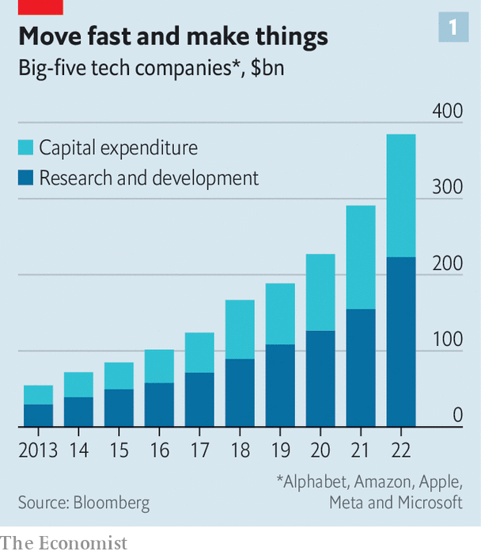
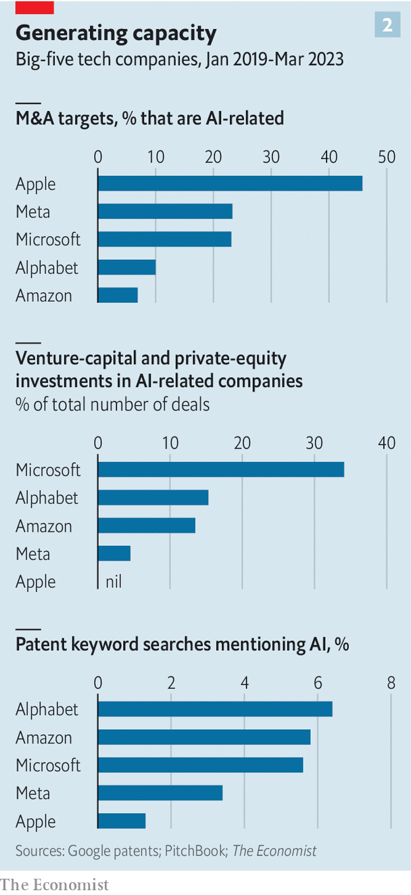
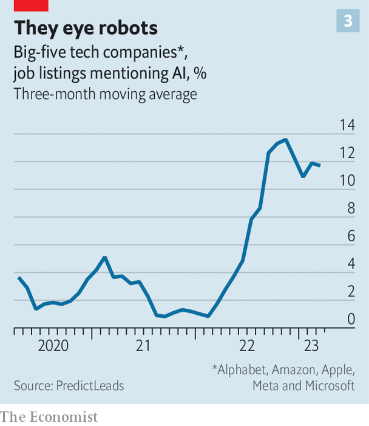
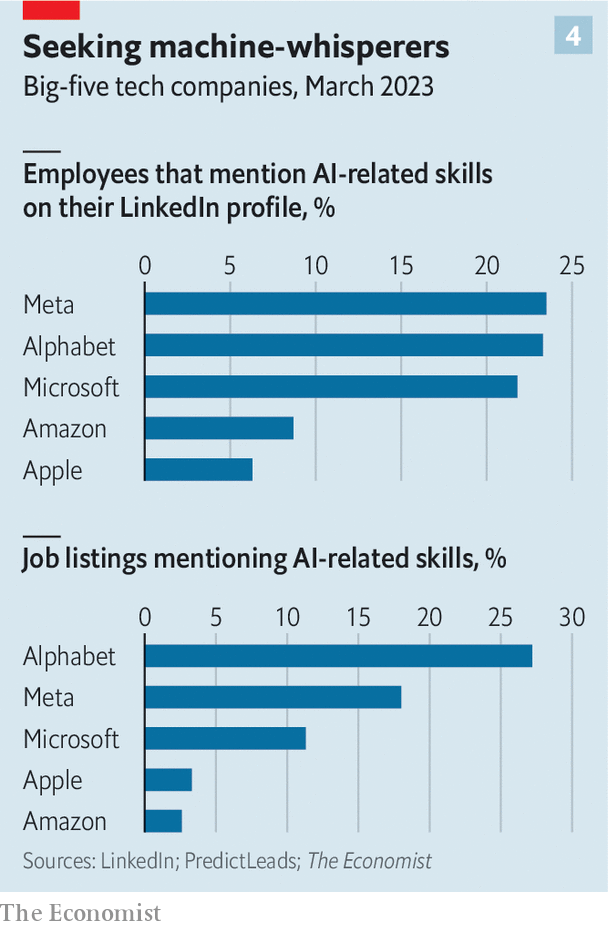

###### Mastering the machine

# Big tech and the pursuit of AI dominance 

##### The tech giants are going all in on artificial intelligence. Each is doing it its own way 

 

> Mar 26th 2023 

What has been achieved on this video call? It takes Jared Spataro just a few clicks to find out. Microsoft’s head of productivity software pulls up a sidebar in Teams, a video-conferencing service. A 30-second pause ensues as an artificial-intelligence (AI) model somewhere in one of the firm’s data centres analyses a recording of the meeting so far. An accurate summary of your correspondent’s questions and Mr Spataro’s answers then pops up. Mr Spataro can barely contain his excitement. “This is not your daddy’s AI,” he beams.

Teams is not the only product into which Microsoft is implanting machine intelligence. On March 16th the company announced that almost all its productivity software, including Word and Excel, were getting the same treatment. Days earlier, Alphabet, Google’s parent company, unveiled a similar upgrade for its productivity products, such as Gmail and Sheets. 

Announcements like these have come thick and fast from America’s tech titans in the past month or so. OpenAI, the startup part-owned by Microsoft that created , a hit AI conversationalist, released GPT-4, a new super-powerful AI. Amazon Web Services (AWS), the e-commerce giant’s cloud-computing arm, has said it will expand a partnership with Hugging Face, another AI startup. Apple is reportedly testing new AIs across its products, including Siri, its virtual assistant. Mark Zuckerberg, boss of Meta, said he wants to “turbocharge” his social networks with AI. Adding to its productivity tools, on March 21st Google launched its own AI chatbot to rival ChatGPT, called Bard. 

The flurry of activity is the result of a new wave of AI models, which are rapidly making their way from the lab to the real world. Progress is so rapid, in fact, that on March 29th an open letter signed by more than 1,000 tech luminaries called for a six-month pause in work on models more advanced than GPT-4. Whether or not such a moratorium is put in place, big tech is taking no chances. All five giants claim to be laser-focused on AI. What that means for each in practice differs. But two things are already clear. The race for AI is heating up. And even before a winner emerges, the contest is changing the way that big tech deploys the technology. 

AI is  to tech’s titans. Amazon’s founder, Jeff Bezos, quizzed his teams in 2014 on how they planned to embed it into products. Two years later Sundar Pichai, Alphabet’s boss, started to describe his firm as an “AI-first company”. The technology underpins how Amazon sells and , Google finds stuff on the internet, Apple imparts smarts on Siri, Microsoft helps clients manage data and Meta serves up adverts. 

The new GPT-4-like “generative” AI models nevertheless seem a . Their promise became clear in November with the release of ChatGPT, with its human-like ability to generate everything from travel plans to poems. What makes such AIs generative is “l”. These analyse content on the internet and, in response to a request from a user, predict the next word, brushstroke or note in a sentence, image or tune. Many technologists believe they mark a “platform shift”. AI will, on this view, become a layer of technology on top of which all manner of software can be built. Comparisons abound to the advent of the internet, the smartphone and cloud computing. 

 


The tech giants have all they need—data, computing power, billions of users—to thrive in the age of AI. They also recall the fate of one-time Goliaths, from Kodak to BlackBerry, that missed earlier platform shifts, only to sink into bankruptcy or irrelevance. Their response is a deluge of investments. In 2022, amid a tech-led stockmarket rout, the big five poured $223bn into  (R&amp;D), up from $109bn in 2019 (see chart 1). That was on top of $161bn in capital spending, a figure that also doubled in three years. All told, this was equal to 26% of their combined sales last year, up from 16% in 2015. 

Not all of this went into cutting-edge technologies; a chunk was spent on prosaic fare, such as warehouses, office buildings and data centres. But a slug of such spending always ends up in the tech firms’ big bets on the future. Today, the wager of choice is AI. And the companies aren’t shy about it. Mr Zuckerberg recently said AI was his firm’s biggest investment category. In its next quarterly earnings report in April, Alphabet plans to reveal the size of its AI investment for the first time.

To tease out exactly how the companies are betting on AI, and how big these bets are,  has analysed data on their investments, acquisitions, job postings, patents, research papers and employees’ LinkedIn profiles. The examination reveals serious resources being put into the technology. According to data from PitchBook, a research firm, around a fifth of the companies’ combined acquisitions and investments since 2019 involved AI firms—considerably more than the share targeting cryptocurrencies, blockchains and other decentralised “Web3” endeavours (2%), or the virtual-reality metaverse (6%), two other recent tech fads. According to numbers from PredictLeads, another research firm, about a tenth of big tech’s job listings require AI skills. Roughly the same share of big tech employees’ LinkedIn profiles say that they work in the field. 

These averages conceal big differences between the five tech giants, however. On our measures, Microsoft and Alphabet appear to be racing ahead, with Meta snapping at their heels. As interesting is where the five are deciding to focus their efforts. 

Consider their equity investments, starting with those that aren’t outright takeovers. In the past four years big tech has taken stakes in 200-odd firms in all. The investments in AI companies are accelerating. Since the start of 2022, the big five have together made roughly one investment a month in AI specialists, three times the rate of the preceding three years.

Microsoft leads the way. One in three of its deals has involved AI-related firms. That is twice the share at Amazon and Alphabet (one of whose venture-capital arms, Gradient Ventures, invests exclusively in AI startups and has backed almost 200 since 2019). It is more than six times that of Meta, and infinitely more than Apple, which has made no such investments. Microsoft’s biggest bet is on OpenAI, whose technology lies behind the giant’s new productivity features and powers a souped-up version of its . The $11bn that Microsoft has reportedly put into OpenAI would, at the startup’s latest rumoured valuation of $29bn, give the software giant a stake of 38%. Microsoft’s other notable investments include D-Matrix, a firm that makes AI technology for data centres, and Noble.AI, which uses algorithms to streamline lab work and other R&amp;D projects. 

 


Microsoft is also a keen acquirer of whole AI startups; nearly a quarter of its acquisition targets, such as Nuance, which develops speech recognition for health care, work in the area. That is a similar share to Meta, which prefers takeovers to piecemeal investments. As with equity stakes, AI’s share of Alphabet acquisitions have lagged behind Microsoft’s since 2019 (see chart 2). But these, plus its equity stakes, are shoring up a formidable AI edifice, one of whose pillars is DeepMind, a London-based AI lab that Google bought in 2014. DeepMind has been behind some big advances in the field, such as AlphaFold, a system to predict the shape of proteins, a task that has stumped scientists for years and is critical to drug discovery. 

The most single-minded AI acquirer is Apple. Nearly half its buy-out targets are AI-related. They range from AI.Music, which composes new tunes, to Credit Kudos, which uses AI to assess the creditworthiness of loan applicants. Apple’s acquisitions have historically been small, notes Wasmi Mohan of Bank of America, but tend to be quickly folded into products. 

 


As with investments, big tech’s AI hiring, too, is growing (see chart 3). Jobs listed by Google, Meta and Microsoft today are likelier to require AI expertise than in the past three years. Since 2019, 23% of Alphabet’s listings have been AI-related. Meta came second, at 8%. Today the figures are 27% and 18%, respectively. According to data from LinkedIn, one in four Alphabet employees mention AI skills on their profile—similar to Meta and a touch ahead of Microsoft (Apple and Amazon lag far behind). Greg Selker of Stanton Chase, an executive-search firm, observes that demand for AI talent remains red-hot, despite big tech’s recent lay-offs.

The AI boffins aren’t twiddling their thumbs. Zeta Alpha, a firm which tracks AI research, looks at the number of published papers in which at least one of the authors works for a given company. Between 2020 and 2022, Alphabet published about 9,000 AI papers, more than any other corporate or academic institution. Microsoft racked up around 8,000 and Meta 4,000 or so. 

 


Meta, in particular, is gaining a reputation for being less tight-lipped about its work than fellow tech giants. Its AI-software library, called PyTorch, has been available to anyone for a while; since February researchers can freely use its large language model, LLaMA, the details of whose training and biases are also public. All this, says Joelle Pineau, who heads Meta’s open-research programme, helps it attract the brightest minds (who often make their move to the private sector conditional on a continued ability to share the fruits of their labours with the world). 

If you adjust Meta’s research output for its revenues and headcount, which are much smaller than Alphabet’s or Microsoft’s, and only consider the most-cited papers, Mr Zuckerberg’s firm tops the research league-table. And, points out Ajay Agrawal of the University of Toronto, openness brings two benefits besides luring the best brains. Low-cost AI can make it cheaper for creators to make content, including texts and videos, that draw more eyes to Meta’s social networks. And it could dent the business of Alphabet, Amazon and Microsoft, which are all trying to sell AI models through their cloud platforms. 


The AI frenzy is, then, in full swing among tech’s mightiest firms. And their AI bets are already beginning to pay off: by making their own operations more efficient (Microsoft’s finance department, which uses AI to automate 70-80% of its 90m-odd annual invoice approvals, now asks a generative-AI chatbot to flag dodgy-looking bills for a human to inspect); and by finding their way into products at a pace that seems faster than for many earlier technological breakthroughs.

Barely four months after ChatGPT captured the world’s imagination, Microsoft and Google have introduced the new-look Bing, Bard and their AI-assisted productivity programs. Alphabet and Meta offer a tool that generates ad campaigns based on advertisers’ objectives, such as boosting sales or winning more customers. Microsoft is making OpenAI’s technology available to customers of its Azure cloud platform. Thanks to partnerships with model-makers such as Cohere and Anthropic, AWS users can tap more than 30 large language models. Google, too, is wooing model-builders and other AI firms to its cloud with $250,000-worth of free computing power in the first year, a more generous bargain than it offers to non-AI startups. It may not be long before AI.Music and Credit Kudos appear in Apple’s music-streaming service and financial offering, or an Amazon chatbot recommends purchases uncannily matched to shoppers’ desires. 

If the platform-shift thesis is right, the tech giants could yet be upset by newcomers, rather as they upset big tech of yore. The mass of resources they are ploughing into the technology reflects a desire to avoid that fate. Whether or not they succeed, one thing is certain: these are just the modest beginnings of the AI revolution. ■


