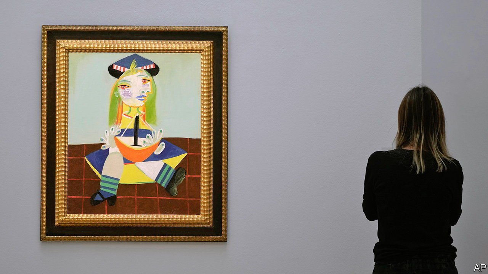

###### Peak Pablo

# The market for Picassos may be about to turn 

##### After a long bull run, the man and the artist are being re-evaluated 

 

> Mar 30th 2023 

Artists rarely create more than 5,000 works over a lifetime. Pablo Picasso, who died on April 8th 1973 at the age of 91, produced 25,000. Between 1950 and 2021 more than 1,500 notable Picassos were sold at auction in America and Britain, compared with 798 by the next-most-prolific artist, Andy Warhol, according to Sotheby’s Mei Moses, the art-data arm of the auction house. In its recent London sales, Sotheby’s offered a sculpture, an illustrated book, a cubist bronze cast, some gravure prints and several drawings and paintings, all by Picasso. Prices ranged from under £5,000 ($6,200) to more than £18m. 

Since 1999 prices of Picasso’s works have grown twice as fast as the broader market for 20th-century art. The most expensive Picasso was sold for $180m, reportedly by a Saudi collector to a former prime minister of Qatar. But in the midst of what one commentator calls the “Picassopalooza” around the 50th anniversary of the artist’s death, dealers and auction houses are nervous that the long bull market may be about to turn. 

One indication is Picasso’s waning influence on today’s creators. “It is artists, more than anyone, who propel artists of the past into the future,” says Ben Luke, a critic. Having interviewed dozens of them, young and old, for a podcast, “A Brush With…”, he notes that few cite Picasso as an inspiration. “Marcel Duchamp, yes. Philip Guston, yes. Louise Bourgeois, often,” Mr Luke says. That Picasso no longer features on that list is a “monumental shift”. 

Another thing that could dampen demand for Picassos is the artist’s abject personal behaviour. He two-timed his wives and sired children with different women at once. He seduced Marie-Thérèse Walter, who would become his mistress and his muse, when she was 17. He was 45. In 1932 he painted her dreaming, depicting her left cheek and her eye as an erect penis. In the wake of #MeToo all this is becoming harder to separate from the art. The works of other prominent artists, including Balthus and Salvador Dalí, have lost value in the eyes of critics and collectors because of how they they acted in private. 

Dealers and collectors are thus anxiously waiting to see how “Celebration Picasso”, an exhibition which opens at the Brooklyn Museum in June, will be received. It will “engage some of the compelling questions young, diverse museum audiences increasingly raise about the interconnected issue of misogyny, masculinity, creativity and ‘genius’,” says the museum. One of the exhibition’s curators pulls no punches. Picasso “suffered from the mental illness of misogyny”, said Hannah Gadsby, an Australian comedian and art historian, in a Netflix show. “I hate him,” she confessed.

“We will be watching it very carefully,” says Giovanna Bertazzoni, vice-chairman of the 20th- and 21st-century department at Christie’s, another big auction house, of the exhibition. If it is a hit, younger buyers may be put off. With Picasso the artist and Picasso the man falling out of favour, so could his oeuvre. ■


