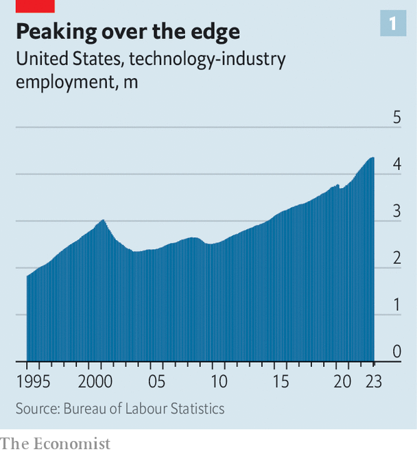
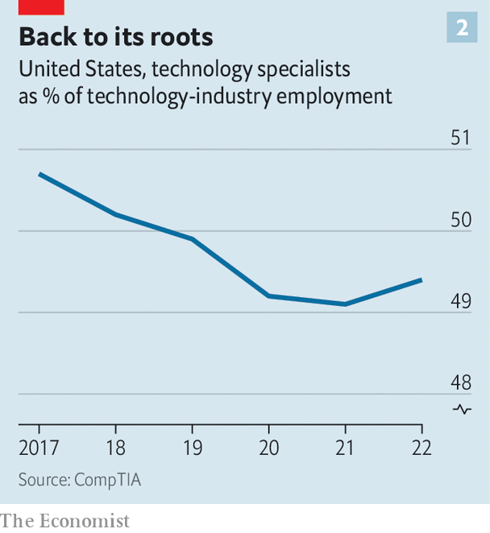

###### The sack of Silicon Valley

# Where have all the laid-off tech workers gone? 

##### Employment in the technology industry has reached an inflection point 

 

> Mar 27th 2023 

To understand the shift in tone that has taken place in Silicon Valley in recent months, look no further than Mark Zuckerberg’s declaration in February that 2023 would be the “year of efficiency”. It is hardly the kind of language to set the pulse racing—unless you are an employee on the receiving end of it. On March 14th Meta, the tech giant Mr Zuckerberg runs, announced it would fire 10,000 staff—on top of the 11,000 it laid off last November. 

Meta is not alone. On March 20th Amazon, another tech behemoth, said it would cut a further 9,000 corporate employees, having already sacked 18,000 white-collar types. So far this year American tech firms have announced 118,000 sackings, according to Crunchbase, a data provider, adding to the 140,000 jobs cut last year. 

Investors have cheered tech’s new-found cost-consciousness. The technology-heavy NASDAQ index is up by 17% from its recent low point in late December. The companies are hearing the market’s message loud and clear. On March 24th the chief operating officer of Salesforce, a business-software firm, hinted that the company would soon add to the 8,000 lay-offs it announced in January. 

 


They have a way to go: firings since the start of 2022 represent only 6% of the American tech industry’s workforce. Because tech companies continued to hire throughout 2022, lay-offs have only just begun to reduce total industry employment (see chart 1). By comparison, between the peak of the dotcom boom at the start of the 2000s and its nadir at the end of 2003, America’s overall tech workforce declined by 23%, or 685,000 jobs.

Still, the recent lay-offs have already been widespread and deep enough to warrant two questions. First, who is getting the chop? And second, where are the laid-off workers going? 

 


So far techies themselves have been mostly spared, observes Tim Herbert of the Computing Technology Industry Association, a trade body. Instead, the axe has fallen mainly on business functions such as sales and recruitment. These had grown steadily as a share of technology-industry employment in recent years, a telltale sign of bloat (see chart 2). 

Between the depths of the pandemic in the spring of 2020 and peak employment at the start of 2023, the tech sector added around 1m workers. Simply enlisting such numbers required hiring plenty of recruiters; as a headhunting rule of thumb, one recruiter can hire 25 new employees a year. Many of those same recruiters may now be surplus to requirements. 

But the specialists are not immune to the efficiency drive. As part of its lay-offs, Meta will restructure its tech functions in April. Releasing talented tech workers back into the wild could be a boon for other sectors wrestling with digital reinvention. For years unsexy industries like industrial goods have struggled to compete with the tech industry for talent. Now they are pouncing. John Deere, an American tractor-maker, has been snapping up fired tech workers to help it make smarter farm machinery. Last year the firm opened an office in Austin, a thriving tech hub in Texas. Carmakers, increasingly focused on software, are also hungry for technologists. So are banks, health insurers and retailers.

Some of the laid-off techies are helping fuel a new generation of startups. Applications in January to Y Combinator, a startup school in Silicon Valley, were up five-fold on the previous year. Excitement is particularly strong in the buzzy field of ChatGPT-like “generative” artificial intelligence (AI), which uses complex algorithms and oodles of data to produce everything from essays to artworks—so much so that even big tech continues to hire enthusiastically in the area (see earlier article).

Optimists hope that this technology will, like the smartphone before it, unlock a new wave of creative destruction, as AI entrepreneurs conjure up a variety of clever applications. The new AIs may in time mean even less need for, say, human marketers. But they could, like other breakthroughs before them, create entirely new job categories—not least in the technology industry itself. ■


