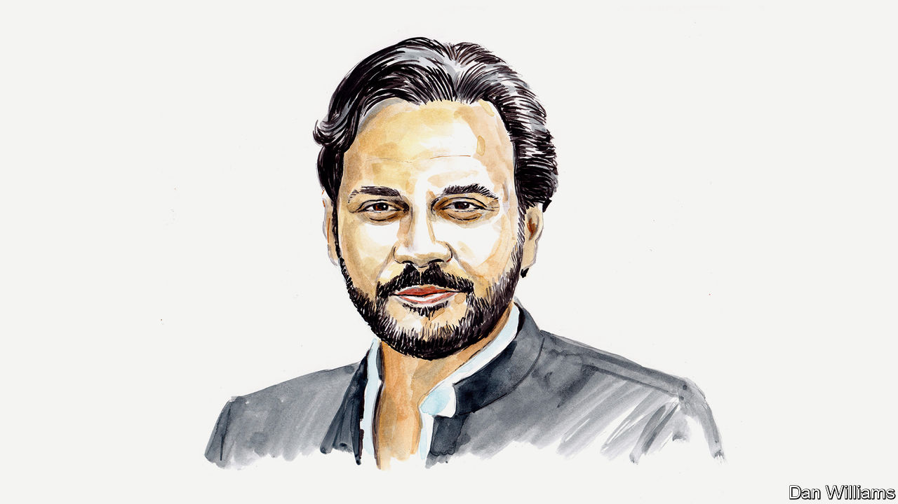

###### Pakistan and the IMF

# Politicians and the IMF are failing Pakistan’s most vulnerable, laments Murtaza Syed 

##### A former central banker on the coming chaos in his country and what to do about it 

 

> Mar 28th 2023 

The problems of Pakistan are encapsulated in the lives of two people I have met in recent months. Mariam Bibi still lives with her five children in a makeshift tent beside the Indus River in north-west Pakistan, eight months after their lives were turned upside down by extensive flooding. Even finding enough to feed and clothe her children is problematic. There are 30m poor people like her in Pakistan who are still feeling the effect of the floods. 

Asif Zaman is a designer at an advertising agency in Karachi. Despite having an undergraduate degree, he makes less than $4 a day. Over the past year, the cost of his groceries and bills has shot up because of soaring inflation and a 60% depreciation of the rupee. There are 45m lower-middle-class people who are struggling like him. 

The country’s economic crisis has brought it to the brink of default. Pakistan’s politicians and the IMF are failing people like Mariam and Asif, and the consequences of this could be disastrous. 

It did not have to be this way. Scarcely 18 months ago, Pakistan was doing relatively well. It handled covid-19 successfully, keeping casualties and economic fallout to a minimum. The pandemic saw public debt soar across the world, but it fell in Pakistan as a result of commendable fiscal discipline. Foreign-exchange reserves rose to all-time highs of over $20bn. 

But at the end of 2021, with a large amount of external debt coming due over the next few years, the government had no choice but to resume the IMF programme that had been paused due to covid-19. Everybody knew it was the only way for Pakistan to meet its external payments. 

This is when policymakers took some reckless decisions. Amid political instability, a populist energy subsidy created a fiscal hole of 1.5% of GDP. More recently, the rupee was artificially propped up through curbs on imports, bringing many industries to their knees. No attempt was made to reduce wasteful government spending or energy usage, nor to win back external creditors who dumped Pakistani assets, unnerved by irresponsible comments from policymakers. As a result, foreign-exchange reserves have today been nearly depleted and the currency has tanked.

The IMF has watched Pakistan commit  with bemusement. Although it now appears willing to help pull the country back from the abyss by reviving its lending programme, the Fund is also complicit in some grave mistakes. 

First, despite all the talk of putting the burden of adjustment on the rich, the main fiscal response the Fund has agreed with the government is an increase in the sales tax—a highly regressive measure. There is not even a hint of taxing property (an unproductive asset where illicit wealth is frequently stashed), agriculture (which is dominated by large landlords) or the retail sector (home to most of Pakistan’s ). This is a historic opportunity missed to broaden the tax base in a progressive way. 

Second, the only real protection being offered to the poor is through BISP, a cash-transfer programme covering 9m families who live on less than 70 cents a day. They will receive an extra 30 cents per day. In a country where 40% of the population—90m people—earn less than the World Bank’s middle-income poverty line and where inflation is running at a 50-year high of 30%, this protection is little more than cosmetic. 

Third, the government and the IMF are pretending that Pakistan’s public debt is sustainable. Pakistan has external financing needs of $35bn in each of the next five years, against foreign exchange reserves of just $4bn. During this time, the government will need to pay 5% of GDP each year in interest payments on the debt it owes to residents and foreigners. Our total tax take is only 10% of GDP. If ever a country needed debt relief, it is Pakistan. Denying this is a recipe for disaster. The austerity it would necessitate could spark major social unrest.

And fourth, the IMF is faltering in its traditional role as lender of last resort. Instead of helping to round up creditors, it has asked Pakistan to do so on its own, reflecting the IMF’s weakened role at the heart of the global financial safety net as new creditors, like China, have emerged. Even the World Bank is no longer automatically coming to the rescue, though the IMF has approved Pakistan’s policies. 

So where to from here? The IMF programme needs to be revived immediately. Flexibility is needed on both sides. Next, debt relief must be delivered despite the obvious co-ordination difficulties. Last, the most vulnerable must be protected while shifting the burden of austerity onto the rich. 

Beyond this immediate relief, Pakistan must start to tackle the underlying maladies that have led it to the IMF a record 23 times: a low tax take, faltering exports and abysmal levels of investment in human and physical capital. A good place to start would be to redefine its social contract. This will require Pakistan’s elites to put aside their differences and finally gamble on economic development. In turn, the global community can help by providing a conducive environment for Pakistan’s exports and by investing in the country. The hour is late. The poor and vulnerable, like Mariam and Asif, cannot wait much longer.■


