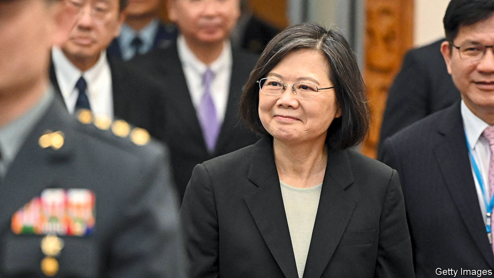

###### The Sino-American cold war

# Can America and China avoid another diplomatic crisis? 

##### Taiwan’s president, Tsai Ing-wen, starts a sensitive visit to America 

 

> Mar 29th 2023 

Travels abroad by Taiwan’s political leaders are always a . But especially prudent steps are required in the coming days, as the current president and a predecessor make unofficial visits to the two superpowers that may determine the island’s future. 

Taiwan’s sitting president, Tsai Ing-wen (pictured), is passing through the United States en route to and from . She is expected to meet the speaker of America’s House of Representatives, Kevin McCarthy, in Los Angeles on April 5th. It would be the first time a Taiwanese president has met a speaker on American soil. 

Meanwhile a former Taiwanese president, Ma Ying-jeou, of the opposition Nationalist Party or kmt, is on a 12-day trip through China. He is travelling as a private citizen, paying homage to his ancestors and visiting historical sites with Taiwanese university students. Mr Ma is the first former president of the Republic of China, Taiwan’s official name, to visit the mainland since the Communist victory over the Nationalists in 1949.

Both trips are delicate manoeuvres at a politically fraught time. Taiwan, a self-governing island of 24m people, is claimed by China. On March 26th Honduras established diplomatic relations with mainland China, leaving Taiwan with only 13 official allies. But it has the support of America, which is helping to bolster the island’s defences. As  deteriorate, Taiwan risks becoming a flashpoint—much as it was last year when China responded to a visit by Nancy Pelosi, the then-speaker of the House, with military drills around the island.

Complicating matters is Taiwan’s presidential election in January. Ms Tsai cannot run again, but she and the ruling Democratic Progressive Party (dpp) are keen to assert Taiwan’s sovereignty—in part to impress voters at home—while trying not to provoke China. Mr Ma and the kmt take a different tack. They want to show voters they can engage with China without kowtowing to the Communist Party. Both are walking a fine line.

The fact that Ms Tsai’s meeting with Mr McCarthy is planned to occur in America rather than Taiwan already shows pragmatic thinking to avoid a crisis. But much will depend on what exactly Ms Tsai says and does. She told reporters on March 29th that the trip will strengthen Taiwan’s relations with “global democratic partners” in the face of expanding authoritarianism. 

The American leg starts in New York, where Ms Tsai landed on March 29th, and was due to make a speech and receive an award the following day at a private dinner, hosted by the Hudson Institute, a conservative think-tank. That should not set any new precedents: she spoke at Columbia University on her last visit in 2019. She then visits Guatemala and Belize, two remaining allies, before flying to Los Angeles for the most sensitive part of her trip, an expected meeting with Mr McCarthy (and probably other members of Congress) at the Reagan Presidential Library. 

American officials are certain to circumscribe her activities, as they have often done for previous Taiwanese leaders. When they broke precedent in 1994 by allowing Lee Teng-hui, then Taiwan’s president, to refuel in Hawaii, a planned airport reception was so frugal he refused to leave his plane. The Clinton administration let Mr Lee visit Cornell University, his alma mater, in 1995, but nixed a news conference and a visit to New York City. The government in Beijing was outraged nonetheless. It staged military drills and fired missiles near Taiwan, prompting America to send two aircraft-carriers to the area. 

Diplomatic sigh

Since then Taiwan’s leaders have made regular “transits” of America without such a dramatic response. Ms Tsai has made six visits, and American officials have told Chinese counterparts this one will be similar to those. Even so, given recent tensions, China could easily take umbrage. Aside from the McCarthy meeting, another sensitive issue is whether Ms Tsai meets senior Democrats or government officials. China will also scrutinise what she says in any speeches, and to what extent they are public. It has already lodged a formal protest. On March 29th a spokesperson for China’s Taiwan Affairs Office threatened “resolute counter-measures” if Ms Tsai met Mr McCarthy, warning America not to arrange contact between her and government officials or do anything else to encourage Taiwan’s independence.

Even if the trip is low-key, China may escalate the now-regular forays by its military ships and aircraft across the Taiwan Strait’s midpoint. It could stage a larger show of force if it considers Ms Tsai’s words or activities especially provocative, says Bonnie Glaser of the German Marshall Fund, a think-tank. Yet China is also wary of responding in a way that helps the dpp in Taiwan’s elections.

Opinion polls suggest that threats from the mainland tend to strengthen Taiwanese identity and resistance to China. Surveys by different organisations show a majority supported Ms Pelosi’s visit and welcome a potential visit by Mr McCarthy, in spite of China’s military aggression. At the same time recent polling shows majority support for reducing cross-strait tensions and resuming exchanges. That is what the kmt is promoting.

Mr Ma’s trip is calibrated to avoid accusations of collusion. He is there as head of his own foundation, with an itinerary focused on cultural activities. Hsiao Hsu-tsen, the director of the foundation, has said that Mr Ma will not go to Beijing, but if mainland officials ask to meet, “the guests will follow the host’s wishes”. Yet the trip has a clear political message: the kmt can engage with mainland authorities in a way the dpp cannot. 

The former Taiwanese leader, now 72, oversaw a period of rapprochement with China when he was president from 2008 to 2016. He signed more than 20 cross-strait agreements, allowing trade and tourism to flourish. In 2015 he met China’s president, Xi Jinping, in Singapore and spoke about the expansion of cross-strait ties built on a consensus of “one China” (including Taiwan), though the two sides interpreted the phrase differently.

Mr Ma and the kmt are trying to return to the past. “We all belong to the Chinese race,” said the former president in Nanjing on March 28th. Both sides of the strait should work together to “seek peace, avoid war and revitalise ”, he said, using a term that denotes ethnic Chinese people rather than China as a state. The emphasis on ethnic unity does not appeal to many Taiwanese voters, who have come to identify less with China as Taiwan has developed its own distinct cultural identity and as the mainland has become more authoritarian under Mr Xi. 

Ms Tsai’s stance since she was elected in 2016 has been to insist that mainland authorities must respect Taiwan’s separate, democratic system rather than treat it as a subordinate part of a Chinese nation. That view is popular with voters but unacceptable to China, which cut communications with Ms Tsai’s government as punishment.

No matter who gets elected next year, Mr Xi will press for unification, says Chao Chun-shan, a Taiwanese policy adviser who helped plan the meeting between Mr Ma and Mr Xi in 2015 and visited China with a kmt delegation in February. Mr Chao frames voters’ choice as one of “peace or war”. The kmt can defuse tensions by promising the Communist Party that it rejects Taiwanese independence, he says—though it cannot guarantee that China will stop its military, economic or diplomatic coercion in return.

The dpp has criticised Mr Ma’s trip as “embracing appeasement” and acting as a “pawn” for the Communist Party’s goal of unification. But it, too, worries about conflict. If China manages to refrain from overreacting to Ms Tsai’s visit, both Taiwanese parties will probably claim a victory for their pragmatism. If China responds with force, it will reduce Taiwanese hopes that goodwill can prevent war, no matter which party is in charge. ■


