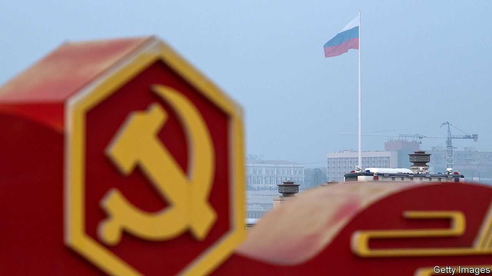
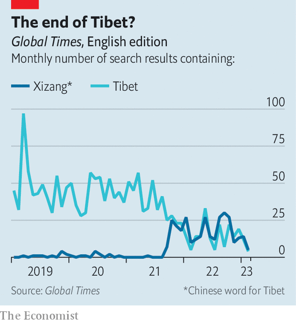

###### Sea-cucumbers and fragrant harbours

# Chinese nationalists are annoyed about colonial-era place names 

##### Vladivostock, Tibet and Hong Kong are in their sights 

 

> Mar 30th 2023 

At the start of a three-day visit to Moscow on March 20th, China’s president, Xi Jinping, was welcomed by his Russian counterpart, Vladimir Putin, with a feast featuring quail, venison and pavlova. At home, the thoughts of some Chinese nationalists were focused on another Russian city—one famous for its sea cucumbers, a popular Chinese delicacy. In China, the far-eastern Russian city of Vladivostok has been known traditionally as Haishenwai, meaning “sea-cucumber bay”. More to the point, as these patriots point out, it was once ruled by China. 

Amid the flourishing of Russia-China ties—said in a joint statement on March 22nd to have reached their “highest level in history”—a few Chinese have dared to recall how their country ceded vast swathes of territory, including Vladivostok, to the tsarist empire back in the 19th century. In the past month they have fumed on social media over the “unequal treaties” that wrested away this land.

Their interest was piqued by an order issued in February by the Chinese Ministry of Natural Resources. It repeated an edict of 2003 requiring that maps in Chinese featuring any of eight listed Russian places must show their historical Chinese names in brackets after their names in Russian. The places, most of them cities, are in former Chinese territory. One is Vladivostok, the biggest Russian port in that region. 

Some of the commenters have been outspoken. On March 22nd one of them, with 54,000 followers on Baijiahao, a blogging platform, wrote that the ministry’s order showed it had not been ruled out that “the homeland ceded by unequal treaties will be taken back in the future”. An academic in Beijing with some 5,000 Baijiahao followers suggested Russia was right to be anxious about China taking back the territory—at least if China’s giant neighbour “falls into chaos”. Another, with 10,000 followers, urged: “Never forget our national shame.” Using the Chinese names for Russian places would “encourage our country to recover these territories as soon as possible”, the blogger wrote. 

 


Censors have been trying to calm things down. Earlier in March, Zhou Libo, a talk-show star, found his social-media accounts blocked after he suggested in a post to his millions of followers that China should aim to recover land ceded to Russia. Mainstream media—even , a nationalist tabloid in Beijing that loves to chide foreign powers for their 19th-century colonialism—have avoided the topic. 

 has been paying more attention to another name: that of “Tibet”. Since 2021 its English edition has often used the Chinese word for the region, Xizang (see chart). Some Chinese diplomats have adopted it, too. China Media Project, a research group in Hong Kong, says this may have begun in 2021, when a statement about a meeting of then foreign minister, Wang Yi, and his Russian counterpart, Sergey Lavrov, noted that “Russia firmly supports China’s positions on issues related to Xinjiang, Hong Kong, Xizang and human rights.” In that list, the anglicised Cantonese name Hong Kong (“fragrant harbour”) is a colonial-era anomaly. Perhaps Hong Kongers should prepare for a rebranding as Xianggang, as the Mandarin pronunciation of the name is transliterated. ■


