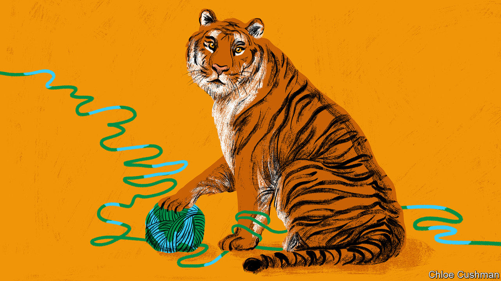

###### Chaguan

# Joe Biden attempts to defang the Chinese tiger 

##### His policies stop short of full containment, but are intolerable to China anyway 

 

> Mar 30th 2023 

To buddhist pilgrims, the Tiger Pagoda of Tanzhe Temple is a monument to a miracle. They believe that this stupa, in Beijing’s pine-clad western hills, marks the tomb of a tiger so touched by a monk’s piety that it abjured killing, moved into the temple grounds and lived on meatless gruel. When Chaguan saw the tomb on a recent hike, it struck him as a sadly useful metaphor. That vegetarian tiger could serve as a symbol for the strong-but-unthreatening China that America once sought as a partner, but which now seems to many in Washington like a naive dream. 

For about 40 years before the election of Donald Trump, successive presidents insisted that America welcomed the rise of China—or at least of a China that is “peaceful and prosperous and that supports international institutions”, to quote George W. Bush in 2006. A few years later, Barack Obama directly addressed the fears of many in China that America wanted to hold their homeland down. While hosting a visiting Chinese leader, Hu Jintao, at the White House, he declared: “I absolutely believe that China’s peaceful rise is good for the world and it’s good for America.” In truth, the welcome was always conditional. In that same joint appearance, Mr Obama offered support for a China whose rise enhanced regional security, and which reinforced international norms and rules as a “responsible actor on the world stage”. He offered examples. China would be a welcome partner in efforts to stop rogue states acquiring weapons of mass destruction. A growing China could help poor countries in Africa and Asia join the global economy. Also, he told Mr Hu: “We want to sell you all kinds of stuff.”

Today, those assurances are like relics from another age. President Joe Biden shuns Trumpian bombast about China, but has kept many tariffs and trade curbs put in place by his predecessor. He has also banned the export of advanced technologies that might help the People’s Liberation Army (PLA) build world-beating weapons or artificial intelligence (AI) systems. America is preparing new controls on investment, both into and out of China. 

Once, American presidents talked of shaping China’s rise. Boldly, they predicted that a growing middle class would surely start to demand individual freedoms, or at least a greater say in the running of their one-party state. In contrast, an Indo-Pacific Strategy released last year by the Biden administration adopts a bleakly defensive tone. The strategy talks of managing competition with the People’s Republic responsibly, while working with allies and friends to defend shared interests and values. It then continues: “Our objective is not to change the PRC but to shape the strategic environment in which it operates.” 

Former hopes have been replaced by fears. China is called a threat to peace in Asia, as it seeks to intimidate the democratic island of Taiwan into submitting to rule from Beijing. China’s growing economic and diplomatic clout in Africa, Asia or Latin America is seen as empowering autocrats and undermining liberal democracy. Put in tigerish terms, a bipartisan consensus in Washington now sees China as a predatory power, whose menacing nature will not be altered by pious sermons.

To Communist Party leaders, America’s shift in strategy is an attack. Speaking to Chinese business representatives in March, the supreme leader, President Xi Jinping, accused Western countries led by America of containing and suppressing China “on all fronts”. For good measure, his newly elevated foreign minister, Qin Gang, denounced even American talk of competing responsibly as a trick. Throwing Mr Biden’s words back at him, Mr Qin said that the American president’s call to establish “guardrails” in the relationship and avoid conflict “actually means that China should not respond in words or action when slandered or attacked”.

For its part, the Biden administration rejects the charge that it is bent on all-encompassing containment of China. In public, the president and senior officials call on China to play a constructive role over such global issues as climate change, food security, public health and flows of deadly narcotics. In private, it is taken as a given that China will be an economic giant and a potent regional military power. But continued military primacy in the Indo-Pacific, for America and its allies, is the goal of leaders in Washington. Explicitly, the logic of export controls and investment screening is to stop American technology and money powering the PLA to a position of unmatched strength.

Two tigers, one mountain

America used to extend a conditional welcome to China’s overall rise. Now, that welcome is highly selective. Some forms of Chinese economic strength and influence are seen as potentially benign, if they support certain global public goods. Other forms of Chinese clout are openly deemed a threat to be blunted. That challenges China’s stated preference for a world order built on great-power balancing. In the words of Zhou Bo, a retired PLA senior colonel now at Tsinghua University’s Centre for International Security and Strategy, there will be stability only “once China and the United States have parity of military strength in the Asia-Pacific”.

Professor Da Wei of Tsinghua University coins his own animal imagery to explain how leaders of his country feel. “It is natural for a country to want to become strong, like a tiger,” he says. “But the US is not comfortable with China becoming a tiger. America wants China to be a cat, maybe a fat cat. And it wants to pull out our teeth, like AI or high-end semiconductors which can empower China’s industrial development and military capability.” 

America’s new vision of co-existence is not quite all-round containment, or across-the-board decoupling. But it does involve seeking to curb China’s coercive power, whether rulers in Beijing like it or not. American distrust of Mr Xi’s growling swagger is understandable. So is China’s hostile response. As a result, a ferocious contest of strength in coming years seems inevitable. After all, no tiger chooses to be neutered.■


