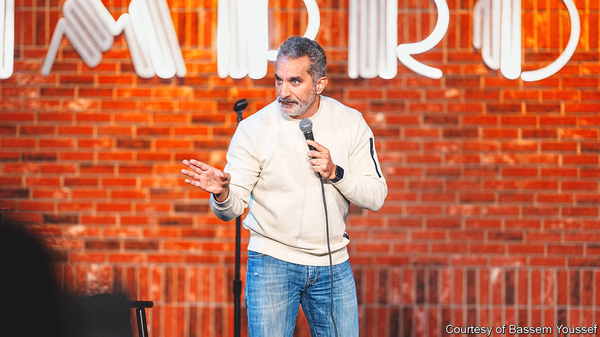

###### Laughter in the dark

# In exile from Egypt, Bassem Youssef is still making people laugh 

##### A pioneer of political satire in Arabic has become an English-speaking stand-up comic 

 

> Mar 30th 2023 

AS BASSEM YOUSSEF, an Egyptian comedian, sauntered onto the stage at the Royal Festival Hall in London on March 9th, members of the audience filmed his entrance. No matter that they had been told repeatedly to put their phones away. “You guys just don’t listen to instructions,” chastised Mr Youssef. “It’s because of people like you we don’t get visas here.”

The largely Egyptian audience roared with laughter. For many of the punters at his show, Mr Youssef is an icon. He was one of the first people in the Arab world to host a political-satire show on television. A decade ago, during his Friday-night slot, generations of Egyptian families would huddle round screens to watch him; the streets of Cairo fell silent. Here, in a prestigious auditorium in London, things were different. Mr Youssef, known for his tongue-in-cheek Arabic humour, was performing almost entirely in English.

His career in comedy began in 2011, during the Arab spring. Previously a heart surgeon, Mr Youssef began filming political satire in his laundry room and posting it to YouTube. He was funny—dangerously funny.  snapped him up and broadcast his show, “The Programme”. At its peak it had between 30m and 40m viewers each week, more than a third of Egypt’s entire population.

During the presidency of Muhammad Morsi, a democratically elected Islamist, Mr Youssef enjoyed relative freedom. He was detained only once—for “disrupting the fabric of society”, among other supposed offences. Mr Youssef’s description of this event makes it seem fairly benign. Wielding transcripts of his show, he remembers, officers questioned him about each gag in turn, laughing as they did so.

In 2013 Abdel-Fattah al-Sisi came to power in a coup. The military dictator  a laughing matter, particularly when the jokes were on him. Mr Youssef’s humour was blocked from the airwaves; he received death threats. Eventually he fled, making his way to America.

He did not know what he would do next, he says now. “The Programme” had been a product of those brief years of revolution. A version of the show made in exile would be a pale replica of the original. In the end he decided on a complete reinvention. Four years ago, he set out to become an English-speaking stand-up comedian. 

Doctor, doctor

It wasn’t easy. A new language came with new cultural references, and at its own pace. “I discovered that the hard way,” recalls Mr Youssef. “There were nights when I did terribly [on stage] because I couldn’t find that rhythm.” But he has now mastered his craft. The acutely observed material in his new show, “Adam”—now bound for New York after a European tour—is a culmination of those laborious years.

Besides the language of its delivery, “Adam” differs from Mr Youssef’s revolution-era comedy in two main ways. The first is its purpose. When he began wisecracking in 2011, he hoped his jokes would serve as a remedy to fear in febrile times. Now his aim is to illuminate the experience of the Arab diaspora in the West (taking friendly jabs at stereotypical Egyptian behaviour along the way). “In America we are a newer group of immigrants, compared to Asians or Latinos,” he explains. “It’s important that we tell our stories, instead of just talking to each other.” 

The second change is his newly direct style. On “The Programme”, Mr Youssef mostly relied on insinuation for his punchlines. He pushed the envelope, but didn’t tear it up altogether. In “Adam” he is no longer burdened by taboos, political or otherwise. Now he is outrageously frank. Topics that in the past he approached only delicately—specifically politics, sex and religion—are tackled head-on. Dictators in the Middle East are “assholes”. Watching pornography in America is much better than back home because “in Egypt our internet is so bad it qualifies as a reason to apply for asylum.” 

For all that, one thing remains the same: Mr Youssef’s life in America is still bound by limitations, albeit of a different kind from the old . To illustrate that point during the show, he tells the story of an Arabic-speaking woman who was detained at an airport for saying the word (“God willing”) on the phone before boarding a plane. In practice, he explained to the non-Arabic-speaking listeners in the room, means “it’s never going to happen” (the Arabs in the audience chuckled knowingly at this paraphrase). 

Along with some experiences of his own, this anecdote made Mr Youssef realise that, to some extent, he would still have to police his own behaviour in the “free world”. The only place he does not have to do this is on stage. Will he ever escape such strictures? There is hope, he says. But with a caveat: “Inshallah.” ■


